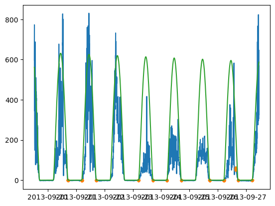
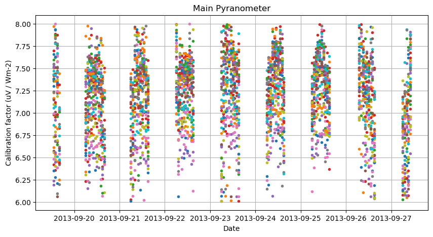
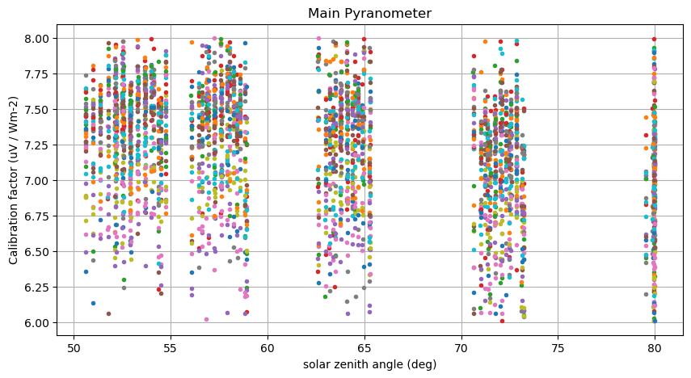

## Calibration for HOPE 2013
```
processed with pyrnet-0.2.16
```

The PyrNet was setup for calibration in a dense array on the Melpitz measurement field from 2013-08-29 to 2013-08-30. Cross-calibration is done versus reference observations from the TROPOS MObile RaDiation ObseRvatory (MORDOR) station.

### Imports


```python
#|dropcode
import os
import xarray as xr
import pandas as pd
import numpy as np
import datetime as dt
import matplotlib.pyplot as plt
import jstyleson as json

from pvlib import clearsky
from pvlib.location import Location

import pyrnet.pyrnet
```

### Prepare PyrNet data
For calibration preparation the PyrNet data is processed to level l1b using a calibration factor of **7 (uV W-1 m2)** for all pyranometers with the ```pyrnet process l1b``` tool. This is done to unify the conversion to sensor voltage during calibration and not run into valid_range limits for netcdf encoding. Here we generate the *calibration.json* file for the processing to l1b:   


```python
box_numbers = np.arange(1,101)
calibrations = {f"{bn:03d}":[7,7] for bn in box_numbers}
calibjson = {"2000-01-01": calibrations}
with open("pyrnet_calib_prep.json","w") as txt:
    json.dump(calibjson, txt)
```

Within *pyrnet_config.json*:
```
{"file_calibration" : "pyrnet_calib_prep.json"}
```

**Workflow for preparation**
1. Prepare *pyrnet_config_calibration_prep.json* with contributors metadata and the dummy calibration config file.
1. ```$ pyrnet process l1a -c pyrnet_config.json raw_data/*.bin l1a/```
1. ```$ pyrnet process l1b_network -c pyrnet_config.json l1a/*.nc l1b_network/```

### Configuration
Set local data paths and lookup metadata.


```python
pf_mordor = "mordor/CR1000_Radiation_corrected.dat"
pf_pyrnet = "l1b_network/{date:%Y-%m-%d}_P1D_pyrnet_hope-melpitz_n000l1bf1s.c01.nc"
dates = pd.date_range("2015-05-06","2015-05-11")

loc = Location(51.525175, 12.91648, altitude=90) # Melpitz

stations = np.arange(1,101)
# lookup which box contains actually a pyranometer/ extra pyranometer
mainmask = [] 
for box in stations:
    _, serials, _, _ = pyrnet.pyrnet.meta_lookup(dates[0],box=box)
    mainmask.append( True if len(serials[0])>0 else False )
```

#### Load reference MORDOR data


```python
#|dropcode
#|dropout

df = pd.read_csv(
    pf_mordor,
    header=0,
    skiprows=[0,2,3],
    date_format="ISO8601",
    na_values=["NAN"],
    parse_dates=[0],
    index_col=0
)
dst = df.to_xarray().rename({"TIMESTAMP":"time"})

# drop not needed variables
keep_vars = ['TP2_Wm2'] # global shortwave irradiance
drop_vars = [v for v in dst if v not in keep_vars]
dst = dst.drop_vars(drop_vars)
dst = dst.resample(time="1min").mean(skipna=True)

cs = loc.get_clearsky(pd.to_datetime(dst.time.values),model='simplified_solis')
cs_mask = clearsky.detect_clearsky(
    dst['TP2_Wm2'].values,
    cs['ghi'],
    times=pd.to_datetime(dst.time.values)
)    

dst = dst.assign({"cs_mask":("time", cs_mask)})

    
mordor = dst.copy()
mordor = mordor.drop_duplicates("time", keep="last")
mordor
```


<div><svg style="position: absolute; width: 0; height: 0; overflow: hidden">
<defs>
<symbol id="icon-database" viewBox="0 0 32 32">
<path d="M16 0c-8.837 0-16 2.239-16 5v4c0 2.761 7.163 5 16 5s16-2.239 16-5v-4c0-2.761-7.163-5-16-5z"></path>
<path d="M16 17c-8.837 0-16-2.239-16-5v6c0 2.761 7.163 5 16 5s16-2.239 16-5v-6c0 2.761-7.163 5-16 5z"></path>
<path d="M16 26c-8.837 0-16-2.239-16-5v6c0 2.761 7.163 5 16 5s16-2.239 16-5v-6c0 2.761-7.163 5-16 5z"></path>
</symbol>
<symbol id="icon-file-text2" viewBox="0 0 32 32">
<path d="M28.681 7.159c-0.694-0.947-1.662-2.053-2.724-3.116s-2.169-2.030-3.116-2.724c-1.612-1.182-2.393-1.319-2.841-1.319h-15.5c-1.378 0-2.5 1.121-2.5 2.5v27c0 1.378 1.122 2.5 2.5 2.5h23c1.378 0 2.5-1.122 2.5-2.5v-19.5c0-0.448-0.137-1.23-1.319-2.841zM24.543 5.457c0.959 0.959 1.712 1.825 2.268 2.543h-4.811v-4.811c0.718 0.556 1.584 1.309 2.543 2.268zM28 29.5c0 0.271-0.229 0.5-0.5 0.5h-23c-0.271 0-0.5-0.229-0.5-0.5v-27c0-0.271 0.229-0.5 0.5-0.5 0 0 15.499-0 15.5 0v7c0 0.552 0.448 1 1 1h7v19.5z"></path>
<path d="M23 26h-14c-0.552 0-1-0.448-1-1s0.448-1 1-1h14c0.552 0 1 0.448 1 1s-0.448 1-1 1z"></path>
<path d="M23 22h-14c-0.552 0-1-0.448-1-1s0.448-1 1-1h14c0.552 0 1 0.448 1 1s-0.448 1-1 1z"></path>
<path d="M23 18h-14c-0.552 0-1-0.448-1-1s0.448-1 1-1h14c0.552 0 1 0.448 1 1s-0.448 1-1 1z"></path>
</symbol>
</defs>
</svg>
<style>/* CSS stylesheet for displaying xarray objects in jupyterlab.
 *
 */

:root {
  --xr-font-color0: var(--jp-content-font-color0, rgba(0, 0, 0, 1));
  --xr-font-color2: var(--jp-content-font-color2, rgba(0, 0, 0, 0.54));
  --xr-font-color3: var(--jp-content-font-color3, rgba(0, 0, 0, 0.38));
  --xr-border-color: var(--jp-border-color2, #e0e0e0);
  --xr-disabled-color: var(--jp-layout-color3, #bdbdbd);
  --xr-background-color: var(--jp-layout-color0, white);
  --xr-background-color-row-even: var(--jp-layout-color1, white);
  --xr-background-color-row-odd: var(--jp-layout-color2, #eeeeee);
}

html[theme=dark],
body[data-theme=dark],
body.vscode-dark {
  --xr-font-color0: rgba(255, 255, 255, 1);
  --xr-font-color2: rgba(255, 255, 255, 0.54);
  --xr-font-color3: rgba(255, 255, 255, 0.38);
  --xr-border-color: #1F1F1F;
  --xr-disabled-color: #515151;
  --xr-background-color: #111111;
  --xr-background-color-row-even: #111111;
  --xr-background-color-row-odd: #313131;
}

.xr-wrap {
  display: block !important;
  min-width: 300px;
  max-width: 700px;
}

.xr-text-repr-fallback {
  /* fallback to plain text repr when CSS is not injected (untrusted notebook) */
  display: none;
}

.xr-header {
  padding-top: 6px;
  padding-bottom: 6px;
  margin-bottom: 4px;
  border-bottom: solid 1px var(--xr-border-color);
}

.xr-header > div,
.xr-header > ul {
  display: inline;
  margin-top: 0;
  margin-bottom: 0;
}

.xr-obj-type,
.xr-array-name {
  margin-left: 2px;
  margin-right: 10px;
}

.xr-obj-type {
  color: var(--xr-font-color2);
}

.xr-sections {
  padding-left: 0 !important;
  display: grid;
  grid-template-columns: 150px auto auto 1fr 20px 20px;
}

.xr-section-item {
  display: contents;
}

.xr-section-item input {
  display: none;
}

.xr-section-item input + label {
  color: var(--xr-disabled-color);
}

.xr-section-item input:enabled + label {
  cursor: pointer;
  color: var(--xr-font-color2);
}

.xr-section-item input:enabled + label:hover {
  color: var(--xr-font-color0);
}

.xr-section-summary {
  grid-column: 1;
  color: var(--xr-font-color2);
  font-weight: 500;
}

.xr-section-summary > span {
  display: inline-block;
  padding-left: 0.5em;
}

.xr-section-summary-in:disabled + label {
  color: var(--xr-font-color2);
}

.xr-section-summary-in + label:before {
  display: inline-block;
  content: '►';
  font-size: 11px;
  width: 15px;
  text-align: center;
}

.xr-section-summary-in:disabled + label:before {
  color: var(--xr-disabled-color);
}

.xr-section-summary-in:checked + label:before {
  content: '▼';
}

.xr-section-summary-in:checked + label > span {
  display: none;
}

.xr-section-summary,
.xr-section-inline-details {
  padding-top: 4px;
  padding-bottom: 4px;
}

.xr-section-inline-details {
  grid-column: 2 / -1;
}

.xr-section-details {
  display: none;
  grid-column: 1 / -1;
  margin-bottom: 5px;
}

.xr-section-summary-in:checked ~ .xr-section-details {
  display: contents;
}

.xr-array-wrap {
  grid-column: 1 / -1;
  display: grid;
  grid-template-columns: 20px auto;
}

.xr-array-wrap > label {
  grid-column: 1;
  vertical-align: top;
}

.xr-preview {
  color: var(--xr-font-color3);
}

.xr-array-preview,
.xr-array-data {
  padding: 0 5px !important;
  grid-column: 2;
}

.xr-array-data,
.xr-array-in:checked ~ .xr-array-preview {
  display: none;
}

.xr-array-in:checked ~ .xr-array-data,
.xr-array-preview {
  display: inline-block;
}

.xr-dim-list {
  display: inline-block !important;
  list-style: none;
  padding: 0 !important;
  margin: 0;
}

.xr-dim-list li {
  display: inline-block;
  padding: 0;
  margin: 0;
}

.xr-dim-list:before {
  content: '(';
}

.xr-dim-list:after {
  content: ')';
}

.xr-dim-list li:not(:last-child):after {
  content: ',';
  padding-right: 5px;
}

.xr-has-index {
  font-weight: bold;
}

.xr-var-list,
.xr-var-item {
  display: contents;
}

.xr-var-item > div,
.xr-var-item label,
.xr-var-item > .xr-var-name span {
  background-color: var(--xr-background-color-row-even);
  margin-bottom: 0;
}

.xr-var-item > .xr-var-name:hover span {
  padding-right: 5px;
}

.xr-var-list > li:nth-child(odd) > div,
.xr-var-list > li:nth-child(odd) > label,
.xr-var-list > li:nth-child(odd) > .xr-var-name span {
  background-color: var(--xr-background-color-row-odd);
}

.xr-var-name {
  grid-column: 1;
}

.xr-var-dims {
  grid-column: 2;
}

.xr-var-dtype {
  grid-column: 3;
  text-align: right;
  color: var(--xr-font-color2);
}

.xr-var-preview {
  grid-column: 4;
}

.xr-index-preview {
  grid-column: 2 / 5;
  color: var(--xr-font-color2);
}

.xr-var-name,
.xr-var-dims,
.xr-var-dtype,
.xr-preview,
.xr-attrs dt {
  white-space: nowrap;
  overflow: hidden;
  text-overflow: ellipsis;
  padding-right: 10px;
}

.xr-var-name:hover,
.xr-var-dims:hover,
.xr-var-dtype:hover,
.xr-attrs dt:hover {
  overflow: visible;
  width: auto;
  z-index: 1;
}

.xr-var-attrs,
.xr-var-data,
.xr-index-data {
  display: none;
  background-color: var(--xr-background-color) !important;
  padding-bottom: 5px !important;
}

.xr-var-attrs-in:checked ~ .xr-var-attrs,
.xr-var-data-in:checked ~ .xr-var-data,
.xr-index-data-in:checked ~ .xr-index-data {
  display: block;
}

.xr-var-data > table {
  float: right;
}

.xr-var-name span,
.xr-var-data,
.xr-index-name div,
.xr-index-data,
.xr-attrs {
  padding-left: 25px !important;
}

.xr-attrs,
.xr-var-attrs,
.xr-var-data,
.xr-index-data {
  grid-column: 1 / -1;
}

dl.xr-attrs {
  padding: 0;
  margin: 0;
  display: grid;
  grid-template-columns: 125px auto;
}

.xr-attrs dt,
.xr-attrs dd {
  padding: 0;
  margin: 0;
  float: left;
  padding-right: 10px;
  width: auto;
}

.xr-attrs dt {
  font-weight: normal;
  grid-column: 1;
}

.xr-attrs dt:hover span {
  display: inline-block;
  background: var(--xr-background-color);
  padding-right: 10px;
}

.xr-attrs dd {
  grid-column: 2;
  white-space: pre-wrap;
  word-break: break-all;
}

.xr-icon-database,
.xr-icon-file-text2,
.xr-no-icon {
  display: inline-block;
  vertical-align: middle;
  width: 1em;
  height: 1.5em !important;
  stroke-width: 0;
  stroke: currentColor;
  fill: currentColor;
}
</style><pre class='xr-text-repr-fallback'>&lt;xarray.Dataset&gt;
Dimensions:  (time: 11394)
Coordinates:
  * time     (time) datetime64[ns] 2013-09-19T12:47:00 ... 2013-09-27T10:40:00
Data variables:
    TP2_Wm2  (time) float64 597.0 713.0 762.6 764.3 ... 401.6 482.4 577.5 646.0
    cs_mask  (time) bool False False False False ... False False False False</pre><div class='xr-wrap' style='display:none'><div class='xr-header'><div class='xr-obj-type'>xarray.Dataset</div></div><ul class='xr-sections'><li class='xr-section-item'><input id='section-0305fc66-2d8f-4113-b465-3e365eee491c' class='xr-section-summary-in' type='checkbox' disabled ><label for='section-0305fc66-2d8f-4113-b465-3e365eee491c' class='xr-section-summary'  title='Expand/collapse section'>Dimensions:</label><div class='xr-section-inline-details'><ul class='xr-dim-list'><li><span class='xr-has-index'>time</span>: 11394</li></ul></div><div class='xr-section-details'></div></li><li class='xr-section-item'><input id='section-eb4a1bad-5a34-434d-8f37-39431d1d7427' class='xr-section-summary-in' type='checkbox'  checked><label for='section-eb4a1bad-5a34-434d-8f37-39431d1d7427' class='xr-section-summary' >Coordinates: <span>(1)</span></label><div class='xr-section-inline-details'></div><div class='xr-section-details'><ul class='xr-var-list'><li class='xr-var-item'><div class='xr-var-name'><span class='xr-has-index'>time</span></div><div class='xr-var-dims'>(time)</div><div class='xr-var-dtype'>datetime64[ns]</div><div class='xr-var-preview xr-preview'>2013-09-19T12:47:00 ... 2013-09-...</div><input id='attrs-7f16e144-c372-4816-8805-07ba7d32f85c' class='xr-var-attrs-in' type='checkbox' disabled><label for='attrs-7f16e144-c372-4816-8805-07ba7d32f85c' title='Show/Hide attributes'><svg class='icon xr-icon-file-text2'><use xlink:href='#icon-file-text2'></use></svg></label><input id='data-e8eac3e6-df86-44a8-b4ab-06bb055204b1' class='xr-var-data-in' type='checkbox'><label for='data-e8eac3e6-df86-44a8-b4ab-06bb055204b1' title='Show/Hide data repr'><svg class='icon xr-icon-database'><use xlink:href='#icon-database'></use></svg></label><div class='xr-var-attrs'><dl class='xr-attrs'></dl></div><div class='xr-var-data'><pre>array([&#x27;2013-09-19T12:47:00.000000000&#x27;, &#x27;2013-09-19T12:48:00.000000000&#x27;,
       &#x27;2013-09-19T12:49:00.000000000&#x27;, ..., &#x27;2013-09-27T10:38:00.000000000&#x27;,
       &#x27;2013-09-27T10:39:00.000000000&#x27;, &#x27;2013-09-27T10:40:00.000000000&#x27;],
      dtype=&#x27;datetime64[ns]&#x27;)</pre></div></li></ul></div></li><li class='xr-section-item'><input id='section-de612ded-d404-4db1-910d-18b164aa9a42' class='xr-section-summary-in' type='checkbox'  checked><label for='section-de612ded-d404-4db1-910d-18b164aa9a42' class='xr-section-summary' >Data variables: <span>(2)</span></label><div class='xr-section-inline-details'></div><div class='xr-section-details'><ul class='xr-var-list'><li class='xr-var-item'><div class='xr-var-name'><span>TP2_Wm2</span></div><div class='xr-var-dims'>(time)</div><div class='xr-var-dtype'>float64</div><div class='xr-var-preview xr-preview'>597.0 713.0 762.6 ... 577.5 646.0</div><input id='attrs-03245ec4-c617-46e9-898a-25bd8697b133' class='xr-var-attrs-in' type='checkbox' disabled><label for='attrs-03245ec4-c617-46e9-898a-25bd8697b133' title='Show/Hide attributes'><svg class='icon xr-icon-file-text2'><use xlink:href='#icon-file-text2'></use></svg></label><input id='data-ee12ffd8-0cfa-4941-9857-e9a68dc04f27' class='xr-var-data-in' type='checkbox'><label for='data-ee12ffd8-0cfa-4941-9857-e9a68dc04f27' title='Show/Hide data repr'><svg class='icon xr-icon-database'><use xlink:href='#icon-database'></use></svg></label><div class='xr-var-attrs'><dl class='xr-attrs'></dl></div><div class='xr-var-data'><pre>array([597.03417722, 713.04633333, 762.641     , ..., 482.38066667,
       577.52266667, 645.95925926])</pre></div></li><li class='xr-var-item'><div class='xr-var-name'><span>cs_mask</span></div><div class='xr-var-dims'>(time)</div><div class='xr-var-dtype'>bool</div><div class='xr-var-preview xr-preview'>False False False ... False False</div><input id='attrs-871ff260-8a2a-4112-b777-900240190420' class='xr-var-attrs-in' type='checkbox' disabled><label for='attrs-871ff260-8a2a-4112-b777-900240190420' title='Show/Hide attributes'><svg class='icon xr-icon-file-text2'><use xlink:href='#icon-file-text2'></use></svg></label><input id='data-fe626d3a-b86d-4bd6-bf0d-246aeb1b48a1' class='xr-var-data-in' type='checkbox'><label for='data-fe626d3a-b86d-4bd6-bf0d-246aeb1b48a1' title='Show/Hide data repr'><svg class='icon xr-icon-database'><use xlink:href='#icon-database'></use></svg></label><div class='xr-var-attrs'><dl class='xr-attrs'></dl></div><div class='xr-var-data'><pre>array([False, False, False, ..., False, False, False])</pre></div></li></ul></div></li><li class='xr-section-item'><input id='section-a1b4575a-bf73-4bce-94a9-0f9d297cbb8f' class='xr-section-summary-in' type='checkbox'  ><label for='section-a1b4575a-bf73-4bce-94a9-0f9d297cbb8f' class='xr-section-summary' >Indexes: <span>(1)</span></label><div class='xr-section-inline-details'></div><div class='xr-section-details'><ul class='xr-var-list'><li class='xr-var-item'><div class='xr-index-name'><div>time</div></div><div class='xr-index-preview'>PandasIndex</div><div></div><input id='index-e44f994f-3f23-4330-93c5-ddbbfd5ae671' class='xr-index-data-in' type='checkbox'/><label for='index-e44f994f-3f23-4330-93c5-ddbbfd5ae671' title='Show/Hide index repr'><svg class='icon xr-icon-database'><use xlink:href='#icon-database'></use></svg></label><div class='xr-index-data'><pre>PandasIndex(DatetimeIndex([&#x27;2013-09-19 12:47:00&#x27;, &#x27;2013-09-19 12:48:00&#x27;,
               &#x27;2013-09-19 12:49:00&#x27;, &#x27;2013-09-19 12:50:00&#x27;,
               &#x27;2013-09-19 12:51:00&#x27;, &#x27;2013-09-19 12:52:00&#x27;,
               &#x27;2013-09-19 12:53:00&#x27;, &#x27;2013-09-19 12:54:00&#x27;,
               &#x27;2013-09-19 12:55:00&#x27;, &#x27;2013-09-19 12:56:00&#x27;,
               ...
               &#x27;2013-09-27 10:31:00&#x27;, &#x27;2013-09-27 10:32:00&#x27;,
               &#x27;2013-09-27 10:33:00&#x27;, &#x27;2013-09-27 10:34:00&#x27;,
               &#x27;2013-09-27 10:35:00&#x27;, &#x27;2013-09-27 10:36:00&#x27;,
               &#x27;2013-09-27 10:37:00&#x27;, &#x27;2013-09-27 10:38:00&#x27;,
               &#x27;2013-09-27 10:39:00&#x27;, &#x27;2013-09-27 10:40:00&#x27;],
              dtype=&#x27;datetime64[ns]&#x27;, name=&#x27;time&#x27;, length=11394, freq=&#x27;T&#x27;))</pre></div></li></ul></div></li><li class='xr-section-item'><input id='section-f60f4301-a6d6-40c1-8e43-e031084e13c6' class='xr-section-summary-in' type='checkbox' disabled ><label for='section-f60f4301-a6d6-40c1-8e43-e031084e13c6' class='xr-section-summary'  title='Expand/collapse section'>Attributes: <span>(0)</span></label><div class='xr-section-inline-details'></div><div class='xr-section-details'><dl class='xr-attrs'></dl></div></li></ul></div></div>


```python
fig,ax = plt.subplots(1,1)
ax.plot(mordor.time,mordor.TP2_Wm2)
ax.plot(mordor.time[mordor.cs_mask],mordor.TP2_Wm2[mordor.cs_mask],ls='',marker='.')
ax.plot(cs.index,cs["ghi"])
```


    [<matplotlib.lines.Line2D at 0x7f0eee1cb970>]


    

    


#### Load PyrNet Data


```python
#|dropcode
#|dropout
dates = pd.date_range(
    pd.to_datetime(mordor.time.values[0].astype("datetime64[D]")),
    pd.to_datetime(mordor.time.values[-1].astype("datetime64[D]")),
    freq="1d"
)

for i,date in enumerate(dates):
    # read from thredds server
    dst = xr.open_dataset(pf_pyrnet.format(date=date))
    
    # drop not needed variables
    keep_vars = ['ghi','szen']
    drop_vars = [v for v in dst if v not in keep_vars]
    dst = dst.drop_vars(drop_vars)

    # unify time and station dimension to speed up merging
    date = dst.time.values[0].astype("datetime64[D]")
    timeidx = pd.date_range(date, date + np.timedelta64(1, 'D'), freq='1s', inclusive='left')
    dst = dst.interp(time=timeidx)
    dst = dst.reindex({"station": stations})

    dst.ghi.values = dst.ghi.values * 7 * 1e-6
    dst = dst.where(dst.szen<80, drop=True)
    dst.ghi.values = dst.ghi.where(dst.ghi>0.033/300.).values

    dst = dst.resample(time="1min").mean(skipna=True)
    
    
    # merge
    if i == 0:
        ds = dst.copy()
    else:
        ds = xr.concat((ds,dst),dim='time', data_vars='minimal', coords='minimal', compat='override')
    
pyr = ds.copy()
pyr
```


<div><svg style="position: absolute; width: 0; height: 0; overflow: hidden">
<defs>
<symbol id="icon-database" viewBox="0 0 32 32">
<path d="M16 0c-8.837 0-16 2.239-16 5v4c0 2.761 7.163 5 16 5s16-2.239 16-5v-4c0-2.761-7.163-5-16-5z"></path>
<path d="M16 17c-8.837 0-16-2.239-16-5v6c0 2.761 7.163 5 16 5s16-2.239 16-5v-6c0 2.761-7.163 5-16 5z"></path>
<path d="M16 26c-8.837 0-16-2.239-16-5v6c0 2.761 7.163 5 16 5s16-2.239 16-5v-6c0 2.761-7.163 5-16 5z"></path>
</symbol>
<symbol id="icon-file-text2" viewBox="0 0 32 32">
<path d="M28.681 7.159c-0.694-0.947-1.662-2.053-2.724-3.116s-2.169-2.030-3.116-2.724c-1.612-1.182-2.393-1.319-2.841-1.319h-15.5c-1.378 0-2.5 1.121-2.5 2.5v27c0 1.378 1.122 2.5 2.5 2.5h23c1.378 0 2.5-1.122 2.5-2.5v-19.5c0-0.448-0.137-1.23-1.319-2.841zM24.543 5.457c0.959 0.959 1.712 1.825 2.268 2.543h-4.811v-4.811c0.718 0.556 1.584 1.309 2.543 2.268zM28 29.5c0 0.271-0.229 0.5-0.5 0.5h-23c-0.271 0-0.5-0.229-0.5-0.5v-27c0-0.271 0.229-0.5 0.5-0.5 0 0 15.499-0 15.5 0v7c0 0.552 0.448 1 1 1h7v19.5z"></path>
<path d="M23 26h-14c-0.552 0-1-0.448-1-1s0.448-1 1-1h14c0.552 0 1 0.448 1 1s-0.448 1-1 1z"></path>
<path d="M23 22h-14c-0.552 0-1-0.448-1-1s0.448-1 1-1h14c0.552 0 1 0.448 1 1s-0.448 1-1 1z"></path>
<path d="M23 18h-14c-0.552 0-1-0.448-1-1s0.448-1 1-1h14c0.552 0 1 0.448 1 1s-0.448 1-1 1z"></path>
</symbol>
</defs>
</svg>
<style>/* CSS stylesheet for displaying xarray objects in jupyterlab.
 *
 */

:root {
  --xr-font-color0: var(--jp-content-font-color0, rgba(0, 0, 0, 1));
  --xr-font-color2: var(--jp-content-font-color2, rgba(0, 0, 0, 0.54));
  --xr-font-color3: var(--jp-content-font-color3, rgba(0, 0, 0, 0.38));
  --xr-border-color: var(--jp-border-color2, #e0e0e0);
  --xr-disabled-color: var(--jp-layout-color3, #bdbdbd);
  --xr-background-color: var(--jp-layout-color0, white);
  --xr-background-color-row-even: var(--jp-layout-color1, white);
  --xr-background-color-row-odd: var(--jp-layout-color2, #eeeeee);
}

html[theme=dark],
body[data-theme=dark],
body.vscode-dark {
  --xr-font-color0: rgba(255, 255, 255, 1);
  --xr-font-color2: rgba(255, 255, 255, 0.54);
  --xr-font-color3: rgba(255, 255, 255, 0.38);
  --xr-border-color: #1F1F1F;
  --xr-disabled-color: #515151;
  --xr-background-color: #111111;
  --xr-background-color-row-even: #111111;
  --xr-background-color-row-odd: #313131;
}

.xr-wrap {
  display: block !important;
  min-width: 300px;
  max-width: 700px;
}

.xr-text-repr-fallback {
  /* fallback to plain text repr when CSS is not injected (untrusted notebook) */
  display: none;
}

.xr-header {
  padding-top: 6px;
  padding-bottom: 6px;
  margin-bottom: 4px;
  border-bottom: solid 1px var(--xr-border-color);
}

.xr-header > div,
.xr-header > ul {
  display: inline;
  margin-top: 0;
  margin-bottom: 0;
}

.xr-obj-type,
.xr-array-name {
  margin-left: 2px;
  margin-right: 10px;
}

.xr-obj-type {
  color: var(--xr-font-color2);
}

.xr-sections {
  padding-left: 0 !important;
  display: grid;
  grid-template-columns: 150px auto auto 1fr 20px 20px;
}

.xr-section-item {
  display: contents;
}

.xr-section-item input {
  display: none;
}

.xr-section-item input + label {
  color: var(--xr-disabled-color);
}

.xr-section-item input:enabled + label {
  cursor: pointer;
  color: var(--xr-font-color2);
}

.xr-section-item input:enabled + label:hover {
  color: var(--xr-font-color0);
}

.xr-section-summary {
  grid-column: 1;
  color: var(--xr-font-color2);
  font-weight: 500;
}

.xr-section-summary > span {
  display: inline-block;
  padding-left: 0.5em;
}

.xr-section-summary-in:disabled + label {
  color: var(--xr-font-color2);
}

.xr-section-summary-in + label:before {
  display: inline-block;
  content: '►';
  font-size: 11px;
  width: 15px;
  text-align: center;
}

.xr-section-summary-in:disabled + label:before {
  color: var(--xr-disabled-color);
}

.xr-section-summary-in:checked + label:before {
  content: '▼';
}

.xr-section-summary-in:checked + label > span {
  display: none;
}

.xr-section-summary,
.xr-section-inline-details {
  padding-top: 4px;
  padding-bottom: 4px;
}

.xr-section-inline-details {
  grid-column: 2 / -1;
}

.xr-section-details {
  display: none;
  grid-column: 1 / -1;
  margin-bottom: 5px;
}

.xr-section-summary-in:checked ~ .xr-section-details {
  display: contents;
}

.xr-array-wrap {
  grid-column: 1 / -1;
  display: grid;
  grid-template-columns: 20px auto;
}

.xr-array-wrap > label {
  grid-column: 1;
  vertical-align: top;
}

.xr-preview {
  color: var(--xr-font-color3);
}

.xr-array-preview,
.xr-array-data {
  padding: 0 5px !important;
  grid-column: 2;
}

.xr-array-data,
.xr-array-in:checked ~ .xr-array-preview {
  display: none;
}

.xr-array-in:checked ~ .xr-array-data,
.xr-array-preview {
  display: inline-block;
}

.xr-dim-list {
  display: inline-block !important;
  list-style: none;
  padding: 0 !important;
  margin: 0;
}

.xr-dim-list li {
  display: inline-block;
  padding: 0;
  margin: 0;
}

.xr-dim-list:before {
  content: '(';
}

.xr-dim-list:after {
  content: ')';
}

.xr-dim-list li:not(:last-child):after {
  content: ',';
  padding-right: 5px;
}

.xr-has-index {
  font-weight: bold;
}

.xr-var-list,
.xr-var-item {
  display: contents;
}

.xr-var-item > div,
.xr-var-item label,
.xr-var-item > .xr-var-name span {
  background-color: var(--xr-background-color-row-even);
  margin-bottom: 0;
}

.xr-var-item > .xr-var-name:hover span {
  padding-right: 5px;
}

.xr-var-list > li:nth-child(odd) > div,
.xr-var-list > li:nth-child(odd) > label,
.xr-var-list > li:nth-child(odd) > .xr-var-name span {
  background-color: var(--xr-background-color-row-odd);
}

.xr-var-name {
  grid-column: 1;
}

.xr-var-dims {
  grid-column: 2;
}

.xr-var-dtype {
  grid-column: 3;
  text-align: right;
  color: var(--xr-font-color2);
}

.xr-var-preview {
  grid-column: 4;
}

.xr-index-preview {
  grid-column: 2 / 5;
  color: var(--xr-font-color2);
}

.xr-var-name,
.xr-var-dims,
.xr-var-dtype,
.xr-preview,
.xr-attrs dt {
  white-space: nowrap;
  overflow: hidden;
  text-overflow: ellipsis;
  padding-right: 10px;
}

.xr-var-name:hover,
.xr-var-dims:hover,
.xr-var-dtype:hover,
.xr-attrs dt:hover {
  overflow: visible;
  width: auto;
  z-index: 1;
}

.xr-var-attrs,
.xr-var-data,
.xr-index-data {
  display: none;
  background-color: var(--xr-background-color) !important;
  padding-bottom: 5px !important;
}

.xr-var-attrs-in:checked ~ .xr-var-attrs,
.xr-var-data-in:checked ~ .xr-var-data,
.xr-index-data-in:checked ~ .xr-index-data {
  display: block;
}

.xr-var-data > table {
  float: right;
}

.xr-var-name span,
.xr-var-data,
.xr-index-name div,
.xr-index-data,
.xr-attrs {
  padding-left: 25px !important;
}

.xr-attrs,
.xr-var-attrs,
.xr-var-data,
.xr-index-data {
  grid-column: 1 / -1;
}

dl.xr-attrs {
  padding: 0;
  margin: 0;
  display: grid;
  grid-template-columns: 125px auto;
}

.xr-attrs dt,
.xr-attrs dd {
  padding: 0;
  margin: 0;
  float: left;
  padding-right: 10px;
  width: auto;
}

.xr-attrs dt {
  font-weight: normal;
  grid-column: 1;
}

.xr-attrs dt:hover span {
  display: inline-block;
  background: var(--xr-background-color);
  padding-right: 10px;
}

.xr-attrs dd {
  grid-column: 2;
  white-space: pre-wrap;
  word-break: break-all;
}

.xr-icon-database,
.xr-icon-file-text2,
.xr-no-icon {
  display: inline-block;
  vertical-align: middle;
  width: 1em;
  height: 1.5em !important;
  stroke-width: 0;
  stroke: currentColor;
  fill: currentColor;
}
</style><pre class='xr-text-repr-fallback'>&lt;xarray.Dataset&gt;
Dimensions:          (station: 50, maintenancetime: 4, time: 5299)
Coordinates:
  * station          (station) int64 2 7 14 16 18 22 23 ... 89 90 92 95 96 100
  * maintenancetime  (maintenancetime) datetime64[ns] 2013-09-19T11:55:00 ......
  * time             (time) datetime64[ns] 2013-09-19T05:59:00 ... 2013-09-27...
Data variables:
    ghi              (time, station) float64 0.0001123 nan ... 0.0005218
    szen             (time, station) float64 79.97 79.97 79.97 ... 79.96 79.96
Attributes: (12/31)
    Conventions:               CF-1.10, ACDD-1.3
    title:                     TROPOS pyranometer network (PyrNet) observatio...
    history:                   2024-11-13T10:53:01: Merged level l1b by pyrne...
    institution:               Leibniz Institute for Tropospheric Research (T...
    source:                    TROPOS pyranometer network (PyrNet)
    references:                https://doi.org/10.5194/amt-9-1153-2016
    ...                        ...
    geospatial_lon_units:      degE
    time_coverage_start:       2013-09-19T00:00:00
    time_coverage_end:         2013-09-19T23:59:59
    time_coverage_duration:    P0DT23H59M59S
    time_coverage_resolution:  P0DT0H0M1S
    site:                      [&#x27;&#x27;, &#x27;&#x27;, &#x27;&#x27;, &#x27;&#x27;, &#x27;&#x27;, &#x27;&#x27;, &#x27;&#x27;, &#x27;&#x27;, &#x27;&#x27;, &#x27;&#x27;, &#x27;&#x27;, &#x27;...</pre><div class='xr-wrap' style='display:none'><div class='xr-header'><div class='xr-obj-type'>xarray.Dataset</div></div><ul class='xr-sections'><li class='xr-section-item'><input id='section-81c9274f-f749-413e-be04-a12cc47de063' class='xr-section-summary-in' type='checkbox' disabled ><label for='section-81c9274f-f749-413e-be04-a12cc47de063' class='xr-section-summary'  title='Expand/collapse section'>Dimensions:</label><div class='xr-section-inline-details'><ul class='xr-dim-list'><li><span class='xr-has-index'>station</span>: 50</li><li><span class='xr-has-index'>maintenancetime</span>: 4</li><li><span class='xr-has-index'>time</span>: 5299</li></ul></div><div class='xr-section-details'></div></li><li class='xr-section-item'><input id='section-2f2dedac-06aa-4985-9489-b8c121b3bc27' class='xr-section-summary-in' type='checkbox'  checked><label for='section-2f2dedac-06aa-4985-9489-b8c121b3bc27' class='xr-section-summary' >Coordinates: <span>(3)</span></label><div class='xr-section-inline-details'></div><div class='xr-section-details'><ul class='xr-var-list'><li class='xr-var-item'><div class='xr-var-name'><span class='xr-has-index'>station</span></div><div class='xr-var-dims'>(station)</div><div class='xr-var-dtype'>int64</div><div class='xr-var-preview xr-preview'>2 7 14 16 18 22 ... 90 92 95 96 100</div><input id='attrs-4ffc30ef-b0e5-4265-9f53-7a43d4ade26d' class='xr-var-attrs-in' type='checkbox' disabled><label for='attrs-4ffc30ef-b0e5-4265-9f53-7a43d4ade26d' title='Show/Hide attributes'><svg class='icon xr-icon-file-text2'><use xlink:href='#icon-file-text2'></use></svg></label><input id='data-db5c8a05-3097-4a18-be75-982b4bacf436' class='xr-var-data-in' type='checkbox'><label for='data-db5c8a05-3097-4a18-be75-982b4bacf436' title='Show/Hide data repr'><svg class='icon xr-icon-database'><use xlink:href='#icon-database'></use></svg></label><div class='xr-var-attrs'><dl class='xr-attrs'></dl></div><div class='xr-var-data'><pre>array([  2,   7,  14,  16,  18,  22,  23,  28,  29,  32,  35,  37,  38,  40,
        42,  43,  48,  49,  51,  53,  54,  56,  58,  60,  63,  65,  66,  67,
        68,  69,  70,  71,  73,  74,  75,  77,  78,  79,  80,  81,  85,  86,
        87,  88,  89,  90,  92,  95,  96, 100])</pre></div></li><li class='xr-var-item'><div class='xr-var-name'><span class='xr-has-index'>maintenancetime</span></div><div class='xr-var-dims'>(maintenancetime)</div><div class='xr-var-dtype'>datetime64[ns]</div><div class='xr-var-preview xr-preview'>2013-09-19T11:55:00 ... 2013-10-...</div><input id='attrs-5c216a4c-8e65-4d6a-9510-78b3408bac2e' class='xr-var-attrs-in' type='checkbox' disabled><label for='attrs-5c216a4c-8e65-4d6a-9510-78b3408bac2e' title='Show/Hide attributes'><svg class='icon xr-icon-file-text2'><use xlink:href='#icon-file-text2'></use></svg></label><input id='data-dc594f83-263b-440c-b7fc-d60e777272b0' class='xr-var-data-in' type='checkbox'><label for='data-dc594f83-263b-440c-b7fc-d60e777272b0' title='Show/Hide data repr'><svg class='icon xr-icon-database'><use xlink:href='#icon-database'></use></svg></label><div class='xr-var-attrs'><dl class='xr-attrs'></dl></div><div class='xr-var-data'><pre>array([&#x27;2013-09-19T11:55:00.000000000&#x27;, &#x27;2013-09-27T08:54:23.000000000&#x27;,
       &#x27;2013-09-27T23:59:59.000000000&#x27;, &#x27;2013-10-07T23:59:59.000000000&#x27;],
      dtype=&#x27;datetime64[ns]&#x27;)</pre></div></li><li class='xr-var-item'><div class='xr-var-name'><span class='xr-has-index'>time</span></div><div class='xr-var-dims'>(time)</div><div class='xr-var-dtype'>datetime64[ns]</div><div class='xr-var-preview xr-preview'>2013-09-19T05:59:00 ... 2013-09-...</div><input id='attrs-86ac3a98-5e5f-4374-bcf8-b00227f5aab7' class='xr-var-attrs-in' type='checkbox' disabled><label for='attrs-86ac3a98-5e5f-4374-bcf8-b00227f5aab7' title='Show/Hide attributes'><svg class='icon xr-icon-file-text2'><use xlink:href='#icon-file-text2'></use></svg></label><input id='data-9647dc2e-1f41-4da0-83e5-7b8fc6cf2754' class='xr-var-data-in' type='checkbox'><label for='data-9647dc2e-1f41-4da0-83e5-7b8fc6cf2754' title='Show/Hide data repr'><svg class='icon xr-icon-database'><use xlink:href='#icon-database'></use></svg></label><div class='xr-var-attrs'><dl class='xr-attrs'></dl></div><div class='xr-var-data'><pre>array([&#x27;2013-09-19T05:59:00.000000000&#x27;, &#x27;2013-09-19T06:00:00.000000000&#x27;,
       &#x27;2013-09-19T06:01:00.000000000&#x27;, ..., &#x27;2013-09-27T15:42:00.000000000&#x27;,
       &#x27;2013-09-27T15:43:00.000000000&#x27;, &#x27;2013-09-27T15:44:00.000000000&#x27;],
      dtype=&#x27;datetime64[ns]&#x27;)</pre></div></li></ul></div></li><li class='xr-section-item'><input id='section-318a679a-e7f4-48a7-8b52-4c0dc68e864f' class='xr-section-summary-in' type='checkbox'  checked><label for='section-318a679a-e7f4-48a7-8b52-4c0dc68e864f' class='xr-section-summary' >Data variables: <span>(2)</span></label><div class='xr-section-inline-details'></div><div class='xr-section-details'><ul class='xr-var-list'><li class='xr-var-item'><div class='xr-var-name'><span>ghi</span></div><div class='xr-var-dims'>(time, station)</div><div class='xr-var-dtype'>float64</div><div class='xr-var-preview xr-preview'>0.0001123 nan ... 0.0005218</div><input id='attrs-4e402bb9-cda0-4839-a6d4-eacd8cd3ca09' class='xr-var-attrs-in' type='checkbox' ><label for='attrs-4e402bb9-cda0-4839-a6d4-eacd8cd3ca09' title='Show/Hide attributes'><svg class='icon xr-icon-file-text2'><use xlink:href='#icon-file-text2'></use></svg></label><input id='data-5271d119-f391-4d9f-ae38-3ce5db8a07e0' class='xr-var-data-in' type='checkbox'><label for='data-5271d119-f391-4d9f-ae38-3ce5db8a07e0' title='Show/Hide data repr'><svg class='icon xr-icon-database'><use xlink:href='#icon-database'></use></svg></label><div class='xr-var-attrs'><dl class='xr-attrs'><dt><span>units :</span></dt><dd>W m-2</dd><dt><span>long_name :</span></dt><dd>downwelling shortwave flux</dd><dt><span>standard_name :</span></dt><dd>downwelling_shortwave_flux_in_air</dd><dt><span>valid_range :</span></dt><dd>[    0 60000]</dd><dt><span>ancillary_variables :</span></dt><dd>maintenance_flag_ghi qc_flag_ghi</dd><dt><span>serial :</span></dt><dd>[&#x27;S12128.002&#x27;, &#x27;S12128.007&#x27;, &#x27;S12128.014&#x27;, &#x27;S12128.027&#x27;, &#x27;S12128.018&#x27;, &#x27;S12128.022&#x27;, &#x27;S12128.023&#x27;, &#x27;S12128.029&#x27;, &#x27;S12078.060&#x27;, &#x27;S12128.032&#x27;, &#x27;S12128.035&#x27;, &#x27;S12128.037&#x27;, &#x27;S12128.038&#x27;, &#x27;S12128.040&#x27;, &#x27;S12128.042&#x27;, &#x27;S12128.043&#x27;, &#x27;S12128.048&#x27;, &#x27;S12128.049&#x27;, &#x27;S12137.001&#x27;, &#x27;S12137.003&#x27;, &#x27;S12137.004&#x27;, &#x27;S12137.006&#x27;, &#x27;S12137.008&#x27;, &#x27;S12137.010&#x27;, &#x27;S12137.013&#x27;, &#x27;S12137.015&#x27;, &#x27;S12137.016&#x27;, &#x27;S12137.017&#x27;, &#x27;S12137.018&#x27;, &#x27;S12137.019&#x27;, &#x27;S12137.020&#x27;, &#x27;S12137.021&#x27;, &#x27;S12137.023&#x27;, &#x27;S12137.024&#x27;, &#x27;S12137.025&#x27;, &#x27;S12137.027&#x27;, &#x27;S12137.028&#x27;, &#x27;S12137.029&#x27;, &#x27;S12137.030&#x27;, &#x27;S12137.031&#x27;, &#x27;S12137.035&#x27;, &#x27;S12137.036&#x27;, &#x27;S12137.038&#x27;, &#x27;S12137.039&#x27;, &#x27;S12137.040&#x27;, &#x27;S12137.042&#x27;, &#x27;S12137.046&#x27;, &#x27;S12137.050&#x27;]</dd><dt><span>calibration_Cabsolute :</span></dt><dd>[142857.14285714 142857.14285714 142857.14285714 142857.14285714
 142857.14285714 142857.14285714 142857.14285714 142857.14285714
 142857.14285714 142857.14285714 142857.14285714 142857.14285714
 142857.14285714 142857.14285714 142857.14285714 142857.14285714
 142857.14285714 142857.14285714 142857.14285714 142857.14285714
 142857.14285714 142857.14285714 142857.14285714 142857.14285714
 142857.14285714 142857.14285714 142857.14285714 142857.14285714
 142857.14285714 142857.14285714 142857.14285714 142857.14285714
 142857.14285714 142857.14285714 142857.14285714 142857.14285714
 142857.14285714 142857.14285714 142857.14285714 142857.14285714
 142857.14285714 142857.14285714 142857.14285714 142857.14285714
 142857.14285714 142857.14285714 142857.14285714 142857.14285714]</dd><dt><span>calibration_Ccoscorr :</span></dt><dd>1.0</dd><dt><span>calibration_function :</span></dt><dd>flux (W m-2) = flux (V) * Cabsolute (W m-2 V-1) * Ccoscorr(mua)</dd><dt><span>vangle :</span></dt><dd>[0 0 0 0 0 0 0 0 0 0 0 0 0 0 0 0 0 0 0 0 0 0 0 0 0 0 0 0 0 0 0 0 0 0 0 0 0
 0 0 0 0 0 0 0 0 0 0 0]</dd><dt><span>hangle :</span></dt><dd>[0 0 0 0 0 0 0 0 0 0 0 0 0 0 0 0 0 0 0 0 0 0 0 0 0 0 0 0 0 0 0 0 0 0 0 0 0
 0 0 0 0 0 0 0 0 0 0 0]</dd></dl></div><div class='xr-var-data'><pre>array([[0.00011235,        nan, 0.00011813, ...,        nan, 0.00011777,
               nan],
       [       nan,        nan, 0.00011656, ...,        nan, 0.00013257,
               nan],
       [0.00011506, 0.00011778, 0.00013218, ...,        nan, 0.00015992,
        0.00011442],
       ...,
       [0.00029493, 0.00024988, 0.00025316, ..., 0.0003341 , 0.00057536,
        0.00038647],
       [0.0003629 , 0.00042465, 0.00032868, ..., 0.00045361, 0.0007844 ,
        0.00051348],
       [0.00039997, 0.00044674, 0.00047885, ..., 0.00049484, 0.00071598,
        0.00052182]])</pre></div></li><li class='xr-var-item'><div class='xr-var-name'><span>szen</span></div><div class='xr-var-dims'>(time, station)</div><div class='xr-var-dtype'>float64</div><div class='xr-var-preview xr-preview'>79.97 79.97 79.97 ... 79.96 79.96</div><input id='attrs-a30afcb4-7dfe-490e-ae3c-e65f88284c34' class='xr-var-attrs-in' type='checkbox' ><label for='attrs-a30afcb4-7dfe-490e-ae3c-e65f88284c34' title='Show/Hide attributes'><svg class='icon xr-icon-file-text2'><use xlink:href='#icon-file-text2'></use></svg></label><input id='data-2828d40e-2192-42d8-9c54-235b6158289e' class='xr-var-data-in' type='checkbox'><label for='data-2828d40e-2192-42d8-9c54-235b6158289e' title='Show/Hide data repr'><svg class='icon xr-icon-database'><use xlink:href='#icon-database'></use></svg></label><div class='xr-var-attrs'><dl class='xr-attrs'><dt><span>standard_name :</span></dt><dd>solar_zenith_angle</dd><dt><span>units :</span></dt><dd>degree</dd><dt><span>valid_range :</span></dt><dd>[    0 36000]</dd></dl></div><div class='xr-var-data'><pre>array([[79.96869394, 79.96999845, 79.96999845, ...,         nan,
        79.97315618, 79.96931631],
       [79.86324819, 79.86541468, 79.86583138, ...,         nan,
        79.87216479, 79.86458155],
       [79.71058146, 79.71274821, 79.71324832, ...,         nan,
        79.71966489, 79.71199811],
       ...,
       [79.70749817, 79.70749817, 79.70749817, ..., 79.70749817,
        79.70291481, 79.70749817],
       [79.85749817, 79.85749817, 79.85749817, ..., 79.85749817,
        79.85249812, 79.85633151],
       [79.9649981 , 79.9649981 , 79.9649981 , ..., 79.9649981 ,
        79.96249826, 79.96370188]])</pre></div></li></ul></div></li><li class='xr-section-item'><input id='section-3e8e9a64-194c-4ce5-8ed9-53d13adad8c5' class='xr-section-summary-in' type='checkbox'  ><label for='section-3e8e9a64-194c-4ce5-8ed9-53d13adad8c5' class='xr-section-summary' >Indexes: <span>(3)</span></label><div class='xr-section-inline-details'></div><div class='xr-section-details'><ul class='xr-var-list'><li class='xr-var-item'><div class='xr-index-name'><div>station</div></div><div class='xr-index-preview'>PandasIndex</div><div></div><input id='index-a55d15c2-5b4b-4f41-876d-2c985c32fafe' class='xr-index-data-in' type='checkbox'/><label for='index-a55d15c2-5b4b-4f41-876d-2c985c32fafe' title='Show/Hide index repr'><svg class='icon xr-icon-database'><use xlink:href='#icon-database'></use></svg></label><div class='xr-index-data'><pre>PandasIndex(Index([  2,   7,  14,  16,  18,  22,  23,  28,  29,  32,  35,  37,  38,  40,
        42,  43,  48,  49,  51,  53,  54,  56,  58,  60,  63,  65,  66,  67,
        68,  69,  70,  71,  73,  74,  75,  77,  78,  79,  80,  81,  85,  86,
        87,  88,  89,  90,  92,  95,  96, 100],
      dtype=&#x27;int64&#x27;, name=&#x27;station&#x27;))</pre></div></li><li class='xr-var-item'><div class='xr-index-name'><div>maintenancetime</div></div><div class='xr-index-preview'>PandasIndex</div><div></div><input id='index-d4ede5a7-7461-47b9-85f4-3456222d3e31' class='xr-index-data-in' type='checkbox'/><label for='index-d4ede5a7-7461-47b9-85f4-3456222d3e31' title='Show/Hide index repr'><svg class='icon xr-icon-database'><use xlink:href='#icon-database'></use></svg></label><div class='xr-index-data'><pre>PandasIndex(DatetimeIndex([&#x27;2013-09-19 11:55:00&#x27;, &#x27;2013-09-27 08:54:23&#x27;,
               &#x27;2013-09-27 23:59:59&#x27;, &#x27;2013-10-07 23:59:59&#x27;],
              dtype=&#x27;datetime64[ns]&#x27;, name=&#x27;maintenancetime&#x27;, freq=None))</pre></div></li><li class='xr-var-item'><div class='xr-index-name'><div>time</div></div><div class='xr-index-preview'>PandasIndex</div><div></div><input id='index-511f3f64-fc0d-4809-b5b8-77615cc0e2f0' class='xr-index-data-in' type='checkbox'/><label for='index-511f3f64-fc0d-4809-b5b8-77615cc0e2f0' title='Show/Hide index repr'><svg class='icon xr-icon-database'><use xlink:href='#icon-database'></use></svg></label><div class='xr-index-data'><pre>PandasIndex(DatetimeIndex([&#x27;2013-09-19 05:59:00&#x27;, &#x27;2013-09-19 06:00:00&#x27;,
               &#x27;2013-09-19 06:01:00&#x27;, &#x27;2013-09-19 06:02:00&#x27;,
               &#x27;2013-09-19 06:03:00&#x27;, &#x27;2013-09-19 06:04:00&#x27;,
               &#x27;2013-09-19 06:05:00&#x27;, &#x27;2013-09-19 06:06:00&#x27;,
               &#x27;2013-09-19 06:07:00&#x27;, &#x27;2013-09-19 06:08:00&#x27;,
               ...
               &#x27;2013-09-27 15:35:00&#x27;, &#x27;2013-09-27 15:36:00&#x27;,
               &#x27;2013-09-27 15:37:00&#x27;, &#x27;2013-09-27 15:38:00&#x27;,
               &#x27;2013-09-27 15:39:00&#x27;, &#x27;2013-09-27 15:40:00&#x27;,
               &#x27;2013-09-27 15:41:00&#x27;, &#x27;2013-09-27 15:42:00&#x27;,
               &#x27;2013-09-27 15:43:00&#x27;, &#x27;2013-09-27 15:44:00&#x27;],
              dtype=&#x27;datetime64[ns]&#x27;, name=&#x27;time&#x27;, length=5299, freq=None))</pre></div></li></ul></div></li><li class='xr-section-item'><input id='section-cf31a3c1-5e31-4967-8a94-ff5d91be5fae' class='xr-section-summary-in' type='checkbox'  ><label for='section-cf31a3c1-5e31-4967-8a94-ff5d91be5fae' class='xr-section-summary' >Attributes: <span>(31)</span></label><div class='xr-section-inline-details'></div><div class='xr-section-details'><dl class='xr-attrs'><dt><span>Conventions :</span></dt><dd>CF-1.10, ACDD-1.3</dd><dt><span>title :</span></dt><dd>TROPOS pyranometer network (PyrNet) observational data set</dd><dt><span>history :</span></dt><dd>2024-11-13T10:53:01: Merged level l1b by pyrnet version 0.2.16+9.gbd94801; </dd><dt><span>institution :</span></dt><dd>Leibniz Institute for Tropospheric Research (TROPOS)</dd><dt><span>source :</span></dt><dd>TROPOS pyranometer network (PyrNet)</dd><dt><span>references :</span></dt><dd>https://doi.org/10.5194/amt-9-1153-2016</dd><dt><span>Department :</span></dt><dd>Remote Sensing of Atmospheric Processes</dd><dt><span>Department_team :</span></dt><dd>Clouds, Aerosol and Radiation</dd><dt><span>Address :</span></dt><dd>Permoser Str. 15, 04318 Leipzig, Germany</dd><dt><span>Contact_person :</span></dt><dd>Andreas Macke and the clouds, aerosol and radiation team of the remote sensing department, mailto:andreas.macke@tropos.de</dd><dt><span>Contributor_name :</span></dt><dd>[&#x27;Leibniz-Institute for Tropospheric Research (TROPOS)&#x27;, &#x27;Andreas Macke (TROPOS)&#x27;, &#x27;John Kalisch (TROPOS)&#x27;, &#x27;Hartwig Deneke (TROPOS)&#x27;, &#x27;Bomidi Lakshmi Madhavan (TROPOS)&#x27;, &#x27;Jonas Witthuhn (TROPOS)&#x27;]</dd><dt><span>Contributor_role :</span></dt><dd>[&#x27;supervision, logistics, setup, maintenance, tear-down, data-processing, site-planning&#x27;, &#x27;supervision&#x27;, &#x27;supervision, design, assembly&#x27;, &#x27;supervision&#x27;, &#x27;site-planning, logistics, setup, tear-down, maintenance, data-processing, quality-control&#x27;, &#x27;logistics, setup, tear-down, maintenance, data-processing, quality-control&#x27;]</dd><dt><span>Authors_software :</span></dt><dd>Hartwig Deneke, Jonas Witthuhn, mailto:deneke@tropos.de</dd><dt><span>Creator_name :</span></dt><dd>Jonas Witthuhn</dd><dt><span>Project :</span></dt><dd>High definition clouds and precipitation for advancing climate prediction (HD(CP)2) Observatiobal Prototype Experiment (HOPE)</dd><dt><span>Standard_name_vocabulary :</span></dt><dd>CF Standard Name Table v81</dd><dt><span>License :</span></dt><dd>CC-BY-SA 3.0</dd><dt><span>processing_level :</span></dt><dd>l1b</dd><dt><span>product_version :</span></dt><dd>0.2.16+9.gbd94801</dd><dt><span>date_created :</span></dt><dd>2024-11-13T10:53:03</dd><dt><span>geospatial_lat_min :</span></dt><dd>51.51859171686988</dd><dt><span>geospatial_lat_max :</span></dt><dd>51.5361479607152</dd><dt><span>geospatial_lat_units :</span></dt><dd>degN</dd><dt><span>geospatial_lon_min :</span></dt><dd>12.913431921306456</dd><dt><span>geospatial_lon_max :</span></dt><dd>12.942077858817024</dd><dt><span>geospatial_lon_units :</span></dt><dd>degE</dd><dt><span>time_coverage_start :</span></dt><dd>2013-09-19T00:00:00</dd><dt><span>time_coverage_end :</span></dt><dd>2013-09-19T23:59:59</dd><dt><span>time_coverage_duration :</span></dt><dd>P0DT23H59M59S</dd><dt><span>time_coverage_resolution :</span></dt><dd>P0DT0H0M1S</dd><dt><span>site :</span></dt><dd>[&#x27;&#x27;, &#x27;&#x27;, &#x27;&#x27;, &#x27;&#x27;, &#x27;&#x27;, &#x27;&#x27;, &#x27;&#x27;, &#x27;&#x27;, &#x27;&#x27;, &#x27;&#x27;, &#x27;&#x27;, &#x27;&#x27;, &#x27;&#x27;, &#x27;&#x27;, &#x27;&#x27;, &#x27;&#x27;, &#x27;&#x27;, &#x27;&#x27;, &#x27;&#x27;, &#x27;&#x27;, &#x27;&#x27;, &#x27;&#x27;, &#x27;&#x27;, &#x27;&#x27;, &#x27;&#x27;, &#x27;&#x27;, &#x27;&#x27;, &#x27;&#x27;, &#x27;&#x27;, &#x27;&#x27;, &#x27;&#x27;, &#x27;&#x27;, &#x27;&#x27;, &#x27;&#x27;, &#x27;&#x27;, &#x27;&#x27;, &#x27;&#x27;, &#x27;&#x27;, &#x27;&#x27;, &#x27;&#x27;, &#x27;&#x27;, &#x27;&#x27;, &#x27;&#x27;, &#x27;&#x27;, &#x27;&#x27;, &#x27;&#x27;, &#x27;&#x27;, &#x27;&#x27;]</dd></dl></div></li></ul></div></div>


### Calibration
The calibration follows the [ISO 9847:1992 - Solar energy — Calibration of field pyranometers by comparison to a reference pyranometer](https://archive.org/details/gov.in.is.iso.9847.1992).
> TODO: Revise versus 2023 EU version.

Cloudy sky treatment is applied.

#### Step 1
Drop Night measures and low signal measures from pyranometer data. Since calibration without incoming radiation doesnt work.

This data is kept for calibration:

 * solar zenith angle < 80° ( as recommended in ISO 9847)
 * Measured Voltage > 0.033 V, e.g. ADC count is 0 or 1 of 1023 (drop the lowest ~1%)
 
Voltage measured ($V_m$) at the logger is the amplified Senor voltage ($V_S$) by a gain of 300.

$ V_m = 300 V_S$

As the uncalibrated flux measurements ($F_U$) are calibrated with a fixed factor of 7 uV W-1 m2:

$ V_s = 7*1e-6* F_U $


```python
# # Set flux values to nan if no pyranometer is installed.
# pyr.ghi.values = pyr.ghi.where(mainmask).values

# # convert to measured voltage
# pyr.ghi.values = pyr.ghi.values * 7 * 1e-6

# # Step 1, select data
# pyr = pyr.where(pyr.szen<80, drop=True)
# pyr.ghi.values = pyr.ghi.where(pyr.ghi>0.033/300.).values

```

#### Step 2
Interpolate reference to PyrNet samples and combine to a single Dataset


```python
# interpolate reference to PyrNet
mordor = mordor.interp(time=pyr.time).interpolate_na()

# Calibration datasets for main and extra pyranometer
Cds_main = xr.Dataset(
    data_vars={
        'reference_Wm2': ('time', mordor['TP2_Wm2'].data),
        'pyrnet_V': (('time','station'), pyr['ghi'].data)
    },
    coords= {
        "time": pyr.time,
        "station": pyr.station
    }
)

```

#### Step 3
Remove outliers from series using xarray grouping and apply function. The following functions removes outliers (deviation more than 2% according to ISO 9847) from a selected group. This step involves calculating calibration series and the integration of one hour intervals to smooth out high variable situation, which would break the calibration even when time synchronization is slightly off. Also this gets rid of some random shading events like birds / chimney / rods in line of sigth, which would affect calibration otherwise. We following ISO 9847 5.4.1.1 equation (2) here.


```python
def remove_outliers(x):
    """
    x is an xarray dataset containing these variables:
    coords: 'time' - datetime64
    'pyrnet_V' - array - voltage measures of pyranometer
    'reference_Wm2' - array - measured irradiance of reference
    """

    # calculate calibration series for single samples
    C = x['pyrnet_V'] / x['reference_Wm2']
    # integrated series 
    ix = x.integrate('time')
    M = ix['pyrnet_V'] / ix['reference_Wm2']
    
    while np.any(np.abs(C-M) > 0.02*M):
        #calculate as long there are outliers deviating more than 2 percent
        x = x.where(np.abs(C-M) < 0.02*M)
        C = x['pyrnet_V'] / x['reference_Wm2']
        #integrated series 
        ix = x.integrate('time')
        M = ix['pyrnet_V'] / ix['reference_Wm2']
        
    #return the reduced dataset x
    return x

# remove outliers
Cds_main = Cds_main.groupby('time.hour').apply(remove_outliers)

# hourly mean
Cds_main = Cds_main.resample(time="1h").mean(skipna=True)


```

#### Step 4
The series of measured voltage and irradiance is now without outliers. So we use equation 1 again to calculate from this reduced series the calibration factor for the instant samples.


```python
C_main = 1e6*Cds_main['pyrnet_V'] / Cds_main['reference_Wm2']
C_main.values[C_main.values<6]=np.nan
C_main.values[C_main.values>8]=np.nan

```

#### Step 5
We just found the Calibration factor to be the mean of the reduced calibration factor series and the uncertainty to be the standard deviation of this reduced series. Steo 3, 4 and 5 are done for every pyranometer seperate.


```python
C_main_mean = C_main.mean(dim='time',skipna=True)
C_main_std = C_main.std(dim='time',skipna=True)
```

### Results


```python
#|dropcode
fig, ax = plt.subplots(1,1, figsize=(10,5))
ax.set_title("Main Pyranometer")
ax.plot(C_main.time, C_main, ls ="", marker='.')
ax.set_xlabel("Date")
ax.set_ylabel("Calibration factor (uV / Wm-2)")
ax.grid(True)
fig.show()

plt.figure()
fig, ax = plt.subplots(1,1, figsize=(10,5))
ax.set_title("Main Pyranometer")
ax.plot(pyr.szen.interp_like(C_main), C_main, ls ="", marker='.')
ax.set_xlabel("solar zenith angle (deg)")
ax.set_ylabel("Calibration factor (uV / Wm-2)")
ax.grid(True)
fig.show()


```


    

    


    <Figure size 640x480 with 0 Axes>


    

    


```python
calibration_new = {}
print(f"Box:    Main       ,     Extra  ")
for box in C_main_mean.station:
    Cm = float(C_main_mean.sel(station=box).values)
    Um = float(C_main_std.sel(station=box).values)
    
    calibration_new.update({
        f"{box:03d}": [np.round(Cm,2), None]
    })
    print(f"{box:3d}: {Cm:.2f} +- {Um:.3f} , {None}")

calibjson = {"2013-09-01": calibration_new}
with open("pyrnet_calib_new.json","w") as txt:
    json.dump(calibjson, txt)
```

    Box:    Main       ,     Extra  
      2: 7.48 +- 0.300 , None
      7: 7.39 +- 0.297 , None
     14: 7.43 +- 0.366 , None
     16: 7.60 +- 0.278 , None
     18: 7.15 +- 0.460 , None
     22: 7.42 +- 0.206 , None
     23: 7.48 +- 0.240 , None
     28: 7.51 +- 0.188 , None
     29: 7.09 +- 0.297 , None
     32: 7.52 +- 0.441 , None
     35: 7.18 +- 0.374 , None
     37: 7.49 +- 0.342 , None
     38: 7.07 +- 0.456 , None
     40: 7.43 +- 0.233 , None
     42: 7.45 +- 0.240 , None
     43: 7.25 +- 0.316 , None
     48: 7.14 +- 0.432 , None
     49: 7.17 +- 0.381 , None
     51: 7.22 +- 0.283 , None
     53: 7.50 +- 0.268 , None
     54: 6.95 +- 0.503 , None
     56: 6.58 +- 0.289 , None
     58: 7.47 +- 0.266 , None
     60: 7.01 +- 0.486 , None
     63: 7.27 +- 0.375 , None
     65: 7.12 +- 0.397 , None
     66: 6.84 +- 0.386 , None
     67: 6.87 +- 0.510 , None
     68: 6.78 +- 0.330 , None
     69: 7.16 +- 0.330 , None
     70: 6.79 +- 0.399 , None
     71: 7.35 +- 0.344 , None
     73: 7.08 +- 0.495 , None
     74: 7.20 +- 0.383 , None
     75: 6.62 +- 0.270 , None
     77: 7.34 +- 0.236 , None
     78: 6.62 +- 0.255 , None
     79: 7.38 +- 0.291 , None
     80: 6.86 +- 0.303 , None
     81: 7.27 +- 0.253 , None
     85: 7.21 +- 0.391 , None
     86: 7.13 +- 0.267 , None
     87: 7.22 +- 0.079 , None
     88: 7.05 +- 0.266 , None
     89: 7.23 +- 0.413 , None
     90: 7.28 +- 0.367 , None
     92: 6.95 +- 0.330 , None
     95: 7.60 +- 0.111 , None
     96: 7.29 +- 0.399 , None
    100: 7.00 +- 0.267 , None

