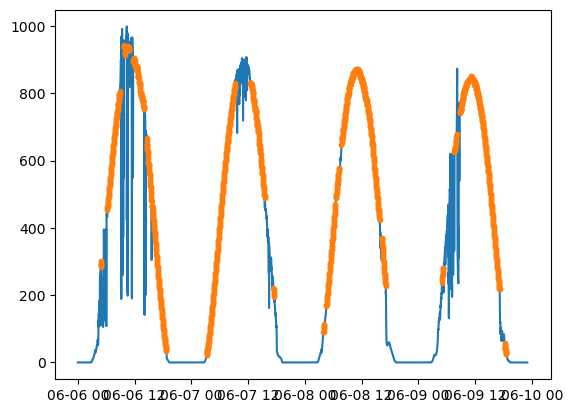
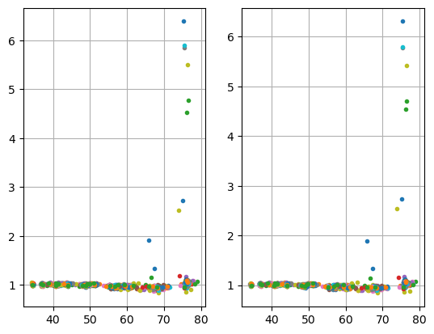
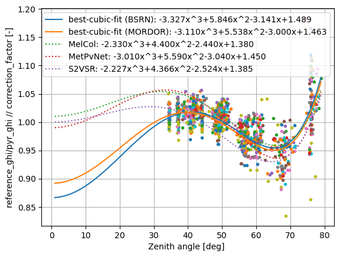

## 2014 IOPRAO
```
processed with pyrnet-0.2.16
```

The PyrNet was setup for calibration in a dense array on the Melpitz measurement field from 2015-05-06 to 2015-05-11. Cross-calibration is done versus reference observations from the TROPOS MObile RaDiation ObseRvatory (MORDOR) station.

### Imports


```python
#|dropcode
from IPython.display import display, Latex
import os
import xarray as xr
import pandas as pd
import numpy as np
import datetime as dt
import matplotlib.pyplot as plt
import jstyleson as json

from scipy.optimize import differential_evolution

from pvlib import clearsky
from pvlib.location import Location

import pyrnet.pyrnet
import pyrnet.utils
```

### Prepare PyrNet data
For calibration preparation the PyrNet data is processed to level l1b using a calibration factor of **7 (uV W-1 m2)** for all pyranometers with the ```pyrnet process l1b``` tool. This is done to unify the conversion to sensor voltage during calibration and not run into valid_range limits for netcdf encoding. 

> Before running this notebook, new absolute calibration factors have to be determined with calibration_melcol.ipynb

### Configuration
Set local data paths and lookup metadata.


```python
pf_mordor = "mordor/{date:%Y/%m/%Y-%m-%d}_Radiation.dat"
pf_bsrn = "bsrn/{date:%Y-%m}_bsrn.tab"
pf_pyrnet = "l1b_network/{date:%Y-%m-%d}_P1D_pyrnet_ioprao_n000l1bf1s.c01.nc"
dates = pd.date_range("2014-06-04","2014-07-18")
# period with lots of clear sky situations
dates = pd.date_range("2014-06-06","2014-06-09")
stations = np.arange(1,101)

loc = Location(52.21, 14.122, altitude=125) # Lindenberg

# lookup which box contains actually a pyranometer/ extra pyranometer
mainmask = [] 
for box in stations:
    _, serials, _, _ = pyrnet.pyrnet.meta_lookup(dates[0],box=box)
    mainmask.append( True if len(serials[0])>0 else False )
```

#### Load reference MORDOR data
The reference data of MORDOR is loaded, and clearsky is detected on daily basis using solis_simple clearsky model and the pvlib.clearsky.detect_clearsky function.


```python
#|dropcode
#|dropout
new = True
for i,date in enumerate(dates):
    fname = pf_mordor.format(date=date)
    if not os.path.exists(fname):
        continue
    df = pd.read_csv(
        fname,
        header=0,
        skiprows=[0,2,3],
        date_format="ISO8601",
        na_values=["NAN"],
        parse_dates=[0],
        index_col=0
    )
    dst = df.to_xarray().rename({"TIMESTAMP":"time"})

    # drop not needed variables
    keep_vars = ['TP2_Wm2'] # global shortwave irradiance
    drop_vars = [v for v in dst if v not in keep_vars]
    dst = dst.drop_vars(drop_vars)
    dst = dst.resample(time="1min").mean(skipna=True)

    cs = loc.get_clearsky(pd.to_datetime(dst.time.values),model='simplified_solis')
    try:
        cs_mask = clearsky.detect_clearsky(
            dst['TP2_Wm2'].values,
            cs['ghi'],
            times=pd.to_datetime(dst.time.values)
        )    
    except:
        cs_mask = np.zeros(dst.time.size).astype(bool)

    dst = dst.assign({"cs_mask":("time", cs_mask)})
    
    # merge
    if new:
        ds = dst.copy()
        new = False
    else:
        ds = xr.concat((ds,dst),dim='time', data_vars='minimal', coords='minimal', compat='override')

mordor = ds.copy()
mordor = mordor.drop_duplicates("time", keep="last")
mordor
```


<div><svg style="position: absolute; width: 0; height: 0; overflow: hidden">
<defs>
<symbol id="icon-database" viewBox="0 0 32 32">
<path d="M16 0c-8.837 0-16 2.239-16 5v4c0 2.761 7.163 5 16 5s16-2.239 16-5v-4c0-2.761-7.163-5-16-5z"></path>
<path d="M16 17c-8.837 0-16-2.239-16-5v6c0 2.761 7.163 5 16 5s16-2.239 16-5v-6c0 2.761-7.163 5-16 5z"></path>
<path d="M16 26c-8.837 0-16-2.239-16-5v6c0 2.761 7.163 5 16 5s16-2.239 16-5v-6c0 2.761-7.163 5-16 5z"></path>
</symbol>
<symbol id="icon-file-text2" viewBox="0 0 32 32">
<path d="M28.681 7.159c-0.694-0.947-1.662-2.053-2.724-3.116s-2.169-2.030-3.116-2.724c-1.612-1.182-2.393-1.319-2.841-1.319h-15.5c-1.378 0-2.5 1.121-2.5 2.5v27c0 1.378 1.122 2.5 2.5 2.5h23c1.378 0 2.5-1.122 2.5-2.5v-19.5c0-0.448-0.137-1.23-1.319-2.841zM24.543 5.457c0.959 0.959 1.712 1.825 2.268 2.543h-4.811v-4.811c0.718 0.556 1.584 1.309 2.543 2.268zM28 29.5c0 0.271-0.229 0.5-0.5 0.5h-23c-0.271 0-0.5-0.229-0.5-0.5v-27c0-0.271 0.229-0.5 0.5-0.5 0 0 15.499-0 15.5 0v7c0 0.552 0.448 1 1 1h7v19.5z"></path>
<path d="M23 26h-14c-0.552 0-1-0.448-1-1s0.448-1 1-1h14c0.552 0 1 0.448 1 1s-0.448 1-1 1z"></path>
<path d="M23 22h-14c-0.552 0-1-0.448-1-1s0.448-1 1-1h14c0.552 0 1 0.448 1 1s-0.448 1-1 1z"></path>
<path d="M23 18h-14c-0.552 0-1-0.448-1-1s0.448-1 1-1h14c0.552 0 1 0.448 1 1s-0.448 1-1 1z"></path>
</symbol>
</defs>
</svg>
<style>/* CSS stylesheet for displaying xarray objects in jupyterlab.
 *
 */

:root {
  --xr-font-color0: var(--jp-content-font-color0, rgba(0, 0, 0, 1));
  --xr-font-color2: var(--jp-content-font-color2, rgba(0, 0, 0, 0.54));
  --xr-font-color3: var(--jp-content-font-color3, rgba(0, 0, 0, 0.38));
  --xr-border-color: var(--jp-border-color2, #e0e0e0);
  --xr-disabled-color: var(--jp-layout-color3, #bdbdbd);
  --xr-background-color: var(--jp-layout-color0, white);
  --xr-background-color-row-even: var(--jp-layout-color1, white);
  --xr-background-color-row-odd: var(--jp-layout-color2, #eeeeee);
}

html[theme=dark],
body[data-theme=dark],
body.vscode-dark {
  --xr-font-color0: rgba(255, 255, 255, 1);
  --xr-font-color2: rgba(255, 255, 255, 0.54);
  --xr-font-color3: rgba(255, 255, 255, 0.38);
  --xr-border-color: #1F1F1F;
  --xr-disabled-color: #515151;
  --xr-background-color: #111111;
  --xr-background-color-row-even: #111111;
  --xr-background-color-row-odd: #313131;
}

.xr-wrap {
  display: block !important;
  min-width: 300px;
  max-width: 700px;
}

.xr-text-repr-fallback {
  /* fallback to plain text repr when CSS is not injected (untrusted notebook) */
  display: none;
}

.xr-header {
  padding-top: 6px;
  padding-bottom: 6px;
  margin-bottom: 4px;
  border-bottom: solid 1px var(--xr-border-color);
}

.xr-header > div,
.xr-header > ul {
  display: inline;
  margin-top: 0;
  margin-bottom: 0;
}

.xr-obj-type,
.xr-array-name {
  margin-left: 2px;
  margin-right: 10px;
}

.xr-obj-type {
  color: var(--xr-font-color2);
}

.xr-sections {
  padding-left: 0 !important;
  display: grid;
  grid-template-columns: 150px auto auto 1fr 20px 20px;
}

.xr-section-item {
  display: contents;
}

.xr-section-item input {
  display: none;
}

.xr-section-item input + label {
  color: var(--xr-disabled-color);
}

.xr-section-item input:enabled + label {
  cursor: pointer;
  color: var(--xr-font-color2);
}

.xr-section-item input:enabled + label:hover {
  color: var(--xr-font-color0);
}

.xr-section-summary {
  grid-column: 1;
  color: var(--xr-font-color2);
  font-weight: 500;
}

.xr-section-summary > span {
  display: inline-block;
  padding-left: 0.5em;
}

.xr-section-summary-in:disabled + label {
  color: var(--xr-font-color2);
}

.xr-section-summary-in + label:before {
  display: inline-block;
  content: '►';
  font-size: 11px;
  width: 15px;
  text-align: center;
}

.xr-section-summary-in:disabled + label:before {
  color: var(--xr-disabled-color);
}

.xr-section-summary-in:checked + label:before {
  content: '▼';
}

.xr-section-summary-in:checked + label > span {
  display: none;
}

.xr-section-summary,
.xr-section-inline-details {
  padding-top: 4px;
  padding-bottom: 4px;
}

.xr-section-inline-details {
  grid-column: 2 / -1;
}

.xr-section-details {
  display: none;
  grid-column: 1 / -1;
  margin-bottom: 5px;
}

.xr-section-summary-in:checked ~ .xr-section-details {
  display: contents;
}

.xr-array-wrap {
  grid-column: 1 / -1;
  display: grid;
  grid-template-columns: 20px auto;
}

.xr-array-wrap > label {
  grid-column: 1;
  vertical-align: top;
}

.xr-preview {
  color: var(--xr-font-color3);
}

.xr-array-preview,
.xr-array-data {
  padding: 0 5px !important;
  grid-column: 2;
}

.xr-array-data,
.xr-array-in:checked ~ .xr-array-preview {
  display: none;
}

.xr-array-in:checked ~ .xr-array-data,
.xr-array-preview {
  display: inline-block;
}

.xr-dim-list {
  display: inline-block !important;
  list-style: none;
  padding: 0 !important;
  margin: 0;
}

.xr-dim-list li {
  display: inline-block;
  padding: 0;
  margin: 0;
}

.xr-dim-list:before {
  content: '(';
}

.xr-dim-list:after {
  content: ')';
}

.xr-dim-list li:not(:last-child):after {
  content: ',';
  padding-right: 5px;
}

.xr-has-index {
  font-weight: bold;
}

.xr-var-list,
.xr-var-item {
  display: contents;
}

.xr-var-item > div,
.xr-var-item label,
.xr-var-item > .xr-var-name span {
  background-color: var(--xr-background-color-row-even);
  margin-bottom: 0;
}

.xr-var-item > .xr-var-name:hover span {
  padding-right: 5px;
}

.xr-var-list > li:nth-child(odd) > div,
.xr-var-list > li:nth-child(odd) > label,
.xr-var-list > li:nth-child(odd) > .xr-var-name span {
  background-color: var(--xr-background-color-row-odd);
}

.xr-var-name {
  grid-column: 1;
}

.xr-var-dims {
  grid-column: 2;
}

.xr-var-dtype {
  grid-column: 3;
  text-align: right;
  color: var(--xr-font-color2);
}

.xr-var-preview {
  grid-column: 4;
}

.xr-index-preview {
  grid-column: 2 / 5;
  color: var(--xr-font-color2);
}

.xr-var-name,
.xr-var-dims,
.xr-var-dtype,
.xr-preview,
.xr-attrs dt {
  white-space: nowrap;
  overflow: hidden;
  text-overflow: ellipsis;
  padding-right: 10px;
}

.xr-var-name:hover,
.xr-var-dims:hover,
.xr-var-dtype:hover,
.xr-attrs dt:hover {
  overflow: visible;
  width: auto;
  z-index: 1;
}

.xr-var-attrs,
.xr-var-data,
.xr-index-data {
  display: none;
  background-color: var(--xr-background-color) !important;
  padding-bottom: 5px !important;
}

.xr-var-attrs-in:checked ~ .xr-var-attrs,
.xr-var-data-in:checked ~ .xr-var-data,
.xr-index-data-in:checked ~ .xr-index-data {
  display: block;
}

.xr-var-data > table {
  float: right;
}

.xr-var-name span,
.xr-var-data,
.xr-index-name div,
.xr-index-data,
.xr-attrs {
  padding-left: 25px !important;
}

.xr-attrs,
.xr-var-attrs,
.xr-var-data,
.xr-index-data {
  grid-column: 1 / -1;
}

dl.xr-attrs {
  padding: 0;
  margin: 0;
  display: grid;
  grid-template-columns: 125px auto;
}

.xr-attrs dt,
.xr-attrs dd {
  padding: 0;
  margin: 0;
  float: left;
  padding-right: 10px;
  width: auto;
}

.xr-attrs dt {
  font-weight: normal;
  grid-column: 1;
}

.xr-attrs dt:hover span {
  display: inline-block;
  background: var(--xr-background-color);
  padding-right: 10px;
}

.xr-attrs dd {
  grid-column: 2;
  white-space: pre-wrap;
  word-break: break-all;
}

.xr-icon-database,
.xr-icon-file-text2,
.xr-no-icon {
  display: inline-block;
  vertical-align: middle;
  width: 1em;
  height: 1.5em !important;
  stroke-width: 0;
  stroke: currentColor;
  fill: currentColor;
}
</style><pre class='xr-text-repr-fallback'>&lt;xarray.Dataset&gt;
Dimensions:  (time: 5719)
Coordinates:
  * time     (time) datetime64[ns] 2014-06-06 ... 2014-06-09T23:18:00
Data variables:
    TP2_Wm2  (time) float64 0.0 0.0 0.0 0.0 0.0 0.0 ... nan nan nan nan nan 0.0
    cs_mask  (time) bool False False False False ... False False False False</pre><div class='xr-wrap' style='display:none'><div class='xr-header'><div class='xr-obj-type'>xarray.Dataset</div></div><ul class='xr-sections'><li class='xr-section-item'><input id='section-af5fc131-e66a-45f8-a9f0-bc56339b80a8' class='xr-section-summary-in' type='checkbox' disabled ><label for='section-af5fc131-e66a-45f8-a9f0-bc56339b80a8' class='xr-section-summary'  title='Expand/collapse section'>Dimensions:</label><div class='xr-section-inline-details'><ul class='xr-dim-list'><li><span class='xr-has-index'>time</span>: 5719</li></ul></div><div class='xr-section-details'></div></li><li class='xr-section-item'><input id='section-ca1eeb0f-122e-4060-8fc9-3daeefec4cf4' class='xr-section-summary-in' type='checkbox'  checked><label for='section-ca1eeb0f-122e-4060-8fc9-3daeefec4cf4' class='xr-section-summary' >Coordinates: <span>(1)</span></label><div class='xr-section-inline-details'></div><div class='xr-section-details'><ul class='xr-var-list'><li class='xr-var-item'><div class='xr-var-name'><span class='xr-has-index'>time</span></div><div class='xr-var-dims'>(time)</div><div class='xr-var-dtype'>datetime64[ns]</div><div class='xr-var-preview xr-preview'>2014-06-06 ... 2014-06-09T23:18:00</div><input id='attrs-92f668c9-a1fc-49ce-af33-3e1e2c2071c7' class='xr-var-attrs-in' type='checkbox' disabled><label for='attrs-92f668c9-a1fc-49ce-af33-3e1e2c2071c7' title='Show/Hide attributes'><svg class='icon xr-icon-file-text2'><use xlink:href='#icon-file-text2'></use></svg></label><input id='data-9d5951ab-ea82-49f0-a4d7-b6a0687bcd9f' class='xr-var-data-in' type='checkbox'><label for='data-9d5951ab-ea82-49f0-a4d7-b6a0687bcd9f' title='Show/Hide data repr'><svg class='icon xr-icon-database'><use xlink:href='#icon-database'></use></svg></label><div class='xr-var-attrs'><dl class='xr-attrs'></dl></div><div class='xr-var-data'><pre>array([&#x27;2014-06-06T00:00:00.000000000&#x27;, &#x27;2014-06-06T00:01:00.000000000&#x27;,
       &#x27;2014-06-06T00:02:00.000000000&#x27;, ..., &#x27;2014-06-09T23:16:00.000000000&#x27;,
       &#x27;2014-06-09T23:17:00.000000000&#x27;, &#x27;2014-06-09T23:18:00.000000000&#x27;],
      dtype=&#x27;datetime64[ns]&#x27;)</pre></div></li></ul></div></li><li class='xr-section-item'><input id='section-17be933a-6ca3-4baa-8947-a5184b6fe1c7' class='xr-section-summary-in' type='checkbox'  checked><label for='section-17be933a-6ca3-4baa-8947-a5184b6fe1c7' class='xr-section-summary' >Data variables: <span>(2)</span></label><div class='xr-section-inline-details'></div><div class='xr-section-details'><ul class='xr-var-list'><li class='xr-var-item'><div class='xr-var-name'><span>TP2_Wm2</span></div><div class='xr-var-dims'>(time)</div><div class='xr-var-dtype'>float64</div><div class='xr-var-preview xr-preview'>0.0 0.0 0.0 0.0 ... nan nan nan 0.0</div><input id='attrs-c452da14-e5b8-479f-9171-ca7782d05e0f' class='xr-var-attrs-in' type='checkbox' disabled><label for='attrs-c452da14-e5b8-479f-9171-ca7782d05e0f' title='Show/Hide attributes'><svg class='icon xr-icon-file-text2'><use xlink:href='#icon-file-text2'></use></svg></label><input id='data-21aa58c2-ccf4-477f-95ee-00cda227969f' class='xr-var-data-in' type='checkbox'><label for='data-21aa58c2-ccf4-477f-95ee-00cda227969f' title='Show/Hide data repr'><svg class='icon xr-icon-database'><use xlink:href='#icon-database'></use></svg></label><div class='xr-var-attrs'><dl class='xr-attrs'></dl></div><div class='xr-var-data'><pre>array([ 0.,  0.,  0., ..., nan, nan,  0.])</pre></div></li><li class='xr-var-item'><div class='xr-var-name'><span>cs_mask</span></div><div class='xr-var-dims'>(time)</div><div class='xr-var-dtype'>bool</div><div class='xr-var-preview xr-preview'>False False False ... False False</div><input id='attrs-9d3f7e49-34a1-4857-9ac0-b4de05b6091e' class='xr-var-attrs-in' type='checkbox' disabled><label for='attrs-9d3f7e49-34a1-4857-9ac0-b4de05b6091e' title='Show/Hide attributes'><svg class='icon xr-icon-file-text2'><use xlink:href='#icon-file-text2'></use></svg></label><input id='data-11021341-dd8a-469e-8a92-87b9f79c1e5d' class='xr-var-data-in' type='checkbox'><label for='data-11021341-dd8a-469e-8a92-87b9f79c1e5d' title='Show/Hide data repr'><svg class='icon xr-icon-database'><use xlink:href='#icon-database'></use></svg></label><div class='xr-var-attrs'><dl class='xr-attrs'></dl></div><div class='xr-var-data'><pre>array([False, False, False, ..., False, False, False])</pre></div></li></ul></div></li><li class='xr-section-item'><input id='section-942d2f4d-15e5-4c17-a7f6-a014fe9a5fa4' class='xr-section-summary-in' type='checkbox'  ><label for='section-942d2f4d-15e5-4c17-a7f6-a014fe9a5fa4' class='xr-section-summary' >Indexes: <span>(1)</span></label><div class='xr-section-inline-details'></div><div class='xr-section-details'><ul class='xr-var-list'><li class='xr-var-item'><div class='xr-index-name'><div>time</div></div><div class='xr-index-preview'>PandasIndex</div><div></div><input id='index-0f6b70b5-b71f-4ddc-a113-005fec07c5c2' class='xr-index-data-in' type='checkbox'/><label for='index-0f6b70b5-b71f-4ddc-a113-005fec07c5c2' title='Show/Hide index repr'><svg class='icon xr-icon-database'><use xlink:href='#icon-database'></use></svg></label><div class='xr-index-data'><pre>PandasIndex(DatetimeIndex([&#x27;2014-06-06 00:00:00&#x27;, &#x27;2014-06-06 00:01:00&#x27;,
               &#x27;2014-06-06 00:02:00&#x27;, &#x27;2014-06-06 00:03:00&#x27;,
               &#x27;2014-06-06 00:04:00&#x27;, &#x27;2014-06-06 00:05:00&#x27;,
               &#x27;2014-06-06 00:06:00&#x27;, &#x27;2014-06-06 00:07:00&#x27;,
               &#x27;2014-06-06 00:08:00&#x27;, &#x27;2014-06-06 00:09:00&#x27;,
               ...
               &#x27;2014-06-09 23:09:00&#x27;, &#x27;2014-06-09 23:10:00&#x27;,
               &#x27;2014-06-09 23:11:00&#x27;, &#x27;2014-06-09 23:12:00&#x27;,
               &#x27;2014-06-09 23:13:00&#x27;, &#x27;2014-06-09 23:14:00&#x27;,
               &#x27;2014-06-09 23:15:00&#x27;, &#x27;2014-06-09 23:16:00&#x27;,
               &#x27;2014-06-09 23:17:00&#x27;, &#x27;2014-06-09 23:18:00&#x27;],
              dtype=&#x27;datetime64[ns]&#x27;, name=&#x27;time&#x27;, length=5719, freq=&#x27;T&#x27;))</pre></div></li></ul></div></li><li class='xr-section-item'><input id='section-b9069589-8cf4-4aa7-b62a-947d87c420b1' class='xr-section-summary-in' type='checkbox' disabled ><label for='section-b9069589-8cf4-4aa7-b62a-947d87c420b1' class='xr-section-summary'  title='Expand/collapse section'>Attributes: <span>(0)</span></label><div class='xr-section-inline-details'></div><div class='xr-section-details'><dl class='xr-attrs'></dl></div></li></ul></div></div>


```python
fig,ax = plt.subplots(1,1)
ax.plot(mordor.time,mordor.TP2_Wm2)
ax.plot(mordor.time[mordor.cs_mask],mordor.TP2_Wm2[mordor.cs_mask],ls='',marker='.')
```


    [<matplotlib.lines.Line2D at 0x7fb251202b60>]


    

    


#### Load BSRN data


```python
umonth = np.unique(dates.values.astype("datetime64[M]"))

new = True
for month in umonth:
    fname = pf_bsrn.format(date=pd.to_datetime(month))
    if not os.path.exists(fname):
        continue
    df = pd.read_csv(
        fname,
        sep='\s+',
        header=None,
        skiprows=34,
        date_format="ISO8601",
        parse_dates=[0],
        index_col=0,
        names=["time","SWD"],
        usecols=[0,2]
    )
    dst = df.to_xarray()

    dst.SWD.values[dst.SWD.values<0] = 0
    dst.SWD.values = dst.SWD.values.astype(float)

    cs = loc.get_clearsky(pd.to_datetime(dst.time.values),model='simplified_solis')
    
    try:
        cs_mask = clearsky.detect_clearsky(
            dst['SWD'].values,
            cs['ghi'].values,
            times=pd.to_datetime(dst.time.values),
            window_length=60
        ) 
    except:
        cs_mask = np.zeros(dst.time.size).astype(bool)

    dst = dst.assign({"cs_mask":("time", cs_mask)})
    
    # merge
    if new:
        ds = dst.copy()
        new = False
    else:
        ds = xr.concat((ds,dst),dim='time', data_vars='minimal', coords='minimal', compat='override')


bsrn = ds.copy()
bsrn = bsrn.drop_duplicates("time", keep="last")
bsrn
```


<div><svg style="position: absolute; width: 0; height: 0; overflow: hidden">
<defs>
<symbol id="icon-database" viewBox="0 0 32 32">
<path d="M16 0c-8.837 0-16 2.239-16 5v4c0 2.761 7.163 5 16 5s16-2.239 16-5v-4c0-2.761-7.163-5-16-5z"></path>
<path d="M16 17c-8.837 0-16-2.239-16-5v6c0 2.761 7.163 5 16 5s16-2.239 16-5v-6c0 2.761-7.163 5-16 5z"></path>
<path d="M16 26c-8.837 0-16-2.239-16-5v6c0 2.761 7.163 5 16 5s16-2.239 16-5v-6c0 2.761-7.163 5-16 5z"></path>
</symbol>
<symbol id="icon-file-text2" viewBox="0 0 32 32">
<path d="M28.681 7.159c-0.694-0.947-1.662-2.053-2.724-3.116s-2.169-2.030-3.116-2.724c-1.612-1.182-2.393-1.319-2.841-1.319h-15.5c-1.378 0-2.5 1.121-2.5 2.5v27c0 1.378 1.122 2.5 2.5 2.5h23c1.378 0 2.5-1.122 2.5-2.5v-19.5c0-0.448-0.137-1.23-1.319-2.841zM24.543 5.457c0.959 0.959 1.712 1.825 2.268 2.543h-4.811v-4.811c0.718 0.556 1.584 1.309 2.543 2.268zM28 29.5c0 0.271-0.229 0.5-0.5 0.5h-23c-0.271 0-0.5-0.229-0.5-0.5v-27c0-0.271 0.229-0.5 0.5-0.5 0 0 15.499-0 15.5 0v7c0 0.552 0.448 1 1 1h7v19.5z"></path>
<path d="M23 26h-14c-0.552 0-1-0.448-1-1s0.448-1 1-1h14c0.552 0 1 0.448 1 1s-0.448 1-1 1z"></path>
<path d="M23 22h-14c-0.552 0-1-0.448-1-1s0.448-1 1-1h14c0.552 0 1 0.448 1 1s-0.448 1-1 1z"></path>
<path d="M23 18h-14c-0.552 0-1-0.448-1-1s0.448-1 1-1h14c0.552 0 1 0.448 1 1s-0.448 1-1 1z"></path>
</symbol>
</defs>
</svg>
<style>/* CSS stylesheet for displaying xarray objects in jupyterlab.
 *
 */

:root {
  --xr-font-color0: var(--jp-content-font-color0, rgba(0, 0, 0, 1));
  --xr-font-color2: var(--jp-content-font-color2, rgba(0, 0, 0, 0.54));
  --xr-font-color3: var(--jp-content-font-color3, rgba(0, 0, 0, 0.38));
  --xr-border-color: var(--jp-border-color2, #e0e0e0);
  --xr-disabled-color: var(--jp-layout-color3, #bdbdbd);
  --xr-background-color: var(--jp-layout-color0, white);
  --xr-background-color-row-even: var(--jp-layout-color1, white);
  --xr-background-color-row-odd: var(--jp-layout-color2, #eeeeee);
}

html[theme=dark],
body[data-theme=dark],
body.vscode-dark {
  --xr-font-color0: rgba(255, 255, 255, 1);
  --xr-font-color2: rgba(255, 255, 255, 0.54);
  --xr-font-color3: rgba(255, 255, 255, 0.38);
  --xr-border-color: #1F1F1F;
  --xr-disabled-color: #515151;
  --xr-background-color: #111111;
  --xr-background-color-row-even: #111111;
  --xr-background-color-row-odd: #313131;
}

.xr-wrap {
  display: block !important;
  min-width: 300px;
  max-width: 700px;
}

.xr-text-repr-fallback {
  /* fallback to plain text repr when CSS is not injected (untrusted notebook) */
  display: none;
}

.xr-header {
  padding-top: 6px;
  padding-bottom: 6px;
  margin-bottom: 4px;
  border-bottom: solid 1px var(--xr-border-color);
}

.xr-header > div,
.xr-header > ul {
  display: inline;
  margin-top: 0;
  margin-bottom: 0;
}

.xr-obj-type,
.xr-array-name {
  margin-left: 2px;
  margin-right: 10px;
}

.xr-obj-type {
  color: var(--xr-font-color2);
}

.xr-sections {
  padding-left: 0 !important;
  display: grid;
  grid-template-columns: 150px auto auto 1fr 20px 20px;
}

.xr-section-item {
  display: contents;
}

.xr-section-item input {
  display: none;
}

.xr-section-item input + label {
  color: var(--xr-disabled-color);
}

.xr-section-item input:enabled + label {
  cursor: pointer;
  color: var(--xr-font-color2);
}

.xr-section-item input:enabled + label:hover {
  color: var(--xr-font-color0);
}

.xr-section-summary {
  grid-column: 1;
  color: var(--xr-font-color2);
  font-weight: 500;
}

.xr-section-summary > span {
  display: inline-block;
  padding-left: 0.5em;
}

.xr-section-summary-in:disabled + label {
  color: var(--xr-font-color2);
}

.xr-section-summary-in + label:before {
  display: inline-block;
  content: '►';
  font-size: 11px;
  width: 15px;
  text-align: center;
}

.xr-section-summary-in:disabled + label:before {
  color: var(--xr-disabled-color);
}

.xr-section-summary-in:checked + label:before {
  content: '▼';
}

.xr-section-summary-in:checked + label > span {
  display: none;
}

.xr-section-summary,
.xr-section-inline-details {
  padding-top: 4px;
  padding-bottom: 4px;
}

.xr-section-inline-details {
  grid-column: 2 / -1;
}

.xr-section-details {
  display: none;
  grid-column: 1 / -1;
  margin-bottom: 5px;
}

.xr-section-summary-in:checked ~ .xr-section-details {
  display: contents;
}

.xr-array-wrap {
  grid-column: 1 / -1;
  display: grid;
  grid-template-columns: 20px auto;
}

.xr-array-wrap > label {
  grid-column: 1;
  vertical-align: top;
}

.xr-preview {
  color: var(--xr-font-color3);
}

.xr-array-preview,
.xr-array-data {
  padding: 0 5px !important;
  grid-column: 2;
}

.xr-array-data,
.xr-array-in:checked ~ .xr-array-preview {
  display: none;
}

.xr-array-in:checked ~ .xr-array-data,
.xr-array-preview {
  display: inline-block;
}

.xr-dim-list {
  display: inline-block !important;
  list-style: none;
  padding: 0 !important;
  margin: 0;
}

.xr-dim-list li {
  display: inline-block;
  padding: 0;
  margin: 0;
}

.xr-dim-list:before {
  content: '(';
}

.xr-dim-list:after {
  content: ')';
}

.xr-dim-list li:not(:last-child):after {
  content: ',';
  padding-right: 5px;
}

.xr-has-index {
  font-weight: bold;
}

.xr-var-list,
.xr-var-item {
  display: contents;
}

.xr-var-item > div,
.xr-var-item label,
.xr-var-item > .xr-var-name span {
  background-color: var(--xr-background-color-row-even);
  margin-bottom: 0;
}

.xr-var-item > .xr-var-name:hover span {
  padding-right: 5px;
}

.xr-var-list > li:nth-child(odd) > div,
.xr-var-list > li:nth-child(odd) > label,
.xr-var-list > li:nth-child(odd) > .xr-var-name span {
  background-color: var(--xr-background-color-row-odd);
}

.xr-var-name {
  grid-column: 1;
}

.xr-var-dims {
  grid-column: 2;
}

.xr-var-dtype {
  grid-column: 3;
  text-align: right;
  color: var(--xr-font-color2);
}

.xr-var-preview {
  grid-column: 4;
}

.xr-index-preview {
  grid-column: 2 / 5;
  color: var(--xr-font-color2);
}

.xr-var-name,
.xr-var-dims,
.xr-var-dtype,
.xr-preview,
.xr-attrs dt {
  white-space: nowrap;
  overflow: hidden;
  text-overflow: ellipsis;
  padding-right: 10px;
}

.xr-var-name:hover,
.xr-var-dims:hover,
.xr-var-dtype:hover,
.xr-attrs dt:hover {
  overflow: visible;
  width: auto;
  z-index: 1;
}

.xr-var-attrs,
.xr-var-data,
.xr-index-data {
  display: none;
  background-color: var(--xr-background-color) !important;
  padding-bottom: 5px !important;
}

.xr-var-attrs-in:checked ~ .xr-var-attrs,
.xr-var-data-in:checked ~ .xr-var-data,
.xr-index-data-in:checked ~ .xr-index-data {
  display: block;
}

.xr-var-data > table {
  float: right;
}

.xr-var-name span,
.xr-var-data,
.xr-index-name div,
.xr-index-data,
.xr-attrs {
  padding-left: 25px !important;
}

.xr-attrs,
.xr-var-attrs,
.xr-var-data,
.xr-index-data {
  grid-column: 1 / -1;
}

dl.xr-attrs {
  padding: 0;
  margin: 0;
  display: grid;
  grid-template-columns: 125px auto;
}

.xr-attrs dt,
.xr-attrs dd {
  padding: 0;
  margin: 0;
  float: left;
  padding-right: 10px;
  width: auto;
}

.xr-attrs dt {
  font-weight: normal;
  grid-column: 1;
}

.xr-attrs dt:hover span {
  display: inline-block;
  background: var(--xr-background-color);
  padding-right: 10px;
}

.xr-attrs dd {
  grid-column: 2;
  white-space: pre-wrap;
  word-break: break-all;
}

.xr-icon-database,
.xr-icon-file-text2,
.xr-no-icon {
  display: inline-block;
  vertical-align: middle;
  width: 1em;
  height: 1.5em !important;
  stroke-width: 0;
  stroke: currentColor;
  fill: currentColor;
}
</style><pre class='xr-text-repr-fallback'>&lt;xarray.Dataset&gt;
Dimensions:  (time: 43200)
Coordinates:
  * time     (time) datetime64[ns] 2014-06-01 ... 2014-06-30T23:59:00
Data variables:
    SWD      (time) float64 1.0 0.0 0.0 0.0 0.0 0.0 ... 0.0 0.0 0.0 0.0 0.0 0.0
    cs_mask  (time) bool False False False False ... False False False False</pre><div class='xr-wrap' style='display:none'><div class='xr-header'><div class='xr-obj-type'>xarray.Dataset</div></div><ul class='xr-sections'><li class='xr-section-item'><input id='section-6f2e958d-ad2f-4889-8fe0-d241f7ca96c9' class='xr-section-summary-in' type='checkbox' disabled ><label for='section-6f2e958d-ad2f-4889-8fe0-d241f7ca96c9' class='xr-section-summary'  title='Expand/collapse section'>Dimensions:</label><div class='xr-section-inline-details'><ul class='xr-dim-list'><li><span class='xr-has-index'>time</span>: 43200</li></ul></div><div class='xr-section-details'></div></li><li class='xr-section-item'><input id='section-89ce024c-91c5-4e96-a090-a7fa22a4893a' class='xr-section-summary-in' type='checkbox'  checked><label for='section-89ce024c-91c5-4e96-a090-a7fa22a4893a' class='xr-section-summary' >Coordinates: <span>(1)</span></label><div class='xr-section-inline-details'></div><div class='xr-section-details'><ul class='xr-var-list'><li class='xr-var-item'><div class='xr-var-name'><span class='xr-has-index'>time</span></div><div class='xr-var-dims'>(time)</div><div class='xr-var-dtype'>datetime64[ns]</div><div class='xr-var-preview xr-preview'>2014-06-01 ... 2014-06-30T23:59:00</div><input id='attrs-b10516bb-f02b-443c-ba16-2918bbf6fc45' class='xr-var-attrs-in' type='checkbox' disabled><label for='attrs-b10516bb-f02b-443c-ba16-2918bbf6fc45' title='Show/Hide attributes'><svg class='icon xr-icon-file-text2'><use xlink:href='#icon-file-text2'></use></svg></label><input id='data-abf7de62-fa61-431a-84b9-aec1907ff249' class='xr-var-data-in' type='checkbox'><label for='data-abf7de62-fa61-431a-84b9-aec1907ff249' title='Show/Hide data repr'><svg class='icon xr-icon-database'><use xlink:href='#icon-database'></use></svg></label><div class='xr-var-attrs'><dl class='xr-attrs'></dl></div><div class='xr-var-data'><pre>array([&#x27;2014-06-01T00:00:00.000000000&#x27;, &#x27;2014-06-01T00:01:00.000000000&#x27;,
       &#x27;2014-06-01T00:02:00.000000000&#x27;, ..., &#x27;2014-06-30T23:57:00.000000000&#x27;,
       &#x27;2014-06-30T23:58:00.000000000&#x27;, &#x27;2014-06-30T23:59:00.000000000&#x27;],
      dtype=&#x27;datetime64[ns]&#x27;)</pre></div></li></ul></div></li><li class='xr-section-item'><input id='section-3d93c3f0-ff74-4487-9838-dee1b6c1306f' class='xr-section-summary-in' type='checkbox'  checked><label for='section-3d93c3f0-ff74-4487-9838-dee1b6c1306f' class='xr-section-summary' >Data variables: <span>(2)</span></label><div class='xr-section-inline-details'></div><div class='xr-section-details'><ul class='xr-var-list'><li class='xr-var-item'><div class='xr-var-name'><span>SWD</span></div><div class='xr-var-dims'>(time)</div><div class='xr-var-dtype'>float64</div><div class='xr-var-preview xr-preview'>1.0 0.0 0.0 0.0 ... 0.0 0.0 0.0 0.0</div><input id='attrs-f503e548-6092-49bb-b5d1-0e11c98498eb' class='xr-var-attrs-in' type='checkbox' disabled><label for='attrs-f503e548-6092-49bb-b5d1-0e11c98498eb' title='Show/Hide attributes'><svg class='icon xr-icon-file-text2'><use xlink:href='#icon-file-text2'></use></svg></label><input id='data-90e4b491-0bb3-4afa-941c-cd538bb52b5f' class='xr-var-data-in' type='checkbox'><label for='data-90e4b491-0bb3-4afa-941c-cd538bb52b5f' title='Show/Hide data repr'><svg class='icon xr-icon-database'><use xlink:href='#icon-database'></use></svg></label><div class='xr-var-attrs'><dl class='xr-attrs'></dl></div><div class='xr-var-data'><pre>array([1., 0., 0., ..., 0., 0., 0.])</pre></div></li><li class='xr-var-item'><div class='xr-var-name'><span>cs_mask</span></div><div class='xr-var-dims'>(time)</div><div class='xr-var-dtype'>bool</div><div class='xr-var-preview xr-preview'>False False False ... False False</div><input id='attrs-bb0f4fde-dc66-45bd-9631-543b32e1cfba' class='xr-var-attrs-in' type='checkbox' disabled><label for='attrs-bb0f4fde-dc66-45bd-9631-543b32e1cfba' title='Show/Hide attributes'><svg class='icon xr-icon-file-text2'><use xlink:href='#icon-file-text2'></use></svg></label><input id='data-f8de6ac4-911d-4a92-8085-a1dc5a89e6f9' class='xr-var-data-in' type='checkbox'><label for='data-f8de6ac4-911d-4a92-8085-a1dc5a89e6f9' title='Show/Hide data repr'><svg class='icon xr-icon-database'><use xlink:href='#icon-database'></use></svg></label><div class='xr-var-attrs'><dl class='xr-attrs'></dl></div><div class='xr-var-data'><pre>array([False, False, False, ..., False, False, False])</pre></div></li></ul></div></li><li class='xr-section-item'><input id='section-23b341d8-17a8-4924-a111-ad3646b9e7df' class='xr-section-summary-in' type='checkbox'  ><label for='section-23b341d8-17a8-4924-a111-ad3646b9e7df' class='xr-section-summary' >Indexes: <span>(1)</span></label><div class='xr-section-inline-details'></div><div class='xr-section-details'><ul class='xr-var-list'><li class='xr-var-item'><div class='xr-index-name'><div>time</div></div><div class='xr-index-preview'>PandasIndex</div><div></div><input id='index-828c534f-d343-465f-80b0-f30e9490995f' class='xr-index-data-in' type='checkbox'/><label for='index-828c534f-d343-465f-80b0-f30e9490995f' title='Show/Hide index repr'><svg class='icon xr-icon-database'><use xlink:href='#icon-database'></use></svg></label><div class='xr-index-data'><pre>PandasIndex(DatetimeIndex([&#x27;2014-06-01 00:00:00&#x27;, &#x27;2014-06-01 00:01:00&#x27;,
               &#x27;2014-06-01 00:02:00&#x27;, &#x27;2014-06-01 00:03:00&#x27;,
               &#x27;2014-06-01 00:04:00&#x27;, &#x27;2014-06-01 00:05:00&#x27;,
               &#x27;2014-06-01 00:06:00&#x27;, &#x27;2014-06-01 00:07:00&#x27;,
               &#x27;2014-06-01 00:08:00&#x27;, &#x27;2014-06-01 00:09:00&#x27;,
               ...
               &#x27;2014-06-30 23:50:00&#x27;, &#x27;2014-06-30 23:51:00&#x27;,
               &#x27;2014-06-30 23:52:00&#x27;, &#x27;2014-06-30 23:53:00&#x27;,
               &#x27;2014-06-30 23:54:00&#x27;, &#x27;2014-06-30 23:55:00&#x27;,
               &#x27;2014-06-30 23:56:00&#x27;, &#x27;2014-06-30 23:57:00&#x27;,
               &#x27;2014-06-30 23:58:00&#x27;, &#x27;2014-06-30 23:59:00&#x27;],
              dtype=&#x27;datetime64[ns]&#x27;, name=&#x27;time&#x27;, length=43200, freq=None))</pre></div></li></ul></div></li><li class='xr-section-item'><input id='section-7eaef94e-0255-4dd9-bb3e-5f2cc3111d32' class='xr-section-summary-in' type='checkbox' disabled ><label for='section-7eaef94e-0255-4dd9-bb3e-5f2cc3111d32' class='xr-section-summary'  title='Expand/collapse section'>Attributes: <span>(0)</span></label><div class='xr-section-inline-details'></div><div class='xr-section-details'><dl class='xr-attrs'></dl></div></li></ul></div></div>


#### Load PyrNet Data


```python
#|dropcode
#|dropout
for i,date in enumerate(dates):
    # read from thredds server
    dst = xr.open_dataset(pf_pyrnet.format(date=date))
    
    # drop not needed variables
    keep_vars = ['ghi','szen']
    drop_vars = [v for v in dst if v not in keep_vars]
    dst = dst.drop_vars(drop_vars)

    # unify time and station dimension to speed up merging
    date = dst.time.values[0].astype("datetime64[D]")
    timeidx = pd.date_range(date, date + np.timedelta64(1, 'D'), freq='1s', inclusive='left')
    dst = dst.interp(time=timeidx)
    dst = dst.reindex({"station": stations})

    dst.ghi.values = dst.ghi.values * 7 * 1e-6
    dst = dst.where(dst.szen<80, drop=True)
    dst.ghi.values = dst.ghi.where(dst.ghi>0.033/300.).values

    dst = dst.resample(time="1min").mean(skipna=True)
    
    # merge
    if i == 0:
        ds = dst.copy()
    else:
        ds = xr.concat((ds,dst),dim='time', data_vars='minimal', coords='minimal', compat='override')
    
pyr = ds.copy()
pyr
```


<div><svg style="position: absolute; width: 0; height: 0; overflow: hidden">
<defs>
<symbol id="icon-database" viewBox="0 0 32 32">
<path d="M16 0c-8.837 0-16 2.239-16 5v4c0 2.761 7.163 5 16 5s16-2.239 16-5v-4c0-2.761-7.163-5-16-5z"></path>
<path d="M16 17c-8.837 0-16-2.239-16-5v6c0 2.761 7.163 5 16 5s16-2.239 16-5v-6c0 2.761-7.163 5-16 5z"></path>
<path d="M16 26c-8.837 0-16-2.239-16-5v6c0 2.761 7.163 5 16 5s16-2.239 16-5v-6c0 2.761-7.163 5-16 5z"></path>
</symbol>
<symbol id="icon-file-text2" viewBox="0 0 32 32">
<path d="M28.681 7.159c-0.694-0.947-1.662-2.053-2.724-3.116s-2.169-2.030-3.116-2.724c-1.612-1.182-2.393-1.319-2.841-1.319h-15.5c-1.378 0-2.5 1.121-2.5 2.5v27c0 1.378 1.122 2.5 2.5 2.5h23c1.378 0 2.5-1.122 2.5-2.5v-19.5c0-0.448-0.137-1.23-1.319-2.841zM24.543 5.457c0.959 0.959 1.712 1.825 2.268 2.543h-4.811v-4.811c0.718 0.556 1.584 1.309 2.543 2.268zM28 29.5c0 0.271-0.229 0.5-0.5 0.5h-23c-0.271 0-0.5-0.229-0.5-0.5v-27c0-0.271 0.229-0.5 0.5-0.5 0 0 15.499-0 15.5 0v7c0 0.552 0.448 1 1 1h7v19.5z"></path>
<path d="M23 26h-14c-0.552 0-1-0.448-1-1s0.448-1 1-1h14c0.552 0 1 0.448 1 1s-0.448 1-1 1z"></path>
<path d="M23 22h-14c-0.552 0-1-0.448-1-1s0.448-1 1-1h14c0.552 0 1 0.448 1 1s-0.448 1-1 1z"></path>
<path d="M23 18h-14c-0.552 0-1-0.448-1-1s0.448-1 1-1h14c0.552 0 1 0.448 1 1s-0.448 1-1 1z"></path>
</symbol>
</defs>
</svg>
<style>/* CSS stylesheet for displaying xarray objects in jupyterlab.
 *
 */

:root {
  --xr-font-color0: var(--jp-content-font-color0, rgba(0, 0, 0, 1));
  --xr-font-color2: var(--jp-content-font-color2, rgba(0, 0, 0, 0.54));
  --xr-font-color3: var(--jp-content-font-color3, rgba(0, 0, 0, 0.38));
  --xr-border-color: var(--jp-border-color2, #e0e0e0);
  --xr-disabled-color: var(--jp-layout-color3, #bdbdbd);
  --xr-background-color: var(--jp-layout-color0, white);
  --xr-background-color-row-even: var(--jp-layout-color1, white);
  --xr-background-color-row-odd: var(--jp-layout-color2, #eeeeee);
}

html[theme=dark],
body[data-theme=dark],
body.vscode-dark {
  --xr-font-color0: rgba(255, 255, 255, 1);
  --xr-font-color2: rgba(255, 255, 255, 0.54);
  --xr-font-color3: rgba(255, 255, 255, 0.38);
  --xr-border-color: #1F1F1F;
  --xr-disabled-color: #515151;
  --xr-background-color: #111111;
  --xr-background-color-row-even: #111111;
  --xr-background-color-row-odd: #313131;
}

.xr-wrap {
  display: block !important;
  min-width: 300px;
  max-width: 700px;
}

.xr-text-repr-fallback {
  /* fallback to plain text repr when CSS is not injected (untrusted notebook) */
  display: none;
}

.xr-header {
  padding-top: 6px;
  padding-bottom: 6px;
  margin-bottom: 4px;
  border-bottom: solid 1px var(--xr-border-color);
}

.xr-header > div,
.xr-header > ul {
  display: inline;
  margin-top: 0;
  margin-bottom: 0;
}

.xr-obj-type,
.xr-array-name {
  margin-left: 2px;
  margin-right: 10px;
}

.xr-obj-type {
  color: var(--xr-font-color2);
}

.xr-sections {
  padding-left: 0 !important;
  display: grid;
  grid-template-columns: 150px auto auto 1fr 20px 20px;
}

.xr-section-item {
  display: contents;
}

.xr-section-item input {
  display: none;
}

.xr-section-item input + label {
  color: var(--xr-disabled-color);
}

.xr-section-item input:enabled + label {
  cursor: pointer;
  color: var(--xr-font-color2);
}

.xr-section-item input:enabled + label:hover {
  color: var(--xr-font-color0);
}

.xr-section-summary {
  grid-column: 1;
  color: var(--xr-font-color2);
  font-weight: 500;
}

.xr-section-summary > span {
  display: inline-block;
  padding-left: 0.5em;
}

.xr-section-summary-in:disabled + label {
  color: var(--xr-font-color2);
}

.xr-section-summary-in + label:before {
  display: inline-block;
  content: '►';
  font-size: 11px;
  width: 15px;
  text-align: center;
}

.xr-section-summary-in:disabled + label:before {
  color: var(--xr-disabled-color);
}

.xr-section-summary-in:checked + label:before {
  content: '▼';
}

.xr-section-summary-in:checked + label > span {
  display: none;
}

.xr-section-summary,
.xr-section-inline-details {
  padding-top: 4px;
  padding-bottom: 4px;
}

.xr-section-inline-details {
  grid-column: 2 / -1;
}

.xr-section-details {
  display: none;
  grid-column: 1 / -1;
  margin-bottom: 5px;
}

.xr-section-summary-in:checked ~ .xr-section-details {
  display: contents;
}

.xr-array-wrap {
  grid-column: 1 / -1;
  display: grid;
  grid-template-columns: 20px auto;
}

.xr-array-wrap > label {
  grid-column: 1;
  vertical-align: top;
}

.xr-preview {
  color: var(--xr-font-color3);
}

.xr-array-preview,
.xr-array-data {
  padding: 0 5px !important;
  grid-column: 2;
}

.xr-array-data,
.xr-array-in:checked ~ .xr-array-preview {
  display: none;
}

.xr-array-in:checked ~ .xr-array-data,
.xr-array-preview {
  display: inline-block;
}

.xr-dim-list {
  display: inline-block !important;
  list-style: none;
  padding: 0 !important;
  margin: 0;
}

.xr-dim-list li {
  display: inline-block;
  padding: 0;
  margin: 0;
}

.xr-dim-list:before {
  content: '(';
}

.xr-dim-list:after {
  content: ')';
}

.xr-dim-list li:not(:last-child):after {
  content: ',';
  padding-right: 5px;
}

.xr-has-index {
  font-weight: bold;
}

.xr-var-list,
.xr-var-item {
  display: contents;
}

.xr-var-item > div,
.xr-var-item label,
.xr-var-item > .xr-var-name span {
  background-color: var(--xr-background-color-row-even);
  margin-bottom: 0;
}

.xr-var-item > .xr-var-name:hover span {
  padding-right: 5px;
}

.xr-var-list > li:nth-child(odd) > div,
.xr-var-list > li:nth-child(odd) > label,
.xr-var-list > li:nth-child(odd) > .xr-var-name span {
  background-color: var(--xr-background-color-row-odd);
}

.xr-var-name {
  grid-column: 1;
}

.xr-var-dims {
  grid-column: 2;
}

.xr-var-dtype {
  grid-column: 3;
  text-align: right;
  color: var(--xr-font-color2);
}

.xr-var-preview {
  grid-column: 4;
}

.xr-index-preview {
  grid-column: 2 / 5;
  color: var(--xr-font-color2);
}

.xr-var-name,
.xr-var-dims,
.xr-var-dtype,
.xr-preview,
.xr-attrs dt {
  white-space: nowrap;
  overflow: hidden;
  text-overflow: ellipsis;
  padding-right: 10px;
}

.xr-var-name:hover,
.xr-var-dims:hover,
.xr-var-dtype:hover,
.xr-attrs dt:hover {
  overflow: visible;
  width: auto;
  z-index: 1;
}

.xr-var-attrs,
.xr-var-data,
.xr-index-data {
  display: none;
  background-color: var(--xr-background-color) !important;
  padding-bottom: 5px !important;
}

.xr-var-attrs-in:checked ~ .xr-var-attrs,
.xr-var-data-in:checked ~ .xr-var-data,
.xr-index-data-in:checked ~ .xr-index-data {
  display: block;
}

.xr-var-data > table {
  float: right;
}

.xr-var-name span,
.xr-var-data,
.xr-index-name div,
.xr-index-data,
.xr-attrs {
  padding-left: 25px !important;
}

.xr-attrs,
.xr-var-attrs,
.xr-var-data,
.xr-index-data {
  grid-column: 1 / -1;
}

dl.xr-attrs {
  padding: 0;
  margin: 0;
  display: grid;
  grid-template-columns: 125px auto;
}

.xr-attrs dt,
.xr-attrs dd {
  padding: 0;
  margin: 0;
  float: left;
  padding-right: 10px;
  width: auto;
}

.xr-attrs dt {
  font-weight: normal;
  grid-column: 1;
}

.xr-attrs dt:hover span {
  display: inline-block;
  background: var(--xr-background-color);
  padding-right: 10px;
}

.xr-attrs dd {
  grid-column: 2;
  white-space: pre-wrap;
  word-break: break-all;
}

.xr-icon-database,
.xr-icon-file-text2,
.xr-no-icon {
  display: inline-block;
  vertical-align: middle;
  width: 1em;
  height: 1.5em !important;
  stroke-width: 0;
  stroke: currentColor;
  fill: currentColor;
}
</style><pre class='xr-text-repr-fallback'>&lt;xarray.Dataset&gt;
Dimensions:          (time: 3319, station: 43, maintenancetime: 1)
Coordinates:
  * station          (station) int64 1 5 6 8 15 16 20 ... 90 91 92 93 95 98 99
  * maintenancetime  (maintenancetime) datetime64[ns] 2014-06-11T23:59:59
  * time             (time) datetime64[ns] 2014-06-06T04:08:00 ... 2014-06-09...
Data variables:
    ghi              (time, station) float64 0.0003242 0.0003215 ... nan nan
    szen             (time, station) float64 79.99 79.99 79.99 ... 79.99 nan nan
Attributes: (12/31)
    Conventions:               CF-1.10, ACDD-1.3
    title:                     TROPOS pyranometer network (PyrNet) observatio...
    history:                   2024-11-12T10:03:39: Merged level l1b by pyrne...
    institution:               Leibniz Institute for Tropospheric Research (T...
    source:                    TROPOS pyranometer network (PyrNet)
    references:                https://doi.org/10.5194/amt-9-1153-2016
    ...                        ...
    geospatial_lon_units:      degE
    time_coverage_start:       2014-06-06T00:00:00
    time_coverage_end:         2014-06-06T23:59:59
    time_coverage_duration:    P0DT23H59M59S
    time_coverage_resolution:  P0DT0H0M1S
    site:                      [&#x27;&#x27;, &#x27;&#x27;, &#x27;&#x27;, &#x27;&#x27;, &#x27;&#x27;, &#x27;&#x27;, &#x27;&#x27;, &#x27;&#x27;, &#x27;&#x27;, &#x27;&#x27;, &#x27;&#x27;, &#x27;...</pre><div class='xr-wrap' style='display:none'><div class='xr-header'><div class='xr-obj-type'>xarray.Dataset</div></div><ul class='xr-sections'><li class='xr-section-item'><input id='section-a7b9861b-f284-4b37-a367-f9807053ffd4' class='xr-section-summary-in' type='checkbox' disabled ><label for='section-a7b9861b-f284-4b37-a367-f9807053ffd4' class='xr-section-summary'  title='Expand/collapse section'>Dimensions:</label><div class='xr-section-inline-details'><ul class='xr-dim-list'><li><span class='xr-has-index'>time</span>: 3319</li><li><span class='xr-has-index'>station</span>: 43</li><li><span class='xr-has-index'>maintenancetime</span>: 1</li></ul></div><div class='xr-section-details'></div></li><li class='xr-section-item'><input id='section-2e022d75-4839-4328-9d75-b8212223f5c0' class='xr-section-summary-in' type='checkbox'  checked><label for='section-2e022d75-4839-4328-9d75-b8212223f5c0' class='xr-section-summary' >Coordinates: <span>(3)</span></label><div class='xr-section-inline-details'></div><div class='xr-section-details'><ul class='xr-var-list'><li class='xr-var-item'><div class='xr-var-name'><span class='xr-has-index'>station</span></div><div class='xr-var-dims'>(station)</div><div class='xr-var-dtype'>int64</div><div class='xr-var-preview xr-preview'>1 5 6 8 15 16 ... 91 92 93 95 98 99</div><input id='attrs-683ff303-098f-4630-8236-853322482cdf' class='xr-var-attrs-in' type='checkbox' disabled><label for='attrs-683ff303-098f-4630-8236-853322482cdf' title='Show/Hide attributes'><svg class='icon xr-icon-file-text2'><use xlink:href='#icon-file-text2'></use></svg></label><input id='data-9565dbd9-2838-450d-aebb-738c3bd83e8e' class='xr-var-data-in' type='checkbox'><label for='data-9565dbd9-2838-450d-aebb-738c3bd83e8e' title='Show/Hide data repr'><svg class='icon xr-icon-database'><use xlink:href='#icon-database'></use></svg></label><div class='xr-var-attrs'><dl class='xr-attrs'></dl></div><div class='xr-var-data'><pre>array([ 1,  5,  6,  8, 15, 16, 20, 21, 22, 30, 37, 41, 42, 43, 44, 45, 46, 47,
       49, 50, 53, 54, 55, 56, 57, 61, 64, 68, 71, 74, 75, 80, 82, 86, 87, 88,
       90, 91, 92, 93, 95, 98, 99])</pre></div></li><li class='xr-var-item'><div class='xr-var-name'><span class='xr-has-index'>maintenancetime</span></div><div class='xr-var-dims'>(maintenancetime)</div><div class='xr-var-dtype'>datetime64[ns]</div><div class='xr-var-preview xr-preview'>2014-06-11T23:59:59</div><input id='attrs-d69cfcbd-0833-47ba-8a8a-48e0e855eb4c' class='xr-var-attrs-in' type='checkbox' disabled><label for='attrs-d69cfcbd-0833-47ba-8a8a-48e0e855eb4c' title='Show/Hide attributes'><svg class='icon xr-icon-file-text2'><use xlink:href='#icon-file-text2'></use></svg></label><input id='data-0e81a0c9-4ed3-4968-a3c8-ff8902e94cd3' class='xr-var-data-in' type='checkbox'><label for='data-0e81a0c9-4ed3-4968-a3c8-ff8902e94cd3' title='Show/Hide data repr'><svg class='icon xr-icon-database'><use xlink:href='#icon-database'></use></svg></label><div class='xr-var-attrs'><dl class='xr-attrs'></dl></div><div class='xr-var-data'><pre>array([&#x27;2014-06-11T23:59:59.000000000&#x27;], dtype=&#x27;datetime64[ns]&#x27;)</pre></div></li><li class='xr-var-item'><div class='xr-var-name'><span class='xr-has-index'>time</span></div><div class='xr-var-dims'>(time)</div><div class='xr-var-dtype'>datetime64[ns]</div><div class='xr-var-preview xr-preview'>2014-06-06T04:08:00 ... 2014-06-...</div><input id='attrs-28884604-6596-4ffd-afa2-d04f5d5da45f' class='xr-var-attrs-in' type='checkbox' disabled><label for='attrs-28884604-6596-4ffd-afa2-d04f5d5da45f' title='Show/Hide attributes'><svg class='icon xr-icon-file-text2'><use xlink:href='#icon-file-text2'></use></svg></label><input id='data-06033c10-e754-4ea9-80ba-eaa85df13a83' class='xr-var-data-in' type='checkbox'><label for='data-06033c10-e754-4ea9-80ba-eaa85df13a83' title='Show/Hide data repr'><svg class='icon xr-icon-database'><use xlink:href='#icon-database'></use></svg></label><div class='xr-var-attrs'><dl class='xr-attrs'></dl></div><div class='xr-var-data'><pre>array([&#x27;2014-06-06T04:08:00.000000000&#x27;, &#x27;2014-06-06T04:09:00.000000000&#x27;,
       &#x27;2014-06-06T04:10:00.000000000&#x27;, ..., &#x27;2014-06-09T17:56:00.000000000&#x27;,
       &#x27;2014-06-09T17:57:00.000000000&#x27;, &#x27;2014-06-09T17:58:00.000000000&#x27;],
      dtype=&#x27;datetime64[ns]&#x27;)</pre></div></li></ul></div></li><li class='xr-section-item'><input id='section-00df14be-a40e-499d-952e-c72c70a7bf45' class='xr-section-summary-in' type='checkbox'  checked><label for='section-00df14be-a40e-499d-952e-c72c70a7bf45' class='xr-section-summary' >Data variables: <span>(2)</span></label><div class='xr-section-inline-details'></div><div class='xr-section-details'><ul class='xr-var-list'><li class='xr-var-item'><div class='xr-var-name'><span>ghi</span></div><div class='xr-var-dims'>(time, station)</div><div class='xr-var-dtype'>float64</div><div class='xr-var-preview xr-preview'>0.0003242 0.0003215 ... nan nan</div><input id='attrs-968e68d4-d7b8-424d-a3cf-c606081b5d7f' class='xr-var-attrs-in' type='checkbox' ><label for='attrs-968e68d4-d7b8-424d-a3cf-c606081b5d7f' title='Show/Hide attributes'><svg class='icon xr-icon-file-text2'><use xlink:href='#icon-file-text2'></use></svg></label><input id='data-0edb5ebf-ce77-44fa-bffd-fb4677c93ab8' class='xr-var-data-in' type='checkbox'><label for='data-0edb5ebf-ce77-44fa-bffd-fb4677c93ab8' title='Show/Hide data repr'><svg class='icon xr-icon-database'><use xlink:href='#icon-database'></use></svg></label><div class='xr-var-attrs'><dl class='xr-attrs'><dt><span>units :</span></dt><dd>W m-2</dd><dt><span>long_name :</span></dt><dd>downwelling shortwave flux</dd><dt><span>standard_name :</span></dt><dd>downwelling_shortwave_flux_in_air</dd><dt><span>valid_range :</span></dt><dd>[    0 60000]</dd><dt><span>ancillary_variables :</span></dt><dd>maintenance_flag_ghi qc_flag_ghi</dd><dt><span>serial :</span></dt><dd>[&#x27;S12128.001&#x27;, &#x27;S12128.005&#x27;, &#x27;S12078.061&#x27;, &#x27;S12128.008&#x27;, &#x27;S12128.015&#x27;, &#x27;S12128.027&#x27;, &#x27;S12128.020&#x27;, &#x27;S12128.021&#x27;, &#x27;S12128.022&#x27;, &#x27;S12128.030&#x27;, &#x27;S12128.037&#x27;, &#x27;S12128.036&#x27;, &#x27;S12128.042&#x27;, &#x27;S12128.043&#x27;, &#x27;S12128.044&#x27;, &#x27;S12128.045&#x27;, &#x27;S12128.046&#x27;, &#x27;S12128.047&#x27;, &#x27;S12128.049&#x27;, &#x27;S12128.050&#x27;, &#x27;S12137.003&#x27;, &#x27;S12137.004&#x27;, &#x27;S12137.005&#x27;, &#x27;S12137.006&#x27;, &#x27;S12137.007&#x27;, &#x27;S12137.011&#x27;, &#x27;S12137.014&#x27;, &#x27;S12137.018&#x27;, &#x27;S12137.021&#x27;, &#x27;S12137.024&#x27;, &#x27;S12137.025&#x27;, &#x27;S12137.030&#x27;, &#x27;S12137.032&#x27;, &#x27;S12137.036&#x27;, &#x27;S12137.037&#x27;, &#x27;S12137.038&#x27;, &#x27;S12137.040&#x27;, &#x27;S12137.041&#x27;, &#x27;S12137.042&#x27;, &#x27;S12137.043&#x27;, &#x27;S12137.045&#x27;, &#x27;S12137.048&#x27;, &#x27;S12137.049&#x27;]</dd><dt><span>calibration_Cabsolute :</span></dt><dd>[142857.14285714 142857.14285714 142857.14285714 142857.14285714
 142857.14285714 142857.14285714 142857.14285714 142857.14285714
 142857.14285714 142857.14285714 142857.14285714 142857.14285714
 142857.14285714 142857.14285714 142857.14285714 142857.14285714
 142857.14285714 142857.14285714 142857.14285714 142857.14285714
 142857.14285714 142857.14285714 142857.14285714 142857.14285714
 142857.14285714 142857.14285714 142857.14285714 142857.14285714
 142857.14285714 142857.14285714 142857.14285714 142857.14285714
 142857.14285714 142857.14285714 142857.14285714 142857.14285714
 142857.14285714 142857.14285714 142857.14285714 142857.14285714
 142857.14285714 142857.14285714 142857.14285714]</dd><dt><span>calibration_Ccoscorr :</span></dt><dd>1.0</dd><dt><span>calibration_function :</span></dt><dd>flux (W m-2) = flux (V) * Cabsolute (W m-2 V-1) * Ccoscorr(mua)</dd><dt><span>vangle :</span></dt><dd>[0 0 0 0 0 0 0 0 0 0 0 0 0 0 0 0 0 0 0 0 0 0 0 0 0 0 0 0 0 0 0 0 0 0 0 0 0
 0 0 0 0 0 0]</dd><dt><span>hangle :</span></dt><dd>[0 0 0 0 0 0 0 0 0 0 0 0 0 0 0 0 0 0 0 0 0 0 0 0 0 0 0 0 0 0 0 0 0 0 0 0 0
 0 0 0 0 0 0]</dd></dl></div><div class='xr-var-data'><pre>array([[0.00032423, 0.00032148, 0.00030234, ..., 0.00034445, 0.0003227 ,
        0.00034237],
       [0.00033008, 0.00032603, 0.00030423, ..., 0.00035312, 0.000325  ,
        0.000347  ],
       [0.00032804, 0.00032221, 0.0003091 , ..., 0.00036259, 0.00033331,
        0.00035446],
       ...,
       [0.00048062, 0.00047669, 0.00040849, ..., 0.00043054, 0.00044911,
        0.00045594],
       [0.00049336, 0.00048807, 0.00042757, ..., 0.00043078, 0.00046371,
        0.00047683],
       [       nan,        nan,        nan, ..., 0.00043715,        nan,
               nan]])</pre></div></li><li class='xr-var-item'><div class='xr-var-name'><span>szen</span></div><div class='xr-var-dims'>(time, station)</div><div class='xr-var-dtype'>float64</div><div class='xr-var-preview xr-preview'>79.99 79.99 79.99 ... 79.99 nan nan</div><input id='attrs-6d1e5cb0-1d5b-4e0a-bba1-100300d9ba98' class='xr-var-attrs-in' type='checkbox' ><label for='attrs-6d1e5cb0-1d5b-4e0a-bba1-100300d9ba98' title='Show/Hide attributes'><svg class='icon xr-icon-file-text2'><use xlink:href='#icon-file-text2'></use></svg></label><input id='data-91d9527d-3795-4dd6-a4ea-2df0d78c8dab' class='xr-var-data-in' type='checkbox'><label for='data-91d9527d-3795-4dd6-a4ea-2df0d78c8dab' title='Show/Hide data repr'><svg class='icon xr-icon-database'><use xlink:href='#icon-database'></use></svg></label><div class='xr-var-attrs'><dl class='xr-attrs'><dt><span>standard_name :</span></dt><dd>solar_zenith_angle</dd><dt><span>units :</span></dt><dd>degree</dd><dt><span>valid_range :</span></dt><dd>[    0 36000]</dd></dl></div><div class='xr-var-data'><pre>array([[79.99249649, 79.99249649, 79.99166361, ..., 79.98192127,
        79.99166361, 79.99099731],
       [79.91716487, 79.91749827, 79.91449814, ..., 79.89683151,
        79.91474813, 79.9154981 ],
       [79.77708155, 79.77741496, 79.77449824, ..., 79.75683136,
        79.77449824, 79.77524821],
       ...,
       [79.79641482, 79.79616483, 79.80174815, ..., 79.78299828,
        79.80174815, 79.79866486],
       [79.93219101, 79.93201554, 79.93407228, ..., 79.92224808,
        79.93407228, 79.93348026],
       [        nan,         nan,         nan, ..., 79.99499512,
                nan,         nan]])</pre></div></li></ul></div></li><li class='xr-section-item'><input id='section-882cfd5e-cb46-4b65-ae5f-f2c0db242d90' class='xr-section-summary-in' type='checkbox'  ><label for='section-882cfd5e-cb46-4b65-ae5f-f2c0db242d90' class='xr-section-summary' >Indexes: <span>(3)</span></label><div class='xr-section-inline-details'></div><div class='xr-section-details'><ul class='xr-var-list'><li class='xr-var-item'><div class='xr-index-name'><div>station</div></div><div class='xr-index-preview'>PandasIndex</div><div></div><input id='index-c5c85ffc-9f45-4494-b65a-6b273c07c66d' class='xr-index-data-in' type='checkbox'/><label for='index-c5c85ffc-9f45-4494-b65a-6b273c07c66d' title='Show/Hide index repr'><svg class='icon xr-icon-database'><use xlink:href='#icon-database'></use></svg></label><div class='xr-index-data'><pre>PandasIndex(Index([ 1,  5,  6,  8, 15, 16, 20, 21, 22, 30, 37, 41, 42, 43, 44, 45, 46, 47,
       49, 50, 53, 54, 55, 56, 57, 61, 64, 68, 71, 74, 75, 80, 82, 86, 87, 88,
       90, 91, 92, 93, 95, 98, 99],
      dtype=&#x27;int64&#x27;, name=&#x27;station&#x27;))</pre></div></li><li class='xr-var-item'><div class='xr-index-name'><div>maintenancetime</div></div><div class='xr-index-preview'>PandasIndex</div><div></div><input id='index-2e6b2e93-2ec0-4d56-b60a-1f298da6c0c2' class='xr-index-data-in' type='checkbox'/><label for='index-2e6b2e93-2ec0-4d56-b60a-1f298da6c0c2' title='Show/Hide index repr'><svg class='icon xr-icon-database'><use xlink:href='#icon-database'></use></svg></label><div class='xr-index-data'><pre>PandasIndex(DatetimeIndex([&#x27;2014-06-11 23:59:59&#x27;], dtype=&#x27;datetime64[ns]&#x27;, name=&#x27;maintenancetime&#x27;, freq=None))</pre></div></li><li class='xr-var-item'><div class='xr-index-name'><div>time</div></div><div class='xr-index-preview'>PandasIndex</div><div></div><input id='index-4c1caa18-dd5a-4173-ba35-08b55a1b4406' class='xr-index-data-in' type='checkbox'/><label for='index-4c1caa18-dd5a-4173-ba35-08b55a1b4406' title='Show/Hide index repr'><svg class='icon xr-icon-database'><use xlink:href='#icon-database'></use></svg></label><div class='xr-index-data'><pre>PandasIndex(DatetimeIndex([&#x27;2014-06-06 04:08:00&#x27;, &#x27;2014-06-06 04:09:00&#x27;,
               &#x27;2014-06-06 04:10:00&#x27;, &#x27;2014-06-06 04:11:00&#x27;,
               &#x27;2014-06-06 04:12:00&#x27;, &#x27;2014-06-06 04:13:00&#x27;,
               &#x27;2014-06-06 04:14:00&#x27;, &#x27;2014-06-06 04:15:00&#x27;,
               &#x27;2014-06-06 04:16:00&#x27;, &#x27;2014-06-06 04:17:00&#x27;,
               ...
               &#x27;2014-06-09 17:49:00&#x27;, &#x27;2014-06-09 17:50:00&#x27;,
               &#x27;2014-06-09 17:51:00&#x27;, &#x27;2014-06-09 17:52:00&#x27;,
               &#x27;2014-06-09 17:53:00&#x27;, &#x27;2014-06-09 17:54:00&#x27;,
               &#x27;2014-06-09 17:55:00&#x27;, &#x27;2014-06-09 17:56:00&#x27;,
               &#x27;2014-06-09 17:57:00&#x27;, &#x27;2014-06-09 17:58:00&#x27;],
              dtype=&#x27;datetime64[ns]&#x27;, name=&#x27;time&#x27;, length=3319, freq=None))</pre></div></li></ul></div></li><li class='xr-section-item'><input id='section-1fc2060f-e63a-44da-963f-5e46fab14434' class='xr-section-summary-in' type='checkbox'  ><label for='section-1fc2060f-e63a-44da-963f-5e46fab14434' class='xr-section-summary' >Attributes: <span>(31)</span></label><div class='xr-section-inline-details'></div><div class='xr-section-details'><dl class='xr-attrs'><dt><span>Conventions :</span></dt><dd>CF-1.10, ACDD-1.3</dd><dt><span>title :</span></dt><dd>TROPOS pyranometer network (PyrNet) observational data set</dd><dt><span>history :</span></dt><dd>2024-11-12T10:03:39: Merged level l1b by pyrnet version 0.2.16+9.gbd94801; </dd><dt><span>institution :</span></dt><dd>Leibniz Institute for Tropospheric Research (TROPOS)</dd><dt><span>source :</span></dt><dd>TROPOS pyranometer network (PyrNet)</dd><dt><span>references :</span></dt><dd>https://doi.org/10.5194/amt-9-1153-2016</dd><dt><span>Department :</span></dt><dd>Remote Sensing of Atmospheric Processes</dd><dt><span>Department_team :</span></dt><dd>Clouds, Aerosol and Radiation</dd><dt><span>Address :</span></dt><dd>Permoser Str. 15, 04318 Leipzig, Germany</dd><dt><span>Contact_person :</span></dt><dd>Andreas Macke and the clouds, aerosol and radiation team of the remote sensing department, mailto:andreas.macke@tropos.de</dd><dt><span>Contributor_name :</span></dt><dd>[&#x27;Leibniz-Institute for Tropospheric Research (TROPOS)&#x27;, &#x27;German Weather Service, Observatory Lindenberg (DWD)&#x27;, &#x27;Andreas Macke (TROPOS)&#x27;, &#x27;Hartwig Deneke (TROPOS)&#x27;, &#x27;Bomidi Lakshmi Madhavan (TROPOS)&#x27;, &#x27;Jonas Witthuhn (TROPOS)&#x27;]</dd><dt><span>Contributor_role :</span></dt><dd>[&#x27;supervision, logistics, setup, maintenance, tear-down, data-processing, site-planning&#x27;, &#x27;supervision, site-manager&#x27;, &#x27;supervision&#x27;, &#x27;supervision&#x27;, &#x27;site-planning, logistics, setup, tear-down, data-processing, quality-control&#x27;, &#x27;logistics, setup, tear-down, maintenance, data-processing, quality-control&#x27;]</dd><dt><span>Authors_software :</span></dt><dd>Hartwig Deneke, Jonas Witthuhn, mailto:deneke@tropos.de</dd><dt><span>Creator_name :</span></dt><dd>Jonas Witthuhn</dd><dt><span>Project :</span></dt><dd>HD(CP)2 short term observations, Intensive observation periode RAO (IOPRAO)</dd><dt><span>Standard_name_vocabulary :</span></dt><dd>CF Standard Name Table v81</dd><dt><span>License :</span></dt><dd>CC-BY-SA 3.0</dd><dt><span>processing_level :</span></dt><dd>l1b</dd><dt><span>product_version :</span></dt><dd>0.2.16+9.gbd94801</dd><dt><span>date_created :</span></dt><dd>2024-11-12T10:03:40</dd><dt><span>geospatial_lat_min :</span></dt><dd>52.1643722272286</dd><dt><span>geospatial_lat_max :</span></dt><dd>52.209451299476896</dd><dt><span>geospatial_lat_units :</span></dt><dd>degN</dd><dt><span>geospatial_lon_min :</span></dt><dd>14.114361177601001</dd><dt><span>geospatial_lon_max :</span></dt><dd>14.128804051166476</dd><dt><span>geospatial_lon_units :</span></dt><dd>degE</dd><dt><span>time_coverage_start :</span></dt><dd>2014-06-06T00:00:00</dd><dt><span>time_coverage_end :</span></dt><dd>2014-06-06T23:59:59</dd><dt><span>time_coverage_duration :</span></dt><dd>P0DT23H59M59S</dd><dt><span>time_coverage_resolution :</span></dt><dd>P0DT0H0M1S</dd><dt><span>site :</span></dt><dd>[&#x27;&#x27;, &#x27;&#x27;, &#x27;&#x27;, &#x27;&#x27;, &#x27;&#x27;, &#x27;&#x27;, &#x27;&#x27;, &#x27;&#x27;, &#x27;&#x27;, &#x27;&#x27;, &#x27;&#x27;, &#x27;&#x27;, &#x27;&#x27;, &#x27;&#x27;, &#x27;&#x27;, &#x27;&#x27;, &#x27;&#x27;, &#x27;&#x27;, &#x27;&#x27;, &#x27;&#x27;, &#x27;&#x27;, &#x27;&#x27;, &#x27;&#x27;, &#x27;&#x27;, &#x27;&#x27;, &#x27;&#x27;, &#x27;&#x27;, &#x27;&#x27;, &#x27;&#x27;, &#x27;&#x27;, &#x27;&#x27;, &#x27;&#x27;, &#x27;&#x27;, &#x27;&#x27;, &#x27;&#x27;, &#x27;&#x27;, &#x27;&#x27;, &#x27;&#x27;, &#x27;&#x27;, &#x27;&#x27;, &#x27;&#x27;, &#x27;&#x27;, &#x27;&#x27;]</dd></dl></div></li></ul></div></div>


### Calibration
The calibration follows the [ISO 9847:1992 - Solar energy — Calibration of field pyranometers by comparison to a reference pyranometer](https://archive.org/details/gov.in.is.iso.9847.1992). For selecting and masking the data.
> TODO: Revise versus 2023 EU version.

Cloudy sky treatment is applied.

#### Step 1
Drop Night measures and low signal measures from pyranometer data. Since calibration without incoming radiation doesnt work.

This data is kept for calibration:

 * solar zenith angle < 80° ( as recommended in ISO 9847)
 * Measured Voltage > 0.033 V, e.g. ADC count is 0 or 1 of 1023 (drop the lowest ~1%)
 
Voltage measured ($V_m$) at the logger is the amplified Senor voltage ($V_S$) by a gain of 300.

$ V_m = 300 V_S$

As the uncalibrated flux measurements ($F_U$) are calibrated with a fixed factor of 7 uV W-1 m2:

$ V_s = 7*1e-6* F_U $

#### Step 2
Apply new absolute calibration from `calibration_ioprao.ipynb`


```python
calib_new = pyrnet.utils.read_json("pyrnet_calib_new_bsrn.json")
calib_new = calib_new[list(calib_new.keys())[0]]
for station in pyr.station:
    pyr.ghi.sel(station=station).values /= calib_new[f"{station:03d}"][0] * 1e-6 


```

#### Step 3
Interpolate reference to PyrNet samples and combine to a single Dataset


```python
# interpolate reference to PyrNet
mordor = mordor.interp(time=pyr.time).interpolate_na()
bsrn = bsrn.interp(time=pyr.time).interpolate_na()

# Calibration datasets for main and extra pyranometer
Cds_main = xr.Dataset(
    data_vars={
        'reference2_Wm2': ('time', mordor['TP2_Wm2'].data[bsrn.cs_mask]),
        'reference_Wm2': ('time', bsrn['SWD'].data[bsrn.cs_mask]),
        'pyrnet_Wm2': (('time','station'), pyr['ghi'].data[bsrn.cs_mask,:]),
        'szen': ('time',pyr.szen.mean("station",skipna=True).data[bsrn.cs_mask])
    },
    coords= {
        "time": pyr.time[bsrn.cs_mask],
        "station": pyr.station
    }
)

```

#### Step 4
Remove outliers from series using xarray grouping and apply function.


```python
def remove_outliers(x):
    """
    x is an xarray dataset containing these variables:
    coords: 'time' - datetime64
    'pyrnet_V' - array - voltage measures of pyranometer
    'reference_Wm2' - array - measured irradiance of reference
    """

    # calculate calibration series for single samples
    C = x['pyrnet_Wm2'] / x['reference_Wm2']
    # integrated series 
    ix = x.integrate('time')
    M = ix['pyrnet_Wm2'] / ix['reference_Wm2']
    
    while np.any(np.abs(C-M) > 0.01*M):
        #calculate as long there are outliers deviating more than 2 percent
        x = x.where(np.abs(C-M) < 0.01*M)
        C = x['pyrnet_Wm2'] / x['reference_Wm2']
        #integrated series 
        ix = x.integrate('time')
        M = ix['pyrnet_Wm2'] / ix['reference_Wm2']
        
    #return the reduced dataset x
    return x

# remove outliers
Cds_main = Cds_main.groupby('time.hour').apply(remove_outliers)

# hourly mean
Cds_main = Cds_main.resample(time="1h").mean(skipna=True)

```

#### Step 5
The series of measured reference and pyrnet irradiance is now without outliers. Now we can fit a cubic function - (reference/pyrnet) vs. szen - to determine the cosine correction function for pyrnet.


```python
fig,(ax,ax2) = plt.subplots(1,2)
p = ax.plot(Cds_main.szen,Cds_main.reference_Wm2/Cds_main.pyrnet_Wm2,ls='',marker='.')
p = ax2.plot(Cds_main.szen,Cds_main.reference2_Wm2/Cds_main.pyrnet_Wm2,ls='',marker='.')

ax.grid(True)
ax2.grid(True)
```


    

    


```python
def cubic_function(x, a, b, c, d):
    return a * x ** 3 + b * x ** 2 + c * x + d

def objective_function(coefficients, x, y):
    a, b, c, d = coefficients
    y_pred = cubic_function(x, a, b, c, d)
    error = np.sum((y - y_pred) ** 2)
    return error
bounds = [(-4, -2), (3, 7), (-5, 0), (0, 3)]


ratio = Cds_main.reference_Wm2/Cds_main.pyrnet_Wm2
ratio = ratio.where(ratio<1.3)
ratio2 = Cds_main.reference2_Wm2/Cds_main.pyrnet_Wm2
ratio2 = ratio2.where(ratio2<1.3)

result = differential_evolution(
    objective_function,
    args=(np.cos(np.deg2rad(Cds_main.szen)), ratio),
    bounds=bounds,
    seed=1
)

result2 = differential_evolution(
    objective_function,
    args=(np.cos(np.deg2rad(Cds_main.szen)), ratio2),
    bounds=bounds,
    seed=1
)

print(result)
print(result2)
```

     message: Optimization terminated successfully.
     success: True
         fun: 0.6873391346566766
           x: [-3.327e+00  5.846e+00 -3.141e+00  1.489e+00]
         nit: 47
        nfev: 3010
         jac: [-4.976e-05  8.521e-05  1.756e-04 -3.683e-04]
     message: Optimization terminated successfully.
     success: True
         fun: 0.7129148950067137
           x: [-3.110e+00  5.538e+00 -3.000e+00  1.463e+00]
         nit: 51
        nfev: 3175
         jac: [-1.436e-04  7.412e-05 -1.138e-04  1.075e-04]


### Results


```python
print("Best cubic fit (BSRN):")
a3, a2, a1, a0 = result.x
display(Latex(
    rf"""
    {a3:+.3f}x^3{a2:+.3f}x^2{a1:+.3f}x{a0:+.3f}
    """
))
print("Best cubic fit (MORDOR):")
a32, a22, a12, a02 = result2.x
display(Latex(
    rf"""
    {a32:+.3f}x^3{a22:+.3f}x^2{a12:+.3f}x{a02:+.3f}
    """
))
```

    Best cubic fit (BSRN):


    -3.327x^3+5.846x^2-3.141x+1.489
    


    Best cubic fit (MORDOR):


    -3.110x^3+5.538x^2-3.000x+1.463
    


```python
# Coefficients from other calibrations:

display(Latex(
    rf"""
    IOPRAO BSRN: {a3:+.3f}x^3{a2:+.3f}x^2{a1:+.3f}x{a0:+.3f}
    """
))
display(Latex(
    rf"""
    IOPRAO MORDOR: {a32:+.3f}x^3{a22:+.3f}x^2{a12:+.3f}x{a02:+.3f}
    """
))

b3, b2, b1, b0 = [-2.33, 4.4,-2.44, 1.38]
display(Latex(
    rf"""
    MelCol: {b3:+.3f}x^3{b2:+.3f}x^2{b1:+.3f}x{b0:+.3f}
    """
))


c3, c2, c1, c0 = [ -3.01, 5.59, -3.04, 1.45 ]
display(Latex(
    rf"""
    MetPVNet: {c3:+.3f}x^3{c2:+.3f}x^2{c1:+.3f}x{c0:+.3f}
    """
))
d3, d2, d1, d0 = [ -2.227, 4.366, -2.524, 1.385 ]
display(Latex(
    rf"""
    S2VSR: {d3:+.3f}x^3{d2:+.3f}x^2{d1:+.3f}x{d0:+.3f}
    """
))
```


    IOPRAO BSRN: -3.327x^3+5.846x^2-3.141x+1.489
    


    IOPRAO MORDOR: -3.110x^3+5.538x^2-3.000x+1.463
    


    MelCol: -2.330x^3+4.400x^2-2.440x+1.380
    


    MetPVNet: -3.010x^3+5.590x^2-3.040x+1.450
    


    S2VSR: -2.227x^3+4.366x^2-2.524x+1.385
    


```python
szen = np.arange(1,80)
mu0 = np.cos(np.deg2rad(szen))

fig,ax = plt.subplots(1,1)
p = ax.plot(Cds_main.szen,ratio,ls='',marker='.')
ax.plot(szen, a3*mu0**3 + a2*mu0**2 + a1*mu0 + a0,
         color='C0', label=f'best-cubic-fit (BSRN): {a3:+.3f}x^3{a2:+.3f}x^2{a1:+.3f}x{a0:+.3f}')
ax.plot(szen, a32*mu0**3 + a22*mu0**2 + a12*mu0 + a02,
         color='C1', label=f'best-cubic-fit (MORDOR): {a32:+.3f}x^3{a22:+.3f}x^2{a12:+.3f}x{a02:+.3f}')
ax.plot(szen, b3*mu0**3 + b2*mu0**2 + b1*mu0 + b0,
         color='C2',ls=':', label=f'MelCol: {b3:+.3f}x^3{b2:+.3f}x^2{b1:+.3f}x{b0:+.3f}')
ax.plot(szen, c3*mu0**3 + c2*mu0**2 + c1*mu0 + c0,
         color='C3',ls=':', label=f'MetPvNet: {c3:+.3f}x^3{c2:+.3f}x^2{c1:+.3f}x{c0:+.3f}')
ax.plot(szen, d3*mu0**3 + d2*mu0**2 + d1*mu0 + d0,
         color='C4',ls=':', label=f'S2VSR: {d3:+.3f}x^3{d2:+.3f}x^2{d1:+.3f}x{d0:+.3f}')

ax.legend()
ax.set_xlabel('Zenith angle [deg] ')
ax.set_ylabel('reference_ghi/pyr_ghi // correction_factor [-]')
ax.grid(True)


```


    

    


```python
# dump to json
calibjson = {"2014-06-01": {"CC":list(result.x[::-1])}}
with open("pyrnet_calib_cc_new_bsrn.json","w") as txt:
    json.dump(calibjson, txt)

calibjson = {"2014-06-01": {"CC":list(result2.x[::-1])}}
with open("pyrnet_calib_cc_new_mordor.json","w") as txt:
    json.dump(calibjson, txt)
```
