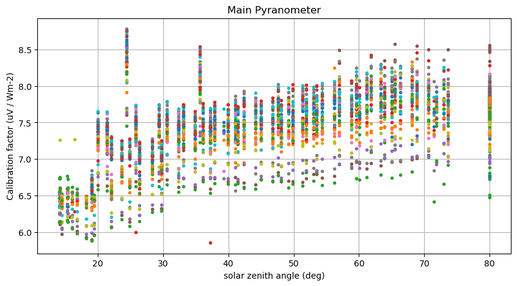

## Calibration S2VSR 2023-06

The PyrNet setup for [Small Scale Variability of Solar Radiation (S2VSR)](https://www.arm.gov/research/campaigns/sgp2023s2vsr) was setup for calibration on the ARM-SGP guest instrument facility (**GIF**) for calibration from 2023-06-02 to 2023-06-08. Cross-calibration is done versus reference observations from the ARM-SGP broadband radiometer station (**BRS**) ([doi:10.5439/1550918](http://dx.doi.org/10.5439/1550918))


### Imports


```python
#|dropcode
import os
import xarray as xr
import pandas as pd
import numpy as np
import datetime as dt
import matplotlib.pyplot as plt
import jstyleson as json

from pyrnet import pyrnet
```

### Prepare PyrNet data
For calibration preparation the PyrNet data is processed to level l1b using a calibration factor of **7 (uV W-1 m2)** for all pyranometers with the ```pyrnet process l1b``` tool. This is done to unify the conversion to sensor voltage during calibration and not run into valid_range limits for netcdf encoding. Here we generate the *calibration.json* file for the processing to l1b:   


```python
box_numbers = np.arange(1,101)
calibrations = {f"{bn:03d}":[7,7] for bn in box_numbers}
calibjson = {"2000-01-01": calibrations}
with open("pyrnet_calib_prep.json","w") as txt:
    json.dump(calibjson, txt)
```

Within *pyrnet_config_calibration_prep.json*:
```
{"file_calibration" : "pyrnet_calib_prep.json"}
```

**Workflow for preparation**
1. Prepare *pyrnet_config_calibration_prep.json* with contributors metadata and the dummy calibration config file.
1. ```$ pyrnet process l1a -c pyrnet_config_calibration_prep.json raw_data/*.bin l1a/```
1. ```$ pyrnet process l1b -c pyrnet_config_calibration_prep.json l1a/*.nc l1b/```
1. ```$ d=2023-06-02; until [[ $d > 2023-06-08 ]]; do pyrnet merge l1b/pyrnet_${d}_*.nc l1b_network/pyrnet_${d}_s2vsr_calibration.c01.nc; d=$(date -I -d "$d + 1 day"); done```
1. Upload the network files to the Thredds server

### Configuration
Data is available via Thredds server. The URLs might have changed when trying to rerun this notebook. 

For the ARM data, create a ARM user account first and then order the [doi:10.5439/1550918](http://dx.doi.org/10.5439/1550918), and choose the Thredds-Server option. You will receive the Thredds-URL via e-mail.

The PyrNet data should be available via [tds.tropops.de](tds.tropos.de), if not, contact witthuhn@tropos.de.


```python
ARM_URL = "https://archive.arm.gov/orders/dodsC/orders/witthuhnj1/240295/sgpbrsC1.b1.{date:%Y%m%d}.000000.custom.cdf"
PYR_URL = "https://tds.tropos.de/thredds/dodsC/scccJher/2023_s2vsr/calibration/pyrnet_{date:%Y-%m-%d}_s2vsr_calibration.c01.nc"
dates = pd.date_range("2023-06-02","2023-06-08")
stations = np.arange(1,101)

# lookup which box contains actually a pyranometer/ extra pyranometer
mainmask, extramask = [] , []
for box in stations:
    _, serials, _ = pyrnet.meta_lookup(dates[0],box=box)
    mainmask.append( True if len(serials[0])>0 else False )
    extramask.append( True if len(serials[1])>0 else False )
```

#### Load ARM-SGP Data


```python
#|dropcode
#|dropout
for i,date in enumerate(dates):
    # read from thredds server
    dst = xr.open_dataset(ARM_URL.format(date=date))
    
    # drop not needed variables
    keep_vars = ['down_short_hemisp']
    drop_vars = [v for v in dst if v not in keep_vars]
    dst = dst.drop_vars(drop_vars)
    
    # merge
    if i == 0:
        ds = dst.copy()
    else:
        ds = xr.concat((ds,dst),dim='time', data_vars='minimal', coords='minimal', compat='override')

arm = ds.copy()
arm
```


<div><svg style="position: absolute; width: 0; height: 0; overflow: hidden">
<defs>
<symbol id="icon-database" viewBox="0 0 32 32">
<path d="M16 0c-8.837 0-16 2.239-16 5v4c0 2.761 7.163 5 16 5s16-2.239 16-5v-4c0-2.761-7.163-5-16-5z"></path>
<path d="M16 17c-8.837 0-16-2.239-16-5v6c0 2.761 7.163 5 16 5s16-2.239 16-5v-6c0 2.761-7.163 5-16 5z"></path>
<path d="M16 26c-8.837 0-16-2.239-16-5v6c0 2.761 7.163 5 16 5s16-2.239 16-5v-6c0 2.761-7.163 5-16 5z"></path>
</symbol>
<symbol id="icon-file-text2" viewBox="0 0 32 32">
<path d="M28.681 7.159c-0.694-0.947-1.662-2.053-2.724-3.116s-2.169-2.030-3.116-2.724c-1.612-1.182-2.393-1.319-2.841-1.319h-15.5c-1.378 0-2.5 1.121-2.5 2.5v27c0 1.378 1.122 2.5 2.5 2.5h23c1.378 0 2.5-1.122 2.5-2.5v-19.5c0-0.448-0.137-1.23-1.319-2.841zM24.543 5.457c0.959 0.959 1.712 1.825 2.268 2.543h-4.811v-4.811c0.718 0.556 1.584 1.309 2.543 2.268zM28 29.5c0 0.271-0.229 0.5-0.5 0.5h-23c-0.271 0-0.5-0.229-0.5-0.5v-27c0-0.271 0.229-0.5 0.5-0.5 0 0 15.499-0 15.5 0v7c0 0.552 0.448 1 1 1h7v19.5z"></path>
<path d="M23 26h-14c-0.552 0-1-0.448-1-1s0.448-1 1-1h14c0.552 0 1 0.448 1 1s-0.448 1-1 1z"></path>
<path d="M23 22h-14c-0.552 0-1-0.448-1-1s0.448-1 1-1h14c0.552 0 1 0.448 1 1s-0.448 1-1 1z"></path>
<path d="M23 18h-14c-0.552 0-1-0.448-1-1s0.448-1 1-1h14c0.552 0 1 0.448 1 1s-0.448 1-1 1z"></path>
</symbol>
</defs>
</svg>
<style>/* CSS stylesheet for displaying xarray objects in jupyterlab.
 *
 */

:root {
  --xr-font-color0: var(--jp-content-font-color0, rgba(0, 0, 0, 1));
  --xr-font-color2: var(--jp-content-font-color2, rgba(0, 0, 0, 0.54));
  --xr-font-color3: var(--jp-content-font-color3, rgba(0, 0, 0, 0.38));
  --xr-border-color: var(--jp-border-color2, #e0e0e0);
  --xr-disabled-color: var(--jp-layout-color3, #bdbdbd);
  --xr-background-color: var(--jp-layout-color0, white);
  --xr-background-color-row-even: var(--jp-layout-color1, white);
  --xr-background-color-row-odd: var(--jp-layout-color2, #eeeeee);
}

html[theme=dark],
body[data-theme=dark],
body.vscode-dark {
  --xr-font-color0: rgba(255, 255, 255, 1);
  --xr-font-color2: rgba(255, 255, 255, 0.54);
  --xr-font-color3: rgba(255, 255, 255, 0.38);
  --xr-border-color: #1F1F1F;
  --xr-disabled-color: #515151;
  --xr-background-color: #111111;
  --xr-background-color-row-even: #111111;
  --xr-background-color-row-odd: #313131;
}

.xr-wrap {
  display: block !important;
  min-width: 300px;
  max-width: 700px;
}

.xr-text-repr-fallback {
  /* fallback to plain text repr when CSS is not injected (untrusted notebook) */
  display: none;
}

.xr-header {
  padding-top: 6px;
  padding-bottom: 6px;
  margin-bottom: 4px;
  border-bottom: solid 1px var(--xr-border-color);
}

.xr-header > div,
.xr-header > ul {
  display: inline;
  margin-top: 0;
  margin-bottom: 0;
}

.xr-obj-type,
.xr-array-name {
  margin-left: 2px;
  margin-right: 10px;
}

.xr-obj-type {
  color: var(--xr-font-color2);
}

.xr-sections {
  padding-left: 0 !important;
  display: grid;
  grid-template-columns: 150px auto auto 1fr 20px 20px;
}

.xr-section-item {
  display: contents;
}

.xr-section-item input {
  display: none;
}

.xr-section-item input + label {
  color: var(--xr-disabled-color);
}

.xr-section-item input:enabled + label {
  cursor: pointer;
  color: var(--xr-font-color2);
}

.xr-section-item input:enabled + label:hover {
  color: var(--xr-font-color0);
}

.xr-section-summary {
  grid-column: 1;
  color: var(--xr-font-color2);
  font-weight: 500;
}

.xr-section-summary > span {
  display: inline-block;
  padding-left: 0.5em;
}

.xr-section-summary-in:disabled + label {
  color: var(--xr-font-color2);
}

.xr-section-summary-in + label:before {
  display: inline-block;
  content: '►';
  font-size: 11px;
  width: 15px;
  text-align: center;
}

.xr-section-summary-in:disabled + label:before {
  color: var(--xr-disabled-color);
}

.xr-section-summary-in:checked + label:before {
  content: '▼';
}

.xr-section-summary-in:checked + label > span {
  display: none;
}

.xr-section-summary,
.xr-section-inline-details {
  padding-top: 4px;
  padding-bottom: 4px;
}

.xr-section-inline-details {
  grid-column: 2 / -1;
}

.xr-section-details {
  display: none;
  grid-column: 1 / -1;
  margin-bottom: 5px;
}

.xr-section-summary-in:checked ~ .xr-section-details {
  display: contents;
}

.xr-array-wrap {
  grid-column: 1 / -1;
  display: grid;
  grid-template-columns: 20px auto;
}

.xr-array-wrap > label {
  grid-column: 1;
  vertical-align: top;
}

.xr-preview {
  color: var(--xr-font-color3);
}

.xr-array-preview,
.xr-array-data {
  padding: 0 5px !important;
  grid-column: 2;
}

.xr-array-data,
.xr-array-in:checked ~ .xr-array-preview {
  display: none;
}

.xr-array-in:checked ~ .xr-array-data,
.xr-array-preview {
  display: inline-block;
}

.xr-dim-list {
  display: inline-block !important;
  list-style: none;
  padding: 0 !important;
  margin: 0;
}

.xr-dim-list li {
  display: inline-block;
  padding: 0;
  margin: 0;
}

.xr-dim-list:before {
  content: '(';
}

.xr-dim-list:after {
  content: ')';
}

.xr-dim-list li:not(:last-child):after {
  content: ',';
  padding-right: 5px;
}

.xr-has-index {
  font-weight: bold;
}

.xr-var-list,
.xr-var-item {
  display: contents;
}

.xr-var-item > div,
.xr-var-item label,
.xr-var-item > .xr-var-name span {
  background-color: var(--xr-background-color-row-even);
  margin-bottom: 0;
}

.xr-var-item > .xr-var-name:hover span {
  padding-right: 5px;
}

.xr-var-list > li:nth-child(odd) > div,
.xr-var-list > li:nth-child(odd) > label,
.xr-var-list > li:nth-child(odd) > .xr-var-name span {
  background-color: var(--xr-background-color-row-odd);
}

.xr-var-name {
  grid-column: 1;
}

.xr-var-dims {
  grid-column: 2;
}

.xr-var-dtype {
  grid-column: 3;
  text-align: right;
  color: var(--xr-font-color2);
}

.xr-var-preview {
  grid-column: 4;
}

.xr-index-preview {
  grid-column: 2 / 5;
  color: var(--xr-font-color2);
}

.xr-var-name,
.xr-var-dims,
.xr-var-dtype,
.xr-preview,
.xr-attrs dt {
  white-space: nowrap;
  overflow: hidden;
  text-overflow: ellipsis;
  padding-right: 10px;
}

.xr-var-name:hover,
.xr-var-dims:hover,
.xr-var-dtype:hover,
.xr-attrs dt:hover {
  overflow: visible;
  width: auto;
  z-index: 1;
}

.xr-var-attrs,
.xr-var-data,
.xr-index-data {
  display: none;
  background-color: var(--xr-background-color) !important;
  padding-bottom: 5px !important;
}

.xr-var-attrs-in:checked ~ .xr-var-attrs,
.xr-var-data-in:checked ~ .xr-var-data,
.xr-index-data-in:checked ~ .xr-index-data {
  display: block;
}

.xr-var-data > table {
  float: right;
}

.xr-var-name span,
.xr-var-data,
.xr-index-name div,
.xr-index-data,
.xr-attrs {
  padding-left: 25px !important;
}

.xr-attrs,
.xr-var-attrs,
.xr-var-data,
.xr-index-data {
  grid-column: 1 / -1;
}

dl.xr-attrs {
  padding: 0;
  margin: 0;
  display: grid;
  grid-template-columns: 125px auto;
}

.xr-attrs dt,
.xr-attrs dd {
  padding: 0;
  margin: 0;
  float: left;
  padding-right: 10px;
  width: auto;
}

.xr-attrs dt {
  font-weight: normal;
  grid-column: 1;
}

.xr-attrs dt:hover span {
  display: inline-block;
  background: var(--xr-background-color);
  padding-right: 10px;
}

.xr-attrs dd {
  grid-column: 2;
  white-space: pre-wrap;
  word-break: break-all;
}

.xr-icon-database,
.xr-icon-file-text2,
.xr-no-icon {
  display: inline-block;
  vertical-align: middle;
  width: 1em;
  height: 1.5em !important;
  stroke-width: 0;
  stroke: currentColor;
  fill: currentColor;
}
</style><pre class='xr-text-repr-fallback'>&lt;xarray.Dataset&gt;
Dimensions:            (time: 10080)
Coordinates:
  * time               (time) datetime64[ns] 2023-06-02 ... 2023-06-08T23:59:00
Data variables:
    down_short_hemisp  (time) float32 7.642 6.241 5.941 ... 165.9 165.4 170.4
Attributes: (12/26)
    command_line:                    sirs_ingest -n brs -s sgp -f C1
    Conventions:                     ARM-1.3
    process_version:                 ingest-sirs-12.9-0.el7
    dod_version:                     brs-b1-4.0
    input_source:                    /data/collection/sgp/sgpbrsC1.00/BRS_Tab...
    site_id:                         sgp
    ...                              ...
    lithium_battery:                 3.37
    low_12v_count:                   4872.0
    skipped_scan:                    0.0
    doi:                             10.5439/1550918
    history:                         created by user dsmgr on machine prod-pr...
    DODS_EXTRA.Unlimited_Dimension:  time</pre><div class='xr-wrap' style='display:none'><div class='xr-header'><div class='xr-obj-type'>xarray.Dataset</div></div><ul class='xr-sections'><li class='xr-section-item'><input id='section-761e966b-f95b-4464-b0fb-651a6d88d34b' class='xr-section-summary-in' type='checkbox' disabled ><label for='section-761e966b-f95b-4464-b0fb-651a6d88d34b' class='xr-section-summary'  title='Expand/collapse section'>Dimensions:</label><div class='xr-section-inline-details'><ul class='xr-dim-list'><li><span class='xr-has-index'>time</span>: 10080</li></ul></div><div class='xr-section-details'></div></li><li class='xr-section-item'><input id='section-be3aca14-5a4b-4f52-94d5-d3263c57f02d' class='xr-section-summary-in' type='checkbox'  checked><label for='section-be3aca14-5a4b-4f52-94d5-d3263c57f02d' class='xr-section-summary' >Coordinates: <span>(1)</span></label><div class='xr-section-inline-details'></div><div class='xr-section-details'><ul class='xr-var-list'><li class='xr-var-item'><div class='xr-var-name'><span class='xr-has-index'>time</span></div><div class='xr-var-dims'>(time)</div><div class='xr-var-dtype'>datetime64[ns]</div><div class='xr-var-preview xr-preview'>2023-06-02 ... 2023-06-08T23:59:00</div><input id='attrs-3584c9a6-8066-47f7-a73d-c4637b5b72ad' class='xr-var-attrs-in' type='checkbox' ><label for='attrs-3584c9a6-8066-47f7-a73d-c4637b5b72ad' title='Show/Hide attributes'><svg class='icon xr-icon-file-text2'><use xlink:href='#icon-file-text2'></use></svg></label><input id='data-507cc3ae-5b5d-43f3-9ee2-5fe982a2d5b4' class='xr-var-data-in' type='checkbox'><label for='data-507cc3ae-5b5d-43f3-9ee2-5fe982a2d5b4' title='Show/Hide data repr'><svg class='icon xr-icon-database'><use xlink:href='#icon-database'></use></svg></label><div class='xr-var-attrs'><dl class='xr-attrs'><dt><span>long_name :</span></dt><dd>Time offset from midnight</dd><dt><span>bounds :</span></dt><dd>time_bounds</dd><dt><span>standard_name :</span></dt><dd>time</dd></dl></div><div class='xr-var-data'><pre>array([&#x27;2023-06-02T00:00:00.000000000&#x27;, &#x27;2023-06-02T00:01:00.000000000&#x27;,
       &#x27;2023-06-02T00:02:00.000000000&#x27;, ..., &#x27;2023-06-08T23:57:00.000000000&#x27;,
       &#x27;2023-06-08T23:58:00.000000000&#x27;, &#x27;2023-06-08T23:59:00.000000000&#x27;],
      dtype=&#x27;datetime64[ns]&#x27;)</pre></div></li></ul></div></li><li class='xr-section-item'><input id='section-c55ae1fc-2cb0-4db3-ab10-ff133c326a99' class='xr-section-summary-in' type='checkbox'  checked><label for='section-c55ae1fc-2cb0-4db3-ab10-ff133c326a99' class='xr-section-summary' >Data variables: <span>(1)</span></label><div class='xr-section-inline-details'></div><div class='xr-section-details'><ul class='xr-var-list'><li class='xr-var-item'><div class='xr-var-name'><span>down_short_hemisp</span></div><div class='xr-var-dims'>(time)</div><div class='xr-var-dtype'>float32</div><div class='xr-var-preview xr-preview'>7.642 6.241 5.941 ... 165.4 170.4</div><input id='attrs-a44770a8-3878-4855-8182-5b5b726250fb' class='xr-var-attrs-in' type='checkbox' ><label for='attrs-a44770a8-3878-4855-8182-5b5b726250fb' title='Show/Hide attributes'><svg class='icon xr-icon-file-text2'><use xlink:href='#icon-file-text2'></use></svg></label><input id='data-2d3d4ac1-2e8c-4189-9e22-40e6cd9125e3' class='xr-var-data-in' type='checkbox'><label for='data-2d3d4ac1-2e8c-4189-9e22-40e6cd9125e3' title='Show/Hide data repr'><svg class='icon xr-icon-database'><use xlink:href='#icon-database'></use></svg></label><div class='xr-var-attrs'><dl class='xr-attrs'><dt><span>long_name :</span></dt><dd>Downwelling shortwave hemispheric irradiance, pyranometer</dd><dt><span>units :</span></dt><dd>W/m^2</dd><dt><span>valid_min :</span></dt><dd>-3.0</dd><dt><span>valid_max :</span></dt><dd>1500.0</dd><dt><span>valid_delta :</span></dt><dd>920.0</dd><dt><span>resolution :</span></dt><dd>0.1</dd><dt><span>ventilation_status :</span></dt><dd>Ventilated</dd><dt><span>standard_name :</span></dt><dd>surface_downwelling_shortwave_flux_in_air</dd><dt><span>cell_methods :</span></dt><dd>time: mean</dd><dt><span>ancillary_variables :</span></dt><dd>qc_down_short_hemisp</dd></dl></div><div class='xr-var-data'><pre>array([  7.641842,   6.241066,   5.941068, ..., 165.8663  , 165.3947  ,
       170.4294  ], dtype=float32)</pre></div></li></ul></div></li><li class='xr-section-item'><input id='section-72a451be-8d63-4f96-8265-45cc968d5787' class='xr-section-summary-in' type='checkbox'  ><label for='section-72a451be-8d63-4f96-8265-45cc968d5787' class='xr-section-summary' >Indexes: <span>(1)</span></label><div class='xr-section-inline-details'></div><div class='xr-section-details'><ul class='xr-var-list'><li class='xr-var-item'><div class='xr-index-name'><div>time</div></div><div class='xr-index-preview'>PandasIndex</div><div></div><input id='index-863614e9-ede5-4517-b6e3-491dc692cbee' class='xr-index-data-in' type='checkbox'/><label for='index-863614e9-ede5-4517-b6e3-491dc692cbee' title='Show/Hide index repr'><svg class='icon xr-icon-database'><use xlink:href='#icon-database'></use></svg></label><div class='xr-index-data'><pre>PandasIndex(DatetimeIndex([&#x27;2023-06-02 00:00:00&#x27;, &#x27;2023-06-02 00:01:00&#x27;,
               &#x27;2023-06-02 00:02:00&#x27;, &#x27;2023-06-02 00:03:00&#x27;,
               &#x27;2023-06-02 00:04:00&#x27;, &#x27;2023-06-02 00:05:00&#x27;,
               &#x27;2023-06-02 00:06:00&#x27;, &#x27;2023-06-02 00:07:00&#x27;,
               &#x27;2023-06-02 00:08:00&#x27;, &#x27;2023-06-02 00:09:00&#x27;,
               ...
               &#x27;2023-06-08 23:50:00&#x27;, &#x27;2023-06-08 23:51:00&#x27;,
               &#x27;2023-06-08 23:52:00&#x27;, &#x27;2023-06-08 23:53:00&#x27;,
               &#x27;2023-06-08 23:54:00&#x27;, &#x27;2023-06-08 23:55:00&#x27;,
               &#x27;2023-06-08 23:56:00&#x27;, &#x27;2023-06-08 23:57:00&#x27;,
               &#x27;2023-06-08 23:58:00&#x27;, &#x27;2023-06-08 23:59:00&#x27;],
              dtype=&#x27;datetime64[ns]&#x27;, name=&#x27;time&#x27;, length=10080, freq=None))</pre></div></li></ul></div></li><li class='xr-section-item'><input id='section-d6e3b0e3-9967-41c8-8eb5-be3641d61604' class='xr-section-summary-in' type='checkbox'  ><label for='section-d6e3b0e3-9967-41c8-8eb5-be3641d61604' class='xr-section-summary' >Attributes: <span>(26)</span></label><div class='xr-section-inline-details'></div><div class='xr-section-details'><dl class='xr-attrs'><dt><span>command_line :</span></dt><dd>sirs_ingest -n brs -s sgp -f C1</dd><dt><span>Conventions :</span></dt><dd>ARM-1.3</dd><dt><span>process_version :</span></dt><dd>ingest-sirs-12.9-0.el7</dd><dt><span>dod_version :</span></dt><dd>brs-b1-4.0</dd><dt><span>input_source :</span></dt><dd>/data/collection/sgp/sgpbrsC1.00/BRS_Table213.20230602000000.dat</dd><dt><span>site_id :</span></dt><dd>sgp</dd><dt><span>platform_id :</span></dt><dd>brs</dd><dt><span>facility_id :</span></dt><dd>C1</dd><dt><span>data_level :</span></dt><dd>b1</dd><dt><span>location_description :</span></dt><dd>Southern Great Plains (SGP), Lamont, Oklahoma</dd><dt><span>datastream :</span></dt><dd>sgpbrsC1.b1</dd><dt><span>serial_number :</span></dt><dd>PIR-UIR:       -9999F3
PIR1-DIR:      30085F3
PIR2-DIR:      30681F3
Diffuse PSP:  200692F3
PSP-US:        -9999F3
NIP:          200804E6
PSP-DS:       200693F3
</dd><dt><span>sampling_interval :</span></dt><dd>1 second</dd><dt><span>averaging_interval :</span></dt><dd>60 seconds</dd><dt><span>resolution_description :</span></dt><dd>The resolution field attributes refer to the number of significant digits relative to the decimal point that should be used in calculations. Using fewer digits might result in greater uncertainty. Using a larger number of digits should have no effect and thus is unnecessary. However, analyses based on differences in values with a larger number of significant digits than indicated could lead to erroneous results or misleading scientific conclusions.

resolution for lat = 0.001
resolution for lon = 0.001
resolution for alt = 1</dd><dt><span>calib_coeff :</span></dt><dd>calib_coeff_k0 = PIR-UIR:     0.00000 W/m^2
calib_coeff_k1 = PIR-UIR:     0.00000 W/(m^2*uV)
calib_coeff_k2 = PIR-UIR:     1.00000 unitless
calib_coeff_k3 = PIR-UIR:     -4.00000 unitless
calib_coeff_kr = PIR-UIR:     0.00070 K/uV
calib_coeff_k0 = PIR1-DIR:    0.00000 W/m^2
calib_coeff_k1 = PIR1-DIR:    0.23141 W/(m^2*uV)
calib_coeff_k2 = PIR1-DIR:    0.99990 unitless
calib_coeff_k3 = PIR1-DIR:    -5.09000 unitless
calib_coeff_kr = PIR1-DIR:    0.000704 K/uV
calib_coeff_k0 = PIR2-DIR:    0.00000 W/m^2
calib_coeff_k1 = PIR2-DIR:    0.24547 W/(m^2*uV)
calib_coeff_k2 = PIR2-DIR:    0.99580 unitless
calib_coeff_k3 = PIR2-DIR:    -3.87000 unitless
calib_coeff_kr = PIR2-DIR:    0.000704 K/uV
Diffuse PSP: 108.33 W/(m^2*mV)
PSP-US:      0.00 W/(m^2*mV)
NIP:         119.27 W/(m^2*mV)
PSP-DS:      99.08 W/(m^2*mV)
</dd><dt><span>station_name :</span></dt><dd>&quot;SGP_BRS_C1&quot;</dd><dt><span>logger_program_name :</span></dt><dd>&quot;CPU:SGP_BRS_TACH_C01_20220722.CR3&quot;</dd><dt><span>logger_os_version :</span></dt><dd>&quot;CR3000.Std.32.03&quot;</dd><dt><span>logger_program_start_time :</span></dt><dd>&quot;09/06/2022 14:35:35&quot;</dd><dt><span>lithium_battery :</span></dt><dd>3.37</dd><dt><span>low_12v_count :</span></dt><dd>4872.0</dd><dt><span>skipped_scan :</span></dt><dd>0.0</dd><dt><span>doi :</span></dt><dd>10.5439/1550918</dd><dt><span>history :</span></dt><dd>created by user dsmgr on machine prod-proc3.adc.arm.gov at 2023-06-02 06:20:02, using ingest-sirs-12.9-0.el7</dd><dt><span>DODS_EXTRA.Unlimited_Dimension :</span></dt><dd>time</dd></dl></div></li></ul></div></div>


#### Load PyrNet Data


```python
#|dropcode
#|dropout
for i,date in enumerate(dates):
    # read from thredds server
    dst = xr.open_dataset(PYR_URL.format(date=date))
    
    # drop not needed variables
    keep_vars = ['ghi','gti','szen']
    drop_vars = [v for v in dst if v not in keep_vars]
    dst = dst.drop_vars(drop_vars)

    # unify time and station dimension to speed up merging
    date = dst.time.values[0].astype("datetime64[D]")
    timeidx = pd.date_range(date, date + np.timedelta64(1, 'D'), freq='1s', inclusive='left')
    dst = dst.interp(time=timeidx)
    dst = dst.reindex({"station": stations})
    
    # add gti for single stations
    if "gti" not in dst:
        dst = ds.assign({
            "gti": (("time","station"), np.full(dst.ghi.values.shape,np.nan))
        })
    
    # merge
    if i == 0:
        ds = dst.copy()
    else:
        ds = xr.concat((ds,dst),dim='time', data_vars='minimal', coords='minimal', compat='override')
    
pyr = ds.copy()
pyr
```


<div><svg style="position: absolute; width: 0; height: 0; overflow: hidden">
<defs>
<symbol id="icon-database" viewBox="0 0 32 32">
<path d="M16 0c-8.837 0-16 2.239-16 5v4c0 2.761 7.163 5 16 5s16-2.239 16-5v-4c0-2.761-7.163-5-16-5z"></path>
<path d="M16 17c-8.837 0-16-2.239-16-5v6c0 2.761 7.163 5 16 5s16-2.239 16-5v-6c0 2.761-7.163 5-16 5z"></path>
<path d="M16 26c-8.837 0-16-2.239-16-5v6c0 2.761 7.163 5 16 5s16-2.239 16-5v-6c0 2.761-7.163 5-16 5z"></path>
</symbol>
<symbol id="icon-file-text2" viewBox="0 0 32 32">
<path d="M28.681 7.159c-0.694-0.947-1.662-2.053-2.724-3.116s-2.169-2.030-3.116-2.724c-1.612-1.182-2.393-1.319-2.841-1.319h-15.5c-1.378 0-2.5 1.121-2.5 2.5v27c0 1.378 1.122 2.5 2.5 2.5h23c1.378 0 2.5-1.122 2.5-2.5v-19.5c0-0.448-0.137-1.23-1.319-2.841zM24.543 5.457c0.959 0.959 1.712 1.825 2.268 2.543h-4.811v-4.811c0.718 0.556 1.584 1.309 2.543 2.268zM28 29.5c0 0.271-0.229 0.5-0.5 0.5h-23c-0.271 0-0.5-0.229-0.5-0.5v-27c0-0.271 0.229-0.5 0.5-0.5 0 0 15.499-0 15.5 0v7c0 0.552 0.448 1 1 1h7v19.5z"></path>
<path d="M23 26h-14c-0.552 0-1-0.448-1-1s0.448-1 1-1h14c0.552 0 1 0.448 1 1s-0.448 1-1 1z"></path>
<path d="M23 22h-14c-0.552 0-1-0.448-1-1s0.448-1 1-1h14c0.552 0 1 0.448 1 1s-0.448 1-1 1z"></path>
<path d="M23 18h-14c-0.552 0-1-0.448-1-1s0.448-1 1-1h14c0.552 0 1 0.448 1 1s-0.448 1-1 1z"></path>
</symbol>
</defs>
</svg>
<style>/* CSS stylesheet for displaying xarray objects in jupyterlab.
 *
 */

:root {
  --xr-font-color0: var(--jp-content-font-color0, rgba(0, 0, 0, 1));
  --xr-font-color2: var(--jp-content-font-color2, rgba(0, 0, 0, 0.54));
  --xr-font-color3: var(--jp-content-font-color3, rgba(0, 0, 0, 0.38));
  --xr-border-color: var(--jp-border-color2, #e0e0e0);
  --xr-disabled-color: var(--jp-layout-color3, #bdbdbd);
  --xr-background-color: var(--jp-layout-color0, white);
  --xr-background-color-row-even: var(--jp-layout-color1, white);
  --xr-background-color-row-odd: var(--jp-layout-color2, #eeeeee);
}

html[theme=dark],
body[data-theme=dark],
body.vscode-dark {
  --xr-font-color0: rgba(255, 255, 255, 1);
  --xr-font-color2: rgba(255, 255, 255, 0.54);
  --xr-font-color3: rgba(255, 255, 255, 0.38);
  --xr-border-color: #1F1F1F;
  --xr-disabled-color: #515151;
  --xr-background-color: #111111;
  --xr-background-color-row-even: #111111;
  --xr-background-color-row-odd: #313131;
}

.xr-wrap {
  display: block !important;
  min-width: 300px;
  max-width: 700px;
}

.xr-text-repr-fallback {
  /* fallback to plain text repr when CSS is not injected (untrusted notebook) */
  display: none;
}

.xr-header {
  padding-top: 6px;
  padding-bottom: 6px;
  margin-bottom: 4px;
  border-bottom: solid 1px var(--xr-border-color);
}

.xr-header > div,
.xr-header > ul {
  display: inline;
  margin-top: 0;
  margin-bottom: 0;
}

.xr-obj-type,
.xr-array-name {
  margin-left: 2px;
  margin-right: 10px;
}

.xr-obj-type {
  color: var(--xr-font-color2);
}

.xr-sections {
  padding-left: 0 !important;
  display: grid;
  grid-template-columns: 150px auto auto 1fr 20px 20px;
}

.xr-section-item {
  display: contents;
}

.xr-section-item input {
  display: none;
}

.xr-section-item input + label {
  color: var(--xr-disabled-color);
}

.xr-section-item input:enabled + label {
  cursor: pointer;
  color: var(--xr-font-color2);
}

.xr-section-item input:enabled + label:hover {
  color: var(--xr-font-color0);
}

.xr-section-summary {
  grid-column: 1;
  color: var(--xr-font-color2);
  font-weight: 500;
}

.xr-section-summary > span {
  display: inline-block;
  padding-left: 0.5em;
}

.xr-section-summary-in:disabled + label {
  color: var(--xr-font-color2);
}

.xr-section-summary-in + label:before {
  display: inline-block;
  content: '►';
  font-size: 11px;
  width: 15px;
  text-align: center;
}

.xr-section-summary-in:disabled + label:before {
  color: var(--xr-disabled-color);
}

.xr-section-summary-in:checked + label:before {
  content: '▼';
}

.xr-section-summary-in:checked + label > span {
  display: none;
}

.xr-section-summary,
.xr-section-inline-details {
  padding-top: 4px;
  padding-bottom: 4px;
}

.xr-section-inline-details {
  grid-column: 2 / -1;
}

.xr-section-details {
  display: none;
  grid-column: 1 / -1;
  margin-bottom: 5px;
}

.xr-section-summary-in:checked ~ .xr-section-details {
  display: contents;
}

.xr-array-wrap {
  grid-column: 1 / -1;
  display: grid;
  grid-template-columns: 20px auto;
}

.xr-array-wrap > label {
  grid-column: 1;
  vertical-align: top;
}

.xr-preview {
  color: var(--xr-font-color3);
}

.xr-array-preview,
.xr-array-data {
  padding: 0 5px !important;
  grid-column: 2;
}

.xr-array-data,
.xr-array-in:checked ~ .xr-array-preview {
  display: none;
}

.xr-array-in:checked ~ .xr-array-data,
.xr-array-preview {
  display: inline-block;
}

.xr-dim-list {
  display: inline-block !important;
  list-style: none;
  padding: 0 !important;
  margin: 0;
}

.xr-dim-list li {
  display: inline-block;
  padding: 0;
  margin: 0;
}

.xr-dim-list:before {
  content: '(';
}

.xr-dim-list:after {
  content: ')';
}

.xr-dim-list li:not(:last-child):after {
  content: ',';
  padding-right: 5px;
}

.xr-has-index {
  font-weight: bold;
}

.xr-var-list,
.xr-var-item {
  display: contents;
}

.xr-var-item > div,
.xr-var-item label,
.xr-var-item > .xr-var-name span {
  background-color: var(--xr-background-color-row-even);
  margin-bottom: 0;
}

.xr-var-item > .xr-var-name:hover span {
  padding-right: 5px;
}

.xr-var-list > li:nth-child(odd) > div,
.xr-var-list > li:nth-child(odd) > label,
.xr-var-list > li:nth-child(odd) > .xr-var-name span {
  background-color: var(--xr-background-color-row-odd);
}

.xr-var-name {
  grid-column: 1;
}

.xr-var-dims {
  grid-column: 2;
}

.xr-var-dtype {
  grid-column: 3;
  text-align: right;
  color: var(--xr-font-color2);
}

.xr-var-preview {
  grid-column: 4;
}

.xr-index-preview {
  grid-column: 2 / 5;
  color: var(--xr-font-color2);
}

.xr-var-name,
.xr-var-dims,
.xr-var-dtype,
.xr-preview,
.xr-attrs dt {
  white-space: nowrap;
  overflow: hidden;
  text-overflow: ellipsis;
  padding-right: 10px;
}

.xr-var-name:hover,
.xr-var-dims:hover,
.xr-var-dtype:hover,
.xr-attrs dt:hover {
  overflow: visible;
  width: auto;
  z-index: 1;
}

.xr-var-attrs,
.xr-var-data,
.xr-index-data {
  display: none;
  background-color: var(--xr-background-color) !important;
  padding-bottom: 5px !important;
}

.xr-var-attrs-in:checked ~ .xr-var-attrs,
.xr-var-data-in:checked ~ .xr-var-data,
.xr-index-data-in:checked ~ .xr-index-data {
  display: block;
}

.xr-var-data > table {
  float: right;
}

.xr-var-name span,
.xr-var-data,
.xr-index-name div,
.xr-index-data,
.xr-attrs {
  padding-left: 25px !important;
}

.xr-attrs,
.xr-var-attrs,
.xr-var-data,
.xr-index-data {
  grid-column: 1 / -1;
}

dl.xr-attrs {
  padding: 0;
  margin: 0;
  display: grid;
  grid-template-columns: 125px auto;
}

.xr-attrs dt,
.xr-attrs dd {
  padding: 0;
  margin: 0;
  float: left;
  padding-right: 10px;
  width: auto;
}

.xr-attrs dt {
  font-weight: normal;
  grid-column: 1;
}

.xr-attrs dt:hover span {
  display: inline-block;
  background: var(--xr-background-color);
  padding-right: 10px;
}

.xr-attrs dd {
  grid-column: 2;
  white-space: pre-wrap;
  word-break: break-all;
}

.xr-icon-database,
.xr-icon-file-text2,
.xr-no-icon {
  display: inline-block;
  vertical-align: middle;
  width: 1em;
  height: 1.5em !important;
  stroke-width: 0;
  stroke: currentColor;
  fill: currentColor;
}
</style><pre class='xr-text-repr-fallback'>&lt;xarray.Dataset&gt;
Dimensions:  (station: 100, time: 604800)
Coordinates:
  * station  (station) int64 1 2 3 4 5 6 7 8 9 ... 92 93 94 95 96 97 98 99 100
  * time     (time) datetime64[ns] 2023-06-02 ... 2023-06-08T23:59:59
Data variables:
    ghi      (time, station) float64 nan nan nan nan nan ... nan nan nan nan nan
    gti      (time, station) float64 nan nan nan nan nan ... nan nan nan nan nan
    szen     (time, station) float64 nan nan nan nan nan ... nan nan nan nan nan
Attributes: (12/31)
    title:                     TROPOS pyranometer network (PyrNet) observations
    institution:               Leibniz Institute for Tropospheric Research (T...
    department:                Remote Sensing of Atmospheric Processes
    department_team:           Clouds, Aerosol and Radiation
    address:                   Permoser Str. 15, 04318 Leipzig, Germany
    source:                    TROPOS pyranometer network (PyrNet)
    ...                        ...
    geospatial_lon_max:        -97.48579382293494
    geospatial_lon_units:      degE
    time_coverage_start:       2023-06-02T17:38:35
    time_coverage_end:         2023-06-02T23:59:59
    time_coverage_duration:    P0DT6H21M24S
    time_coverage_resolution:  P0DT0H0M1S</pre><div class='xr-wrap' style='display:none'><div class='xr-header'><div class='xr-obj-type'>xarray.Dataset</div></div><ul class='xr-sections'><li class='xr-section-item'><input id='section-5d893c70-de18-49f6-9aca-48a3e0fa707f' class='xr-section-summary-in' type='checkbox' disabled ><label for='section-5d893c70-de18-49f6-9aca-48a3e0fa707f' class='xr-section-summary'  title='Expand/collapse section'>Dimensions:</label><div class='xr-section-inline-details'><ul class='xr-dim-list'><li><span class='xr-has-index'>station</span>: 100</li><li><span class='xr-has-index'>time</span>: 604800</li></ul></div><div class='xr-section-details'></div></li><li class='xr-section-item'><input id='section-e6be0b01-47c6-4854-8fde-6538ab0e47cd' class='xr-section-summary-in' type='checkbox'  checked><label for='section-e6be0b01-47c6-4854-8fde-6538ab0e47cd' class='xr-section-summary' >Coordinates: <span>(2)</span></label><div class='xr-section-inline-details'></div><div class='xr-section-details'><ul class='xr-var-list'><li class='xr-var-item'><div class='xr-var-name'><span class='xr-has-index'>station</span></div><div class='xr-var-dims'>(station)</div><div class='xr-var-dtype'>int64</div><div class='xr-var-preview xr-preview'>1 2 3 4 5 6 ... 95 96 97 98 99 100</div><input id='attrs-b39cfb95-b965-4762-abda-230fe9e20ebb' class='xr-var-attrs-in' type='checkbox' ><label for='attrs-b39cfb95-b965-4762-abda-230fe9e20ebb' title='Show/Hide attributes'><svg class='icon xr-icon-file-text2'><use xlink:href='#icon-file-text2'></use></svg></label><input id='data-36ec96ef-da56-43a8-9a18-4821e015e1c0' class='xr-var-data-in' type='checkbox'><label for='data-36ec96ef-da56-43a8-9a18-4821e015e1c0' title='Show/Hide data repr'><svg class='icon xr-icon-database'><use xlink:href='#icon-database'></use></svg></label><div class='xr-var-attrs'><dl class='xr-attrs'><dt><span>long_name :</span></dt><dd>PyrNet unit box number</dd><dt><span>units :</span></dt><dd>-</dd><dt><span>_ChunkSizes :</span></dt><dd>54</dd></dl></div><div class='xr-var-data'><pre>array([  1,   2,   3,   4,   5,   6,   7,   8,   9,  10,  11,  12,  13,  14,
        15,  16,  17,  18,  19,  20,  21,  22,  23,  24,  25,  26,  27,  28,
        29,  30,  31,  32,  33,  34,  35,  36,  37,  38,  39,  40,  41,  42,
        43,  44,  45,  46,  47,  48,  49,  50,  51,  52,  53,  54,  55,  56,
        57,  58,  59,  60,  61,  62,  63,  64,  65,  66,  67,  68,  69,  70,
        71,  72,  73,  74,  75,  76,  77,  78,  79,  80,  81,  82,  83,  84,
        85,  86,  87,  88,  89,  90,  91,  92,  93,  94,  95,  96,  97,  98,
        99, 100])</pre></div></li><li class='xr-var-item'><div class='xr-var-name'><span class='xr-has-index'>time</span></div><div class='xr-var-dims'>(time)</div><div class='xr-var-dtype'>datetime64[ns]</div><div class='xr-var-preview xr-preview'>2023-06-02 ... 2023-06-08T23:59:59</div><input id='attrs-12f2fd91-8dec-4080-996b-1b1177acb40a' class='xr-var-attrs-in' type='checkbox' disabled><label for='attrs-12f2fd91-8dec-4080-996b-1b1177acb40a' title='Show/Hide attributes'><svg class='icon xr-icon-file-text2'><use xlink:href='#icon-file-text2'></use></svg></label><input id='data-70ce40f1-06ab-4277-acb1-81271e411601' class='xr-var-data-in' type='checkbox'><label for='data-70ce40f1-06ab-4277-acb1-81271e411601' title='Show/Hide data repr'><svg class='icon xr-icon-database'><use xlink:href='#icon-database'></use></svg></label><div class='xr-var-attrs'><dl class='xr-attrs'></dl></div><div class='xr-var-data'><pre>array([&#x27;2023-06-02T00:00:00.000000000&#x27;, &#x27;2023-06-02T00:00:01.000000000&#x27;,
       &#x27;2023-06-02T00:00:02.000000000&#x27;, ..., &#x27;2023-06-08T23:59:57.000000000&#x27;,
       &#x27;2023-06-08T23:59:58.000000000&#x27;, &#x27;2023-06-08T23:59:59.000000000&#x27;],
      dtype=&#x27;datetime64[ns]&#x27;)</pre></div></li></ul></div></li><li class='xr-section-item'><input id='section-47b00cb3-527f-42a9-bdff-0ee0f88bfb9c' class='xr-section-summary-in' type='checkbox'  checked><label for='section-47b00cb3-527f-42a9-bdff-0ee0f88bfb9c' class='xr-section-summary' >Data variables: <span>(3)</span></label><div class='xr-section-inline-details'></div><div class='xr-section-details'><ul class='xr-var-list'><li class='xr-var-item'><div class='xr-var-name'><span>ghi</span></div><div class='xr-var-dims'>(time, station)</div><div class='xr-var-dtype'>float64</div><div class='xr-var-preview xr-preview'>nan nan nan nan ... nan nan nan nan</div><input id='attrs-9da8bdea-b20a-4b2a-801c-fead5c4bdaac' class='xr-var-attrs-in' type='checkbox' ><label for='attrs-9da8bdea-b20a-4b2a-801c-fead5c4bdaac' title='Show/Hide attributes'><svg class='icon xr-icon-file-text2'><use xlink:href='#icon-file-text2'></use></svg></label><input id='data-c1f2e5e8-95f4-4a00-96a6-4310b4c3cb03' class='xr-var-data-in' type='checkbox'><label for='data-c1f2e5e8-95f4-4a00-96a6-4310b4c3cb03' title='Show/Hide data repr'><svg class='icon xr-icon-database'><use xlink:href='#icon-database'></use></svg></label><div class='xr-var-attrs'><dl class='xr-attrs'><dt><span>units :</span></dt><dd>W m-2</dd><dt><span>long_name :</span></dt><dd>downwelling shortwave flux</dd><dt><span>standard_name :</span></dt><dd>downwelling_shortwave_flux_in_air</dd><dt><span>valid_range :</span></dt><dd>[    0 65534]</dd><dt><span>serial :</span></dt><dd>S12128.001</dd><dt><span>calibration_factor :</span></dt><dd>[7 7 7 7 7 7 7 7 7 7 7 7 7 7 7 7 7 7 7 7 7 7 7 7 7 7 7 7 7 7 7 7 7 7 7 7 7
 7 7 7 7 7 7 7 7 7 7 7 7 7 7 7 7 7]</dd><dt><span>_ChunkSizes :</span></dt><dd>[86400    54]</dd></dl></div><div class='xr-var-data'><pre>array([[nan, nan, nan, ..., nan, nan, nan],
       [nan, nan, nan, ..., nan, nan, nan],
       [nan, nan, nan, ..., nan, nan, nan],
       ...,
       [nan, nan, nan, ..., nan, nan, nan],
       [nan, nan, nan, ..., nan, nan, nan],
       [nan, nan, nan, ..., nan, nan, nan]])</pre></div></li><li class='xr-var-item'><div class='xr-var-name'><span>gti</span></div><div class='xr-var-dims'>(time, station)</div><div class='xr-var-dtype'>float64</div><div class='xr-var-preview xr-preview'>nan nan nan nan ... nan nan nan nan</div><input id='attrs-acafe372-b6bd-406b-a7ee-e224d0ca8e49' class='xr-var-attrs-in' type='checkbox' ><label for='attrs-acafe372-b6bd-406b-a7ee-e224d0ca8e49' title='Show/Hide attributes'><svg class='icon xr-icon-file-text2'><use xlink:href='#icon-file-text2'></use></svg></label><input id='data-786e386d-518b-45ce-9d26-ec84d6700e86' class='xr-var-data-in' type='checkbox'><label for='data-786e386d-518b-45ce-9d26-ec84d6700e86' title='Show/Hide data repr'><svg class='icon xr-icon-database'><use xlink:href='#icon-database'></use></svg></label><div class='xr-var-attrs'><dl class='xr-attrs'><dt><span>units :</span></dt><dd>W m-2</dd><dt><span>long_name :</span></dt><dd>downwelling shortwave flux measured on secondary platform, might be tilted</dd><dt><span>standard_name :</span></dt><dd>downwelling_shortwave_flux_in_air</dd><dt><span>valid_range :</span></dt><dd>[    0 65534]</dd><dt><span>hangle :</span></dt><dd>[0 0 0 0 0 0 0 0 0 0 0 0 0 0 0 0 0 0 0 0 0 0 0 0 0 0 0 0 0 0 0 0 0 0 0 0 0
 0 0 0 0 0 0 0 0 0 0 0 0 0 0 0 0 0]</dd><dt><span>vangle :</span></dt><dd>[0 0 0 0 0 0 0 0 0 0 0 0 0 0 0 0 0 0 0 0 0 0 0 0 0 0 0 0 0 0 0 0 0 0 0 0 0
 0 0 0 0 0 0 0 0 0 0 0 0 0 0 0 0 0]</dd><dt><span>serial :</span></dt><dd>S12137.049</dd><dt><span>calibration_factor :</span></dt><dd>7</dd><dt><span>_ChunkSizes :</span></dt><dd>[86400    54]</dd></dl></div><div class='xr-var-data'><pre>array([[nan, nan, nan, ..., nan, nan, nan],
       [nan, nan, nan, ..., nan, nan, nan],
       [nan, nan, nan, ..., nan, nan, nan],
       ...,
       [nan, nan, nan, ..., nan, nan, nan],
       [nan, nan, nan, ..., nan, nan, nan],
       [nan, nan, nan, ..., nan, nan, nan]])</pre></div></li><li class='xr-var-item'><div class='xr-var-name'><span>szen</span></div><div class='xr-var-dims'>(time, station)</div><div class='xr-var-dtype'>float64</div><div class='xr-var-preview xr-preview'>nan nan nan nan ... nan nan nan nan</div><input id='attrs-9f955332-aa29-4267-a756-091f79681e41' class='xr-var-attrs-in' type='checkbox' ><label for='attrs-9f955332-aa29-4267-a756-091f79681e41' title='Show/Hide attributes'><svg class='icon xr-icon-file-text2'><use xlink:href='#icon-file-text2'></use></svg></label><input id='data-516d7cfa-5bf4-4eb6-a515-ac6e9380bba5' class='xr-var-data-in' type='checkbox'><label for='data-516d7cfa-5bf4-4eb6-a515-ac6e9380bba5' title='Show/Hide data repr'><svg class='icon xr-icon-database'><use xlink:href='#icon-database'></use></svg></label><div class='xr-var-attrs'><dl class='xr-attrs'><dt><span>standard_name :</span></dt><dd>solar_zenith_angle</dd><dt><span>units :</span></dt><dd>degree</dd><dt><span>valid_range :</span></dt><dd>[    0 36000]</dd><dt><span>_ChunkSizes :</span></dt><dd>[86400    54]</dd></dl></div><div class='xr-var-data'><pre>array([[nan, nan, nan, ..., nan, nan, nan],
       [nan, nan, nan, ..., nan, nan, nan],
       [nan, nan, nan, ..., nan, nan, nan],
       ...,
       [nan, nan, nan, ..., nan, nan, nan],
       [nan, nan, nan, ..., nan, nan, nan],
       [nan, nan, nan, ..., nan, nan, nan]])</pre></div></li></ul></div></li><li class='xr-section-item'><input id='section-92a14ece-a3d7-4f0e-96ec-0d0446ef57d4' class='xr-section-summary-in' type='checkbox'  ><label for='section-92a14ece-a3d7-4f0e-96ec-0d0446ef57d4' class='xr-section-summary' >Indexes: <span>(2)</span></label><div class='xr-section-inline-details'></div><div class='xr-section-details'><ul class='xr-var-list'><li class='xr-var-item'><div class='xr-index-name'><div>station</div></div><div class='xr-index-preview'>PandasIndex</div><div></div><input id='index-33faab7a-a04d-47e0-909a-905d61e62c27' class='xr-index-data-in' type='checkbox'/><label for='index-33faab7a-a04d-47e0-909a-905d61e62c27' title='Show/Hide index repr'><svg class='icon xr-icon-database'><use xlink:href='#icon-database'></use></svg></label><div class='xr-index-data'><pre>PandasIndex(Index([  1,   2,   3,   4,   5,   6,   7,   8,   9,  10,  11,  12,  13,  14,
        15,  16,  17,  18,  19,  20,  21,  22,  23,  24,  25,  26,  27,  28,
        29,  30,  31,  32,  33,  34,  35,  36,  37,  38,  39,  40,  41,  42,
        43,  44,  45,  46,  47,  48,  49,  50,  51,  52,  53,  54,  55,  56,
        57,  58,  59,  60,  61,  62,  63,  64,  65,  66,  67,  68,  69,  70,
        71,  72,  73,  74,  75,  76,  77,  78,  79,  80,  81,  82,  83,  84,
        85,  86,  87,  88,  89,  90,  91,  92,  93,  94,  95,  96,  97,  98,
        99, 100],
      dtype=&#x27;int64&#x27;, name=&#x27;station&#x27;))</pre></div></li><li class='xr-var-item'><div class='xr-index-name'><div>time</div></div><div class='xr-index-preview'>PandasIndex</div><div></div><input id='index-d07866df-396d-428c-b1c4-1094e6f063b5' class='xr-index-data-in' type='checkbox'/><label for='index-d07866df-396d-428c-b1c4-1094e6f063b5' title='Show/Hide index repr'><svg class='icon xr-icon-database'><use xlink:href='#icon-database'></use></svg></label><div class='xr-index-data'><pre>PandasIndex(DatetimeIndex([&#x27;2023-06-02 00:00:00&#x27;, &#x27;2023-06-02 00:00:01&#x27;,
               &#x27;2023-06-02 00:00:02&#x27;, &#x27;2023-06-02 00:00:03&#x27;,
               &#x27;2023-06-02 00:00:04&#x27;, &#x27;2023-06-02 00:00:05&#x27;,
               &#x27;2023-06-02 00:00:06&#x27;, &#x27;2023-06-02 00:00:07&#x27;,
               &#x27;2023-06-02 00:00:08&#x27;, &#x27;2023-06-02 00:00:09&#x27;,
               ...
               &#x27;2023-06-08 23:59:50&#x27;, &#x27;2023-06-08 23:59:51&#x27;,
               &#x27;2023-06-08 23:59:52&#x27;, &#x27;2023-06-08 23:59:53&#x27;,
               &#x27;2023-06-08 23:59:54&#x27;, &#x27;2023-06-08 23:59:55&#x27;,
               &#x27;2023-06-08 23:59:56&#x27;, &#x27;2023-06-08 23:59:57&#x27;,
               &#x27;2023-06-08 23:59:58&#x27;, &#x27;2023-06-08 23:59:59&#x27;],
              dtype=&#x27;datetime64[ns]&#x27;, name=&#x27;time&#x27;, length=604800, freq=None))</pre></div></li></ul></div></li><li class='xr-section-item'><input id='section-c488831f-40b6-453c-b5fc-7a0fb2e9e279' class='xr-section-summary-in' type='checkbox'  ><label for='section-c488831f-40b6-453c-b5fc-7a0fb2e9e279' class='xr-section-summary' >Attributes: <span>(31)</span></label><div class='xr-section-inline-details'></div><div class='xr-section-details'><dl class='xr-attrs'><dt><span>title :</span></dt><dd>TROPOS pyranometer network (PyrNet) observations</dd><dt><span>institution :</span></dt><dd>Leibniz Institute for Tropospheric Research (TROPOS)</dd><dt><span>department :</span></dt><dd>Remote Sensing of Atmospheric Processes</dd><dt><span>department_team :</span></dt><dd>Clouds, Aerosol and Radiation</dd><dt><span>address :</span></dt><dd>Permoser Str. 15, 04318 Leipzig, Germany</dd><dt><span>source :</span></dt><dd>TROPOS pyranometer network (PyrNet)</dd><dt><span>contact_person :</span></dt><dd>Andreas Macke and the clouds, aerosol and radiation team of the remote sensing department, mailto:andreas.macke@tropos.de</dd><dt><span>contributor_name :</span></dt><dd>[&#x27;Leibniz-Institute for Tropospheric Research (TROPOS)&#x27;, &#x27;University of Oklahoma (OU)&#x27;, &#x27;Atmospheric Radiation Measurement Program Southern Great Plains (ARM-SGP)&#x27;, &#x27;Hartwig Deneke (TROPOS)&#x27;, &#x27;Oscar Ritter (TROPOS)&#x27;, &#x27;Jonas Witthuhn (TROPOS)&#x27;, &#x27;Andreas Macke (TROPOS)&#x27;, &#x27;Connor J. Flynn (OU)&#x27;, &#x27;Bradley F. Lamkin (OU)&#x27;, &#x27;Emily D. Lenhardt (OU)&#x27;, &#x27;Emily K. West (OU)&#x27;, &#x27;Logan T. Mitchell (OU)&#x27;, &#x27;Abdulamid A. Fakoya (OU)&#x27;, &#x27;Jens Redemann (OU)&#x27;, &#x27;Michael T. Ritsche (ARM)&#x27;, &#x27;John Schatz (ARM)&#x27;]</dd><dt><span>contributor_role :</span></dt><dd>[&#x27;Project lead, supervision, PyrNet setup, maintenance, tear-down, site planning&#x27;, &#x27;PyrNet setup, maintenance, tear-down, site planning&#x27;, &#x27;Infrastructure, support, site management&#x27;, &#x27;Project lead, site planning, supervision&#x27;, &#x27;PyrNet maintenance, tear-down&#x27;, &#x27;PyrNet setup, maintenance, data processing, site planning, supervision&#x27;, &#x27;supervision&#x27;, &#x27;PyrNet setup, maintenance, tear-down, site planning, supervision&#x27;, &#x27;PyrNet setup, maintenance, tear-down&#x27;, &#x27;PyrNet setup, maintenance, tear-down&#x27;, &#x27;PyrNet setup, maintenance, tear-down&#x27;, &#x27;PyrNet setup, maintenance, tear-down&#x27;, &#x27;PyrNet setup, maintenance, tear-down&#x27;, &#x27;supervision&#x27;, &#x27;ARM-SGP Observatory Manager&#x27;, &#x27;ARM-SGP Site Safety Officer&#x27;]</dd><dt><span>authors_software :</span></dt><dd>Hartwig Deneke, Jonas Witthuhn, mailto:deneke@tropos.de</dd><dt><span>creator_name :</span></dt><dd>Jonas Witthuhn</dd><dt><span>project :</span></dt><dd>Small-Scale Variability of Solar Radiation (S2VSR)</dd><dt><span>references :</span></dt><dd>https://doi.org/10.5194/amt-9-1153-2016</dd><dt><span>standard_name_vocabulary :</span></dt><dd>CF Standard Name Table v81</dd><dt><span>conventions :</span></dt><dd>CF-1.10, ACDD-1.3</dd><dt><span>license :</span></dt><dd>CC-BY-SA 3.0</dd><dt><span>licence :</span></dt><dd>Preliminary campaign data. Not released for public use. Contact deneke@tropos.de.</dd><dt><span>processing_level :</span></dt><dd>l1b</dd><dt><span>product_version :</span></dt><dd>0.1.6</dd><dt><span>history :</span></dt><dd>2023-06-15T19:34:38: Generated level l1a  by pyrnet version 0.1.6; 2023-06-15T22:15:26: Generated level l1b  by pyrnet version 0.1.6+1.gddf2627; </dd><dt><span>date_created :</span></dt><dd>2023-06-15T22:15:27</dd><dt><span>geospatial_lat_min :</span></dt><dd>36.60551836636469</dd><dt><span>geospatial_lat_max :</span></dt><dd>36.60551836636469</dd><dt><span>geospatial_lat_units :</span></dt><dd>degN</dd><dt><span>geospatial_lon_min :</span></dt><dd>-97.48579382293494</dd><dt><span>geospatial_lon_max :</span></dt><dd>-97.48579382293494</dd><dt><span>geospatial_lon_units :</span></dt><dd>degE</dd><dt><span>time_coverage_start :</span></dt><dd>2023-06-02T17:38:35</dd><dt><span>time_coverage_end :</span></dt><dd>2023-06-02T23:59:59</dd><dt><span>time_coverage_duration :</span></dt><dd>P0DT6H21M24S</dd><dt><span>time_coverage_resolution :</span></dt><dd>P0DT0H0M1S</dd></dl></div></li></ul></div></div>


### Calibration
The calibration follows the [ISO 9847:1992 - Solar energy — Calibration of field pyranometers by comparison to a reference pyranometer](https://archive.org/details/gov.in.is.iso.9847.1992).
> TODO: Revise versus 2023 EU version.

Cloudy sky treatment is applied.

#### Step 1
Drop Night measures and low signal measures from pyranometer data. Since calibration without incoming radiation doesnt work.

This data is kept for calibration:

 * solar zenith angle < 80° ( as recommended in ISO 9847)
 * Measured Voltage > 0.033 V, e.g. ADC count is 0 or 1 of 1023 (drop the lowest ~1%)
 
Voltage measured ($V_m$) at the logger is the amplified Senor voltage ($V_S$) by a gain of 300.

$ V_m = 300 V_S$

As the uncalibrated flux measurements ($F_U$) are calibrated with a fixed factor of 7 uV W-1 m2:

$ V_s = 7*1e-6* F_U $


```python
# Set flux values to nan if no pyranometer is installed.
pyr.ghi.values = pyr.ghi.where(mainmask).values
pyr.gti.values = pyr.gti.where(extramask).values

# convert to measured voltage
pyr.ghi.values = pyr.ghi.values * 7 * 1e-6
pyr.gti.values = pyr.gti.values * 7 * 1e-6

# Step 1, select data
pyr = pyr.where(pyr.szen<80, drop=True)
pyr.ghi.values = pyr.ghi.where(pyr.ghi>0.033/300.).values
pyr.gti.values = pyr.gti.where(pyr.gti>0.033/300.).values
```

#### Step 2
Interpolate reference to PyrNet samples and combine to a single Dataset


```python
# interpolate reference to PyrNet
arm = arm.interp(time=pyr.time)

# Calibration datasets for main and extra pyranometer
Cds_main = xr.Dataset(
    data_vars={
        'reference_Wm2': ('time', arm['down_short_hemisp'].data),
        'pyrnet_V': (('time','station'), pyr['ghi'].data)
    },
    coords= {
        "time": pyr.time,
        "station": pyr.station
    }
)

Cds_extra = xr.Dataset(
    data_vars={
        'reference_Wm2': ('time', arm['down_short_hemisp'].data),
        'pyrnet_V': (('time','station'), pyr['gti'].data)
    },
    coords= {
        "time": pyr.time,
        "station": pyr.station
    }
)
```

#### Step 3
Remove outliers from series using xarray grouping and apply function. The following functions removes outliers (deviation more than 2% according to ISO 9847) from a selected group. This step involves calculating calibration series and the integration of one hour intervals to smooth out high variable situation, which would break the calibration even when time synchronization is slightly off. Also this gets rid of some random shading events like birds / chimney / rods in line of sigth, which would affect calibration otherwise. We following ISO 9847 5.4.1.1 equation (2) here.


```python
def remove_outliers(x):
    """
    x is an xarray dataset containing these variables:
    coords: 'time' - datetime64
    'pyrnet_V' - array - voltage measures of pyranometer
    'reference_Wm2' - array - measured irradiance of reference
    """

    # calculate calibration series for single samples
    C = x['pyrnet_V'] / x['reference_Wm2']
    # integrated series 
    ix = x.integrate('time')
    M = ix['pyrnet_V'] / ix['reference_Wm2']
    
    while np.any(np.abs(C-M) > 0.02*M):
        #calculate as long there are outliers deviating more than 2 percent
        x = x.where(np.abs(C-M) < 0.02*M)
        C = x['pyrnet_V'] / x['reference_Wm2']
        #integrated series 
        ix = x.integrate('time')
        M = ix['pyrnet_V'] / ix['reference_Wm2']
        
    #return the reduced dataset x
    return x

# remove outliers
Cds_main = Cds_main.groupby('time.hour').apply(remove_outliers)
Cds_extra = Cds_extra.groupby('time.hour').apply(remove_outliers)

# hourly mean
Cds_main = Cds_main.coarsen(time=60*60,boundary='trim').mean(skipna=True)
Cds_extra = Cds_extra.coarsen(time=60*60,boundary='trim').mean(skipna=True)

```

#### Step 4
The series of measured voltage and irradiance is now without outliers. So we use equation 1 again to calculate from this reduced series the calibration factor for the instant samples.


```python
C_main = 1e6*Cds_main['pyrnet_V'] / Cds_main['reference_Wm2']
C_extra = 1e6*Cds_extra['pyrnet_V'] / Cds_extra['reference_Wm2']
```

#### Step 5
We just found the Calibration factor to be the mean of the reduced calibration factor series and the uncertainty to be the standard deviation of this reduced series. Steo 3, 4 and 5 are done for every pyranometer seperate.


```python
C_main_mean = C_main.mean(dim='time',skipna=True)
C_main_std = C_main.std(dim='time',skipna=True)
C_extra_mean = C_extra.mean(dim='time',skipna=True)
C_extra_std = C_extra.std(dim='time',skipna=True)
```

    /home/walther/.conda/envs/pyrnet/lib/python3.11/site-packages/numpy/lib/nanfunctions.py:1872: RuntimeWarning: Degrees of freedom <= 0 for slice.
      var = nanvar(a, axis=axis, dtype=dtype, out=out, ddof=ddof,


### Results


```python
#|dropcode
fig, ax = plt.subplots(1,1, figsize=(10,5))
ax.set_title("Main Pyranometer")
ax.plot(C_main.time, C_main, ls ="", marker='.')
ax.set_xlabel("Date")
ax.set_ylabel("Calibration factor (uV / Wm-2)")
ax.grid(True)
fig.show()

plt.figure()
fig, ax = plt.subplots(1,1, figsize=(10,5))
ax.set_title("Main Pyranometer")
ax.plot(pyr.szen.interp_like(C_main), C_main, ls ="", marker='.')
ax.set_xlabel("solar zenith angle (deg)")
ax.set_ylabel("Calibration factor (uV / Wm-2)")
ax.grid(True)
fig.show()

fig, ax = plt.subplots(1,1, figsize=(10,5))
ax.set_title("Extra Pyranometer")
ax.plot(C_extra.time, C_extra, ls ="", marker='.')
ax.set_xlabel("Date")
ax.set_ylabel("Calibration factor (uV / Wm-2)")
ax.grid(True)
fig.show()

plt.figure()
fig, ax = plt.subplots(1,1, figsize=(10,5))
ax.set_title("Extra Pyranometer")
ax.plot(pyr.szen.interp_like(C_extra), C_extra, ls ="", marker='.')
ax.set_xlabel("solar zenith angle (deg)")
ax.set_ylabel("Calibration factor (uV / Wm-2)")
ax.grid(True)
fig.show()

```


    

    


    <Figure size 640x480 with 0 Axes>


    

    


    

    


    <Figure size 640x480 with 0 Axes>


    

    


```python
calibration_new = {}
print(f"Box:    Main       ,     Extra  ")
for box in C_main_mean.station:
    Cm = C_main_mean.sel(station=box).values
    Ce = C_extra_mean.sel(station=box).values
    Um = C_main_std.sel(station=box).values
    Ue = C_extra_std.sel(station=box).values
    
    calibration_new.update({
        f"{box:03d}": [Cm, Ce]
    })
    print(f"{box:3d}: {Cm:.2f} +- {Um:.3f} , {Ce:.2f} +- {Ue:.3f}")

calibjson = {"2023-06-02": calibration_new}
with open("pyrnet_calib_new.json","w") as txt:
    json.dump(calibjson, txt)
```

    Box:    Main       ,     Extra  
      1: 7.64 +- 0.360 , 6.88 +- 0.481
      2: 7.56 +- 0.322 , nan +- nan
      3: 7.69 +- 0.282 , nan +- nan
      4: 7.43 +- 0.728 , 8.25 +- 0.553
      5: 7.57 +- 0.321 , 6.27 +- 0.469
      6: 6.62 +- 0.374 , nan +- nan
      7: 7.63 +- 0.341 , 6.73 +- 0.865
      8: 7.87 +- 0.355 , nan +- nan
      9: 7.62 +- 0.327 , 6.73 +- 0.476
     10: 7.73 +- 0.357 , 2.14 +- 1.451
     12: 7.68 +- 0.322 , 6.71 +- 0.523
     13: 7.08 +- 0.409 , nan +- nan
     15: 7.63 +- 0.316 , 6.77 +- 0.651
     16: 7.42 +- 0.038 , nan +- nan
     17: 7.43 +- 0.456 , nan +- nan
     18: 7.63 +- 0.403 , 6.74 +- 0.579
     19: 7.55 +- 0.041 , nan +- nan
     20: 7.37 +- 0.505 , nan +- nan
     21: 7.66 +- 0.360 , nan +- nan
     22: 7.17 +- 0.570 , nan +- nan
     23: 7.41 +- 0.026 , nan +- nan
     24: 7.71 +- 0.429 , 6.30 +- 0.556
     25: 7.36 +- 0.445 , 7.03 +- 0.492
     26: 7.64 +- 0.366 , 6.88 +- 0.523
     28: 7.56 +- 0.031 , nan +- nan
     29: 7.41 +- 0.036 , nan +- nan
     32: 7.79 +- 0.328 , 6.83 +- 0.459
     33: 7.84 +- 0.356 , 6.64 +- 0.504
     35: 7.71 +- 0.384 , 6.98 +- 0.568
     37: 7.80 +- 0.324 , 6.61 +- 0.529
     38: 7.30 +- 0.501 , 6.83 +- 0.495
     43: 7.42 +- 0.469 , 7.20 +- 0.610
     44: 7.17 +- 0.433 , 7.05 +- 0.559
     46: 7.70 +- 0.337 , 6.95 +- 0.562
     47: 7.38 +- 0.542 , 7.45 +- 0.519
     49: 7.85 +- 0.472 , 7.19 +- 0.600
     53: 7.62 +- 0.346 , 6.06 +- 0.610
     54: 7.47 +- 0.038 , nan +- nan
     55: 7.39 +- 0.260 , nan +- nan
     58: 7.60 +- 0.300 , 6.80 +- 0.509
     60: 7.70 +- 0.261 , 6.61 +- 0.434
     61: 7.25 +- 0.435 , nan +- nan
     63: 7.58 +- 0.303 , nan +- nan
     64: 7.17 +- 0.411 , nan +- nan
     65: 7.58 +- 0.438 , nan +- nan
     66: 7.63 +- 0.311 , nan +- nan
     67: 7.13 +- 0.339 , nan +- nan
     68: 6.78 +- 0.336 , nan +- nan
     70: 6.88 +- 0.404 , nan +- nan
     71: 7.48 +- 0.231 , nan +- nan
     72: 7.49 +- 0.312 , nan +- nan
     73: 7.16 +- 0.326 , nan +- nan
     75: 6.60 +- 0.334 , nan +- nan
     77: 7.50 +- 0.252 , nan +- nan
     78: 6.76 +- 0.368 , nan +- nan
     79: 7.54 +- 0.258 , nan +- nan
     80: 6.88 +- 0.047 , nan +- nan
     81: 7.52 +- 0.280 , nan +- nan
     83: 7.31 +- 0.392 , nan +- nan
     84: 7.21 +- 0.039 , nan +- nan
     85: 7.46 +- 0.256 , nan +- nan
     86: 7.29 +- 0.435 , 6.62 +- 0.517
     87: 7.28 +- 0.432 , nan +- nan


    ---------------------------------------------------------------------------

    TypeError                                 Traceback (most recent call last)

    Cell In[14], line 16
         14 calibjson = {"2023-06-02": calibration_new}
         15 with open("pyrnet_calib_new.json","w") as txt:
    ---> 16     json.dump(calibjson, txt)


    File ~/.conda/envs/pyrnet/lib/python3.11/site-packages/jstyleson.py:135, in dump(obj, fp, **kwargs)
        134 def dump(obj, fp, **kwargs):
    --> 135     json.dump(obj, fp, **kwargs)


    File ~/.conda/envs/pyrnet/lib/python3.11/json/__init__.py:179, in dump(obj, fp, skipkeys, ensure_ascii, check_circular, allow_nan, cls, indent, separators, default, sort_keys, **kw)
        173     iterable = cls(skipkeys=skipkeys, ensure_ascii=ensure_ascii,
        174         check_circular=check_circular, allow_nan=allow_nan, indent=indent,
        175         separators=separators,
        176         default=default, sort_keys=sort_keys, **kw).iterencode(obj)
        177 # could accelerate with writelines in some versions of Python, at
        178 # a debuggability cost
    --> 179 for chunk in iterable:
        180     fp.write(chunk)


    File ~/.conda/envs/pyrnet/lib/python3.11/json/encoder.py:432, in _make_iterencode.<locals>._iterencode(o, _current_indent_level)
        430     yield from _iterencode_list(o, _current_indent_level)
        431 elif isinstance(o, dict):
    --> 432     yield from _iterencode_dict(o, _current_indent_level)
        433 else:
        434     if markers is not None:


    File ~/.conda/envs/pyrnet/lib/python3.11/json/encoder.py:406, in _make_iterencode.<locals>._iterencode_dict(dct, _current_indent_level)
        404         else:
        405             chunks = _iterencode(value, _current_indent_level)
    --> 406         yield from chunks
        407 if newline_indent is not None:
        408     _current_indent_level -= 1


    File ~/.conda/envs/pyrnet/lib/python3.11/json/encoder.py:406, in _make_iterencode.<locals>._iterencode_dict(dct, _current_indent_level)
        404         else:
        405             chunks = _iterencode(value, _current_indent_level)
    --> 406         yield from chunks
        407 if newline_indent is not None:
        408     _current_indent_level -= 1


    File ~/.conda/envs/pyrnet/lib/python3.11/json/encoder.py:326, in _make_iterencode.<locals>._iterencode_list(lst, _current_indent_level)
        324         else:
        325             chunks = _iterencode(value, _current_indent_level)
    --> 326         yield from chunks
        327 if newline_indent is not None:
        328     _current_indent_level -= 1


    File ~/.conda/envs/pyrnet/lib/python3.11/json/encoder.py:439, in _make_iterencode.<locals>._iterencode(o, _current_indent_level)
        437         raise ValueError("Circular reference detected")
        438     markers[markerid] = o
    --> 439 o = _default(o)
        440 yield from _iterencode(o, _current_indent_level)
        441 if markers is not None:


    File ~/.conda/envs/pyrnet/lib/python3.11/json/encoder.py:180, in JSONEncoder.default(self, o)
        161 def default(self, o):
        162     """Implement this method in a subclass such that it returns
        163     a serializable object for ``o``, or calls the base implementation
        164     (to raise a ``TypeError``).
       (...)
        178 
        179     """
    --> 180     raise TypeError(f'Object of type {o.__class__.__name__} '
        181                     f'is not JSON serializable')


    TypeError: Object of type ndarray is not JSON serializable

