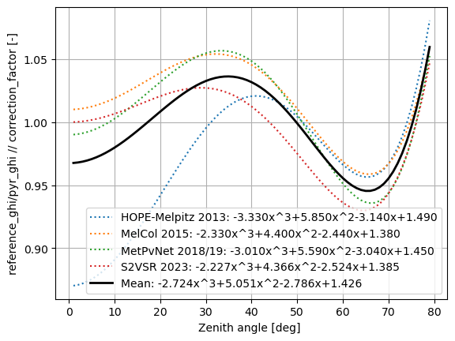

## Mean Cosine Correction from all calibration campaigns
```
processed with pyrnet-0.2.16
```

Considering the cosine correction function from all past campaigns. The mean cosine correction function is calculated.


```python
#|dropcode
from IPython.display import display, Latex
import numpy as np
import matplotlib.pyplot as plt
```


```python
#|dropcode
# Coefficients from calibrations:

a3,a2,a1,a0 = [ -3.33, 5.85, -3.14, 1.49]
display(Latex(
    rf"""
    IOPRAO 2014: {a3:+.3f}x^3{a2:+.3f}x^2{a1:+.3f}x{a0:+.3f}
    """
))

b3, b2, b1, b0 = [-2.33, 4.4,-2.44, 1.38]
display(Latex(
    rf"""
    MelCol 2015: {b3:+.3f}x^3{b2:+.3f}x^2{b1:+.3f}x{b0:+.3f}
    """
))

c3, c2, c1, c0 = [ -3.01, 5.59, -3.04, 1.45 ]
display(Latex(
    rf"""
    MetPVNet 2018/19: {c3:+.3f}x^3{c2:+.3f}x^2{c1:+.3f}x{c0:+.3f}
    """
))

d3, d2, d1, d0 = [ -2.227, 4.366, -2.524, 1.385 ]
display(Latex(
    rf"""
    S2VSR 2023: {d3:+.3f}x^3{d2:+.3f}x^2{d1:+.3f}x{d0:+.3f}
    """
))
```


    IOPRAO 2014: -3.330x^3+5.850x^2-3.140x+1.490
    


    MelCol 2015: -2.330x^3+4.400x^2-2.440x+1.380
    


    MetPVNet 2018/19: -3.010x^3+5.590x^2-3.040x+1.450
    


    S2VSR 2023: -2.227x^3+4.366x^2-2.524x+1.385
    


```python
#|dropcode
szen = np.arange(1,80)
mu0 = np.cos(np.deg2rad(szen))

fig,ax = plt.subplots(1,1)
ax.plot(szen, a3*mu0**3 + a2*mu0**2 + a1*mu0 + a0,
         color='C0',ls=':', label=f'HOPE-Melpitz 2013: {a3:+.3f}x^3{a2:+.3f}x^2{a1:+.3f}x{a0:+.3f}')
ax.plot(szen, b3*mu0**3 + b2*mu0**2 + b1*mu0 + b0,
         color='C1',ls=':', label=f'MelCol 2015: {b3:+.3f}x^3{b2:+.3f}x^2{b1:+.3f}x{b0:+.3f}')
ax.plot(szen, c3*mu0**3 + c2*mu0**2 + c1*mu0 + c0,
         color='C2',ls=':', label=f'MetPvNet 2018/19: {c3:+.3f}x^3{c2:+.3f}x^2{c1:+.3f}x{c0:+.3f}')
ax.plot(szen, d3*mu0**3 + d2*mu0**2 + d1*mu0 + d0,
         color='C3',ls=':', label=f'S2VSR 2023: {d3:+.3f}x^3{d2:+.3f}x^2{d1:+.3f}x{d0:+.3f}')

m3 = np.mean([a3,b3,c3,d3])
m2 = np.mean([a2,b2,c2,d2])
m1 = np.mean([a1,b1,c1,d1])
m0 = np.mean([a0,b0,c0,d0])

ax.plot(szen, m3*mu0**3 + m2*mu0**2 + m1*mu0 + m0,
         color='k',lw=2,ls='-', label=f'Mean: {m3:+.3f}x^3{m2:+.3f}x^2{m1:+.3f}x{m0:+.3f}')


ax.legend()
ax.set_xlabel('Zenith angle [deg] ')
ax.set_ylabel('reference_ghi/pyr_ghi // correction_factor [-]')
ax.grid(True)

print(f"[{m0:.2f}, {m1:.2f}, {m2:.2f}, {m3:.2f}]")

```

    [1.43, -2.79, 5.05, -2.72]


    

    

