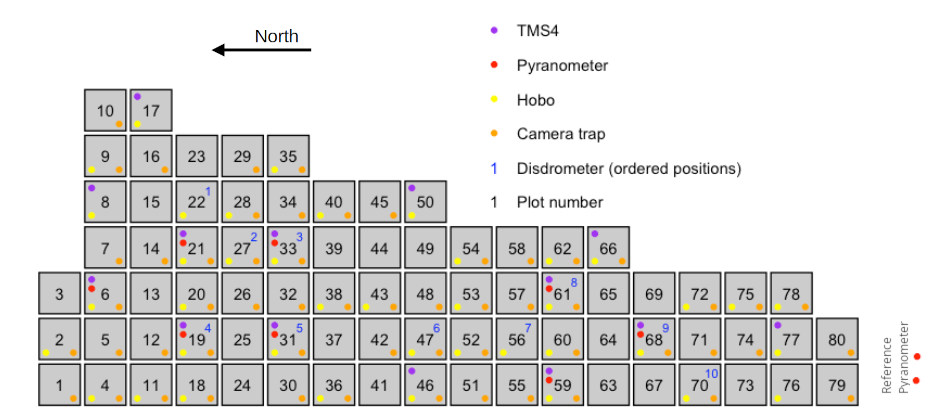

# Campaigns
In the following, a short description of measurement campaings utilizing PyrNet is presented.

## 2023 S2VSR

## 2022 Microclimate in Space and Time: MiST project

The Microclimate in Space and Time (MiST) project was a pre-study on tree diversity effects on under-canopy and soil microclimate heterogeneity.
Among other variables, solar radiation under the canopy of different tree patches at the MyDiv site was measured by PyrNet.
Leaders of the project are: Rémy Beugnon, Simone Cesarz, Nico Eisenhauer.


### Setup configuration in MyDiv

Pyranometers where placed in batches of 3 in 8 MyDiv Patches in the following configuration:




```{raw}
# MyDiv Patch:
o = tree
P = Pyranometer
+---------North-------------------------------+
|o   o   o   o   o   o   o   o   o   o   o   o|
|                                             |
|o   o   o   o   o   o   o   o   o   o   o   o|
|                                             |
|o   o   o   o   o   o   o   o   o   o   o   o|
|                                             |
|o   o   o   o   o   o   o   o   o   o   o   o|
|              P1                             |
|o   o   o   o   o   o   o   o   o   o   o   o|
|                                             |
|o   o   o   o   o   o   o   o   o   o   o   o|
|                          P2                 |
|o   o   o   o   o   o   o   o   o   o   o   o|
|                                             |
|o   o   o   o   o   o   o   o   o   o   o   o|
|              P3                             |
|o   o   o   o   o   o   o   o   o   o   o   o|
|                                             |
|o   o   o   o   o   o   o   o   o   o   o   o|
|                                             |
|o   o   o   o   o   o   o   o   o   o   o   o|
|                                             |
|o   o   o   o   o   o   o   o   o   o   o   o|
+---------South-------------------------------+
```

### Patches
* Patchno.: P1, P2, P3
* 06: 43, 44, 86
* 19: 46, 04, 32
* 21: 54, 12, 24
* 31: 15, 01, 26
* 33: 35, 87, 10
* 59: 49, 38, 58
* 61: 14, 55, 60
* 68: 33, 47, 53

### Reference
Reference pyranometers 03 and 09 where mounted at the southern fence of the MyDiv area.
Its relatively free area with good distance to tree patches.
Pyr03 is in single pyranometer configuration and was running on Powerbank power supply for the 1st week and the 4th week.

```
----------------North-------------------
#-#-#-#-#-#-P09-#-#-#-#-#-P03-#-#-#-#-#-
----------------South-------------------
```

## 2018/19 MetPVNet

## 2017 AC3 Pascal

## 2015 MelCol

## 2013 HOPE Melpitz

## 2013 HOPE Juelich